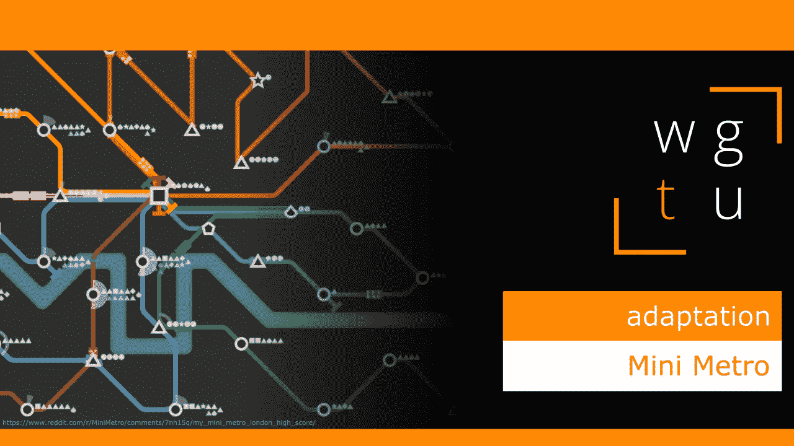

# WGTU #6:适应—使用迷你地铁

> 原文：<https://medium.com/geekculture/wgtu-6-adaptation-with-mini-metro-7da5d65cc461?source=collection_archive---------21----------------------->

## 让我们看看这个独立的益智游戏如何训练我们的适应能力！

[*⬅️ WGTU #5:多才多艺 VS 专精——带炉石*](/geekculture/wgtu-5-versatility-vs-specialisation-with-hearthstone-454786bf24a3) *|* [*WGTU #7:氛围&旁白——带别饿死➡️*](https://mina-pecheux.medium.com/1b3d4d186fde)

*这篇文章有视频格式和文本格式，见下文:)*