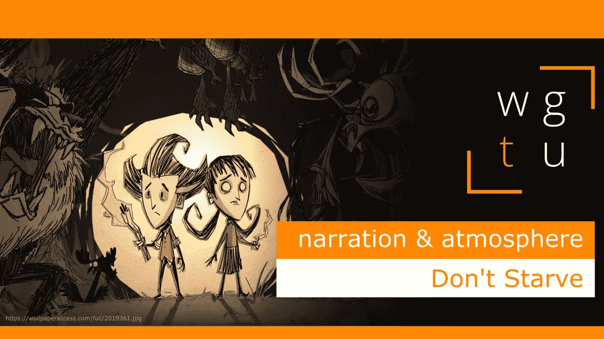

# WGTU #7:氛围和叙述——与“不要挨饿”一起

> 原文：<https://medium.com/geekculture/wgtu-7-atmosphere-narration-with-dont-starve-1b3d4d186fde?source=collection_archive---------25----------------------->

## 让我们看看这款生存 roguelike 游戏是如何通过它的氛围来讲述故事的！

[*⬅️ WGTU #6:适应—与迷你地铁*](/geekculture/wgtu-6-adaptation-with-mini-metro-7da5d65cc461) *|* [*WGTU #8:在探索中学习—与旅程➡️*](https://mina-pecheux.medium.com/wgtu-8-learning-through-exploration-with-journey-dcc8c86a3292)

*这篇文章有视频格式和文本格式，见下文:)*