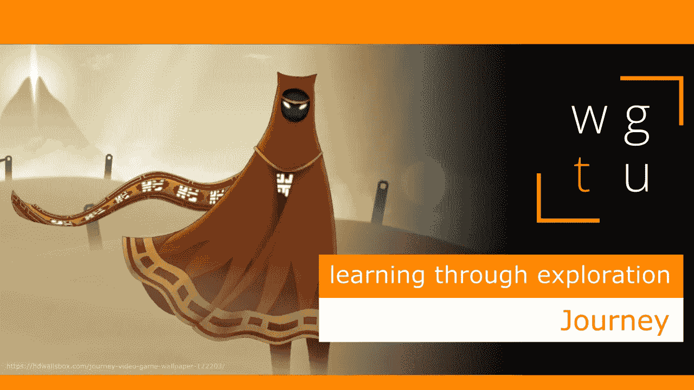

# WGTU #8:在探索中学习——伴随旅程

> 原文：<https://medium.com/geekculture/wgtu-8-learning-through-exploration-with-journey-dcc8c86a3292?source=collection_archive---------17----------------------->

## 让我们看看这个精致的冒险游戏是如何让我们通过发现和解释来学习的！

[*⬅️ WGTU #7:氛围&旁白—与不要挨饿*](/geekculture/wgtu-7-atmosphere-narration-with-dont-starve-1b3d4d186fde) *|* [*WGTU #9:守成派 VS 非守成派学习—与魔兽世界➡️*](https://mina-pecheux.medium.com/wgtu-8-learning-through-exploration-with-journey-dcc8c86a3292)

