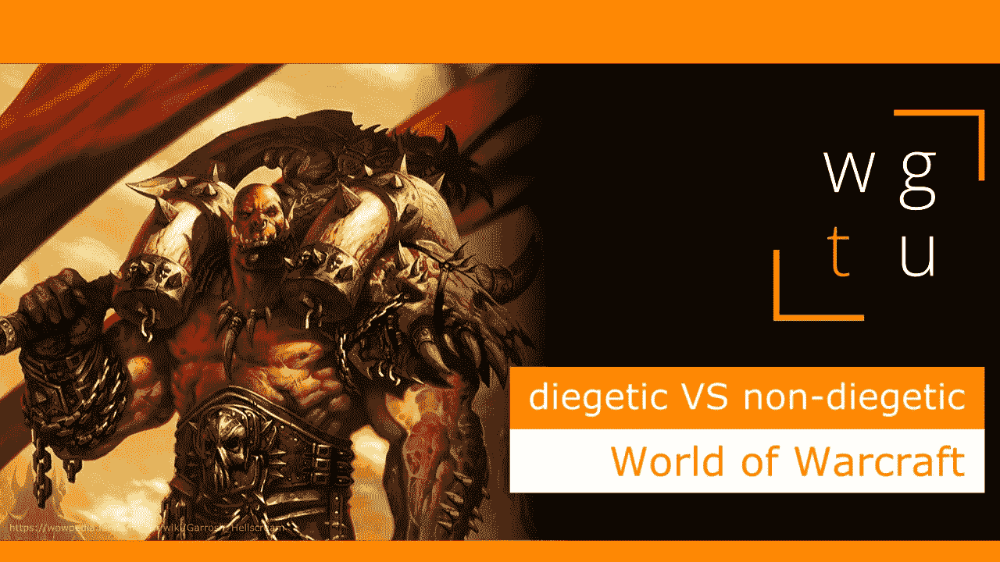

# WGTU #9:认知与非认知学习——魔兽世界

> 原文：<https://medium.com/geekculture/wgtu-9-diegetic-vs-non-diegetic-learning-with-world-of-warcraft-f7eff7eb44a0?source=collection_archive---------18----------------------->

## 让我们看看暴雪著名的 MMORPG 是如何混合死亡和非死亡知识的！

[*⬅️ WGTU #8:在探索中学习—与旅程同行*](/geekculture/wgtu-8-learning-through-exploration-with-journey-dcc8c86a3292)*|*[*wgtu # 10:超人类主义—与➡️同行*](https://mina-pecheux.medium.com/wgtu-10-transhumanism-with-deus-ex-7bb1179fee05)

*这篇文章有视频格式和文本格式，见下文:)*