# Azure 函数到底是什么？

> 原文：<https://medium.com/geekculture/what-a-heck-is-an-azure-function-e3ddd39c81cf?source=collection_archive---------4----------------------->

Azure functions

您可能已经注意到，云是当今对话中一个热门且反复出现的话题。

我们反复听到类似于[***AWS Lambdas***](https://aws.amazon.com/pt/lambda/)****Kubernetes****[***Azure functions***](https://azure.microsoft.com/en-us/services/functions/)*等等的热门词汇。看到并意识到这些公司为客户提供的大量功能，这是令人难以置信的，有时也是令人紧张的。***

***作为软件工程师，这是一个要求，让一切都跟上速度，跟上市场的速度和创新，所以我们不会失去火车。***

***在今天的文章中，我将主要关注 ***Azure 函数:******

*   **Azure 函数到底是个什么玩意儿？**
*   **创建和使用它们容易吗？**
*   **结论**

# **#什么是 Azure 函数？**

**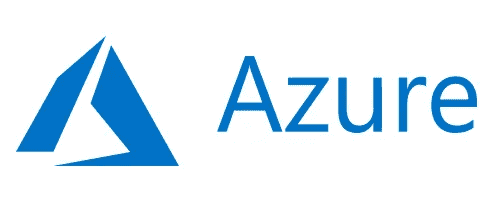**

**Microsoft Azure**

****Azure 功能**是一个众所周知的服务，由 [***微软 Azure***](https://azure.microsoft.com/en-us/)*云服务提供。***

***我们可以把它们看作是你可以在云中运行而不用担心基础设施问题的小段代码，也称为 ***无服务器*** 。***

> **无服务器是一种描述服务、实践和策略的方式，使您能够构建更加敏捷的应用程序，以便您能够更快地创新和响应变化。借助无服务器计算，AWS 可以处理容量供应和修补等基础设施管理任务，因此您可以专注于编写为客户服务的代码。像 [AWS Lambda](https://aws.amazon.com/lambda/) 这样的无服务器服务具有自动伸缩、内置的高可用性和按价值付费的计费模式。**
> 
> **亚马逊 AWS**

**这种服务的目标是帮助你专注于你试图解决的领域问题。我们可能没有注意到，但随着时间的推移，我们通常会忽略我们试图解决的领域问题，比如基础设施。**

**你甚至不需要学习一种新的编码语言来编码它们。它支持大量的语言，比如 Java、C#、Python、JavaScript，甚至 Powershell，如果你喜欢的话。**

**您的服务将自动扩展(垂直或水平)。再一次，你解决了你的领域问题，而 Azure 解决了基础设施问题，不用担心，你只需要为代码运行的时间付费。当它闲置时，你不需要付费。**

> **你可能想知道，这些函数是如何被调用和执行的？**
> 
> **这是个有趣的问题。你的问题也有很多可能的解决方案。**

**有个东西叫 ***触发*** 和 ***绑定:*****

*   *****触发*** —方向始终在。定义一个函数如何执行。一个函数只能有一个触发器。**
*   *****绑定—*** 方向可能是进出。绑定是到函数中数据的连接。**

**可能触发您的功能的一些动作示例:**

*   *****HTTP trigger—G***每当通过 HTTP 协议发送请求时，ets 就会执行。**
*   *****CosmosDBTrigger—***每当在 NoSQL 数据库中插入或更新文档时，都会执行该触发器；**
*   *****定时器触发器—*** 按照指定的时间表。**

**其他例子可以在 Azure 的[文档](https://docs.microsoft.com/en-us/azure/azure-functions/functions-triggers-bindings?tabs=csharp)中找到。**

**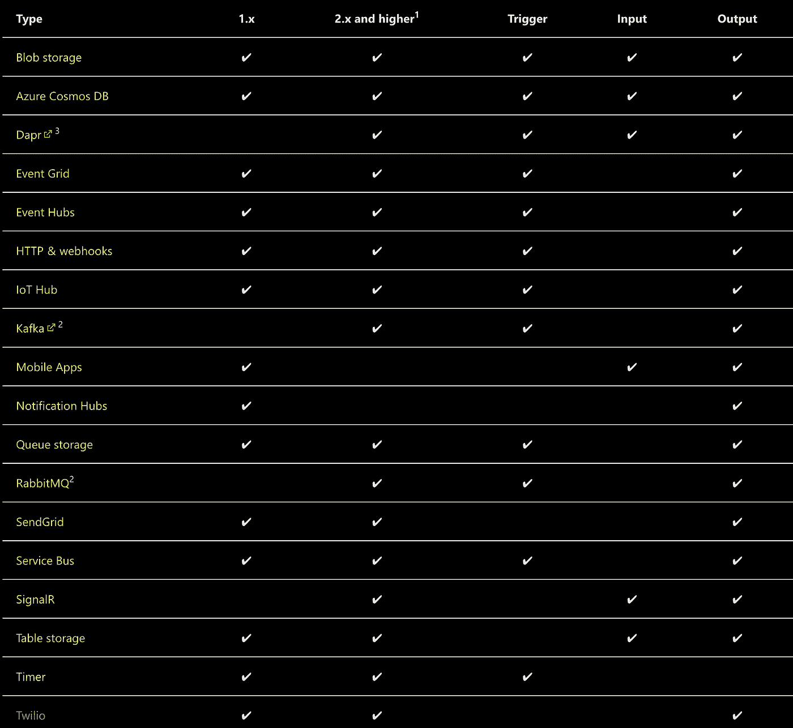**

**Alternatives**

**如果你目前正在寻找一些管理简单性和编码灵活性，Azure functions 可能是你最好的选择。**

# **#创建和使用它们容易吗？**

****

**Photo by [Hello I'm Nik 🎞](https://unsplash.com/@helloimnik?utm_source=medium&utm_medium=referral) on [Unsplash](https://unsplash.com?utm_source=medium&utm_medium=referral)**

**如果它们简化了我们的管理，使我们的代码更加灵活，为什么它们很难设置呢？**

**当我开始学习 Azure 的平台组织时，我就想到了这一点。习惯了之后，就像点几个按钮那么简单。**

**现在，我将解释如何通过几个步骤轻松创建并运行 Azure function 解决方案。**

1.  **进入 [Azure 功能官方页面](https://azure.microsoft.com/en-us/services/functions/#features)，点击“*开始免费”*按钮，设置 14 天免费等级的账户。**

**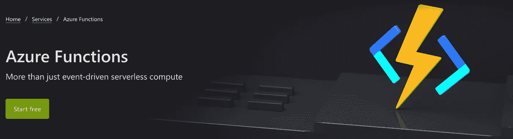**

**Start Free**

**2.登录 [Azure 门户](https://portal.azure.com/#home)。您应该可以看到主页上已经有一些建议使用的服务。**

**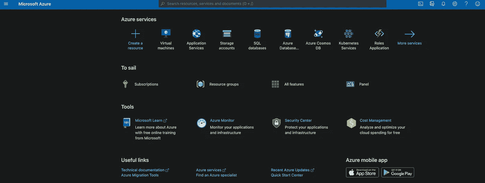**

**Azure portal main page**

**3.点击 ***创建资源*** ，选择 ***功能 App。*****

**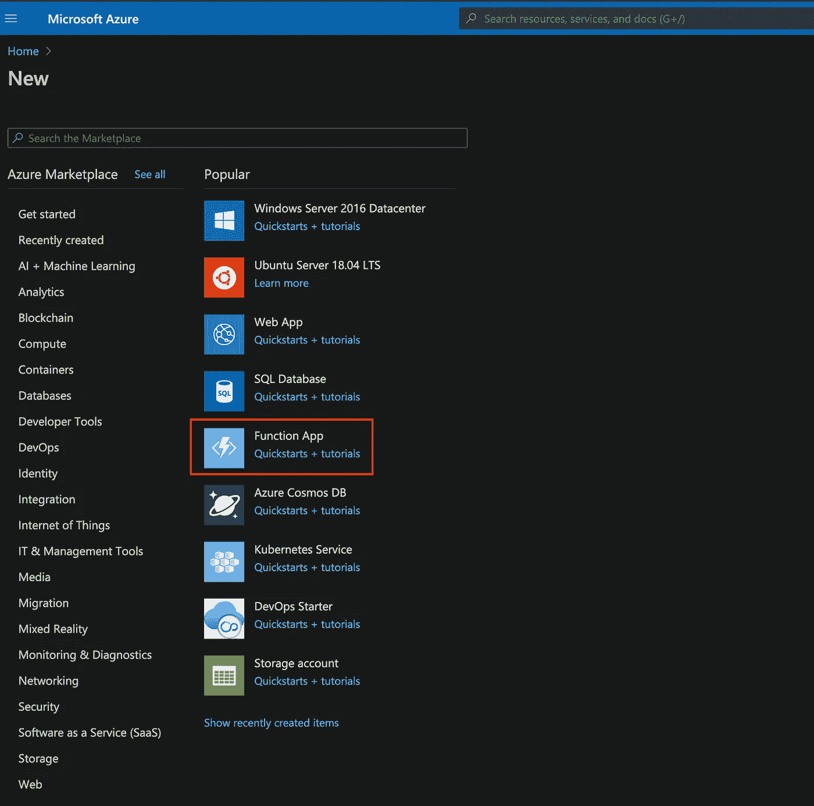**

**Function App**

**4.用以下数据填写表格:**

*   *****套餐*** —选择您希望用于计费的套餐。我们目前使用的是免费层，没有相关的账单，请选择出现的第一个。**
*   *****资源组*** —资源组就像是虚拟机甚至功能的逻辑集合。创建一个能帮助你逻辑组织你的功能的。**
*   *****功能应用程序名称*** —该名称应该是唯一的，因为它将用于生成唯一的 URL，该 URL 将标识您的功能并使其可用。**
*   *****发布*** —选择编码。**
*   *****运行时堆栈*** —选择您将用于编写函数的语言堆栈。在当前示例中，我们将使用 Node.JS。**
*   *****版本*** —堆栈版本，通常会自动填充。**
*   *****地区*** —选择您所在位置附近的地区。它将是你的函数被存储的地方。**

**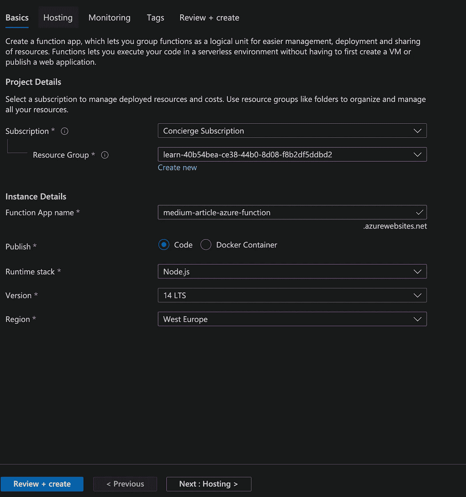**

**Create Function App Form**

**5.点击 ***审核+创建*** ，确认后，点击 ***创建*** 。它将显示功能概述页面。点击 ***转到资源*** 。**

**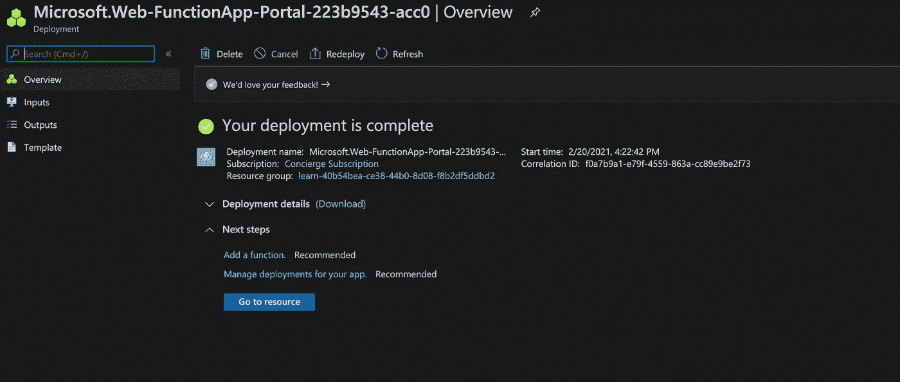**

**Overview page**

**6.在 ***功能 App*** 内，可以有多种功能。让我们添加我们的第一个。点击左侧 ***功能*** 选项，然后***“+添加*** ”。**

**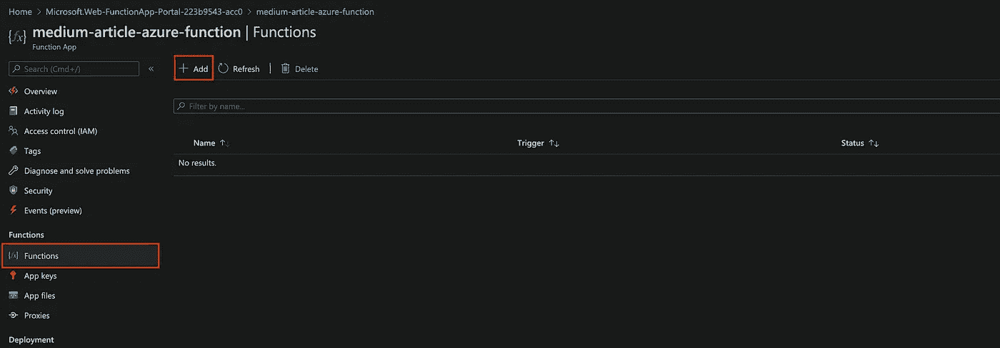**

**Functions page**

**7.如前一节所述，我们需要定义什么动作会触发我们的函数。Azure 已经给了我们几个可以使用的模板。**

**为了使例子简单，我们选择 ***HTTPTrigger*** 模板。**

**选择模板后，定义要为其指定的名称以及希望函数拥有的身份验证权限。**

*   *****功能*** —仅共享同一个功能 App 的功能；**
*   *****匿名*** —不需要认证，任何有效的 HTTP 请求都通过；**
*   *****Admin*** —需要主机密钥进行授权的授权级别。**

**要提交所有选中的决策，点击 ***添加*** 。**

**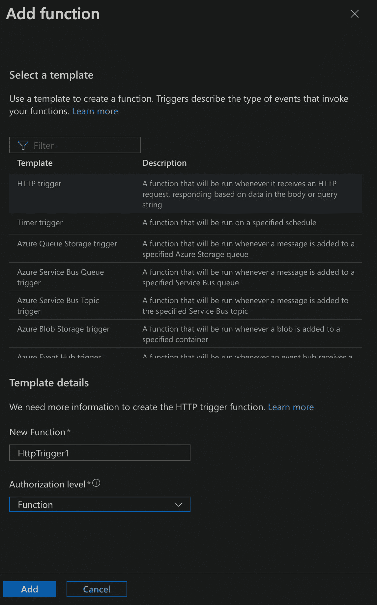**

**7.创建函数后，您将能够看到管理页面。在其中，您可以监控所有请求和时间执行，最重要的是，编写您的域逻辑。**

**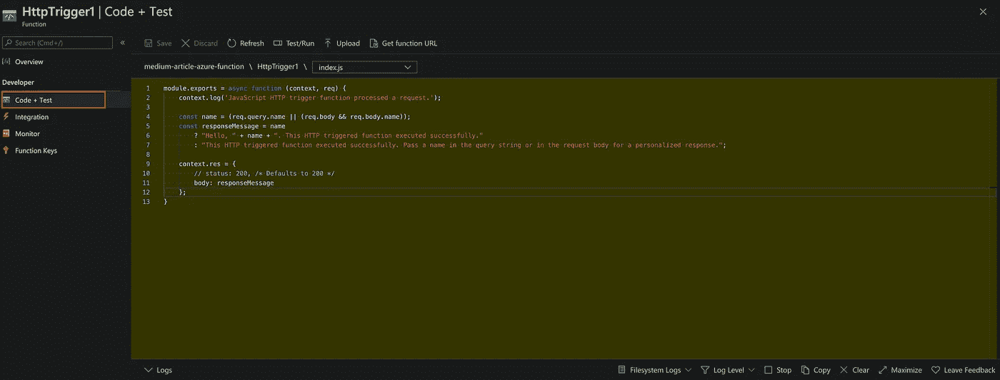**

**Code + Test**

**8.要测试您的函数可用性，您可以点击 ***获取函数 URL*** 并向给定的链接发出请求。您应该会得到类似的回应。**

**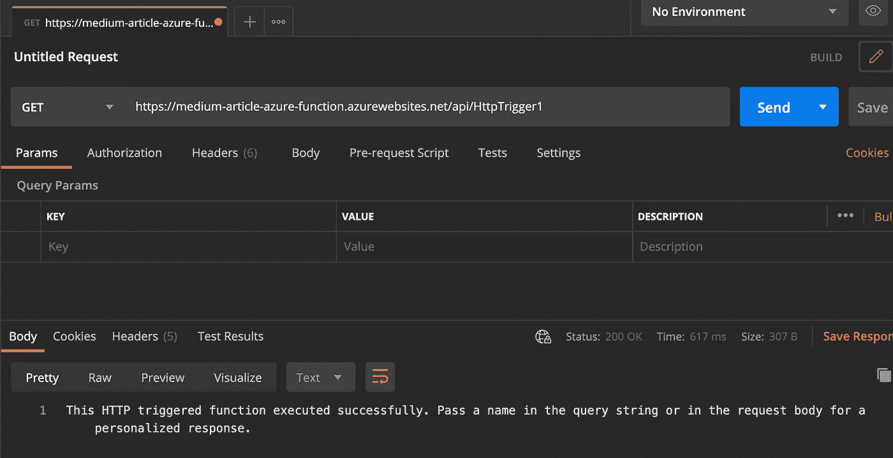**

**HTTP GET Request**

**就这样，你的第一个 Azure 函数已经创建好了，现在每个人都可以使用了！**

# **#结论**

**如你所见，简单又干净！**

**你能在市场上找到的最好的 Azure 函数兄弟是 AWS lambda。它们在概念上是相似的，当你抓住主要概念时，供应商之间的变化应该是直接的。**

**看看我以前的一些文章，谁知道呢，大概你是和我一样喜欢简单灵活的人吧。**

**我们在 [Linkedin](https://www.linkedin.com/in/rafael-as-martins/) 上聊天吧。**

** [## 在《疫情时报》上，我是如何设法将我的生产率提高 400%的

### 成功的人只是那些拥有成功习惯的人——布莱恩·特兰西

rafael-as-martins.medium.com](https://rafael-as-martins.medium.com/how-i-manage-to-boost-my-productivity-by-400-in-pandemic-times-53a64e1275be)  [## 将您的 Spring Boot 与 Redis 缓存系统集成

### 你上一次需要从网站上提交或提取数据，并且花费了很长时间是什么时候？

medium.com](/swlh/integrate-your-spring-boot-with-a-redis-cache-system-ff707e61e75e)  [## 通过 Spring Cloud Gateway 和 Eureka 使用关联 id

### 在微服务架构中，有时我们希望确保所有服务的行为，例如:请求跟踪…

medium.com](/swlh/using-correlation-ids-with-spring-cloud-gateway-and-eureka-f00145c579ab)**