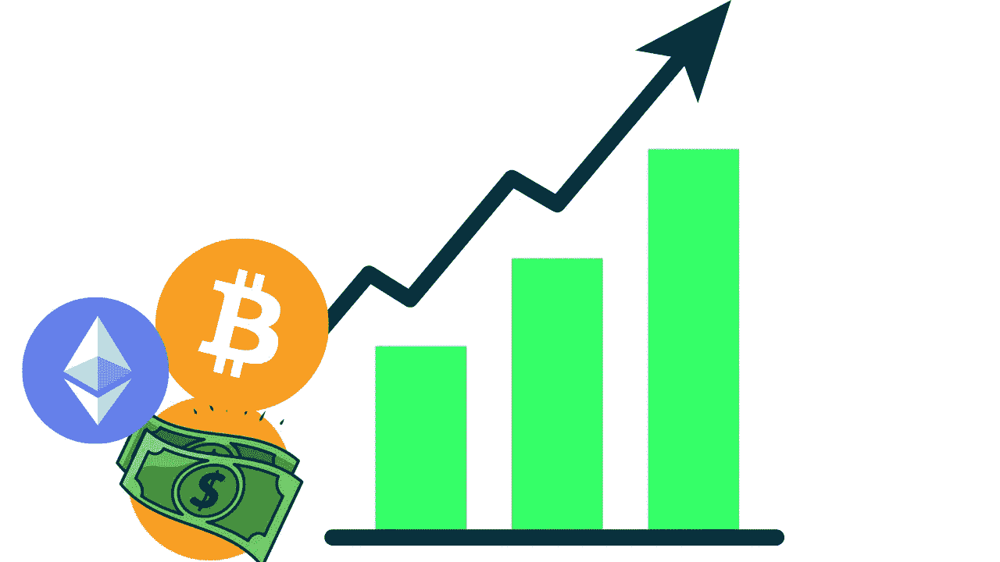

# 比特币是什么？投资比特币以来我学到的东西。

> 原文：<https://medium.com/geekculture/what-are-bitcoins-what-i-have-learned-since-investing-in-bitcoin-415eb4cf551?source=collection_archive---------38----------------------->

我相信你可能听说过加密货币。这是每个人都在谈论的热门话题。你可能已经看到了近年来价格的飙升，以及埃隆·马斯克如何宣布特斯拉将开始接受比特币作为支付方式。然后是对 [dogecoins](https://www.cnbc.com/2021/05/12/dogecoin-price-surge-elon-musk-slim-jim.html) 的大肆宣传，它被用作 Twitter 的模因。