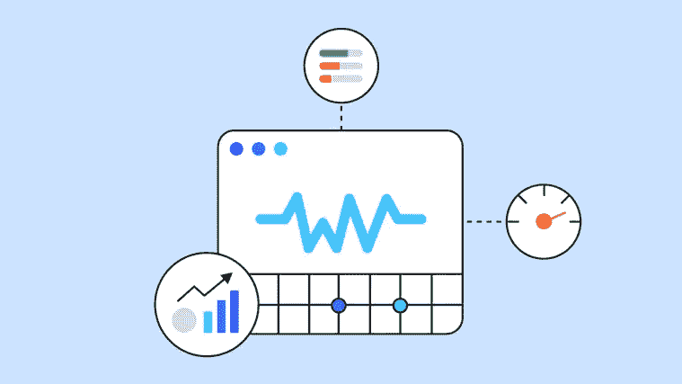
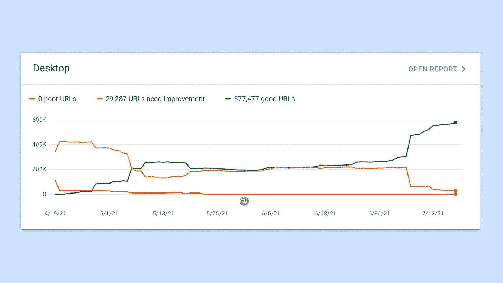
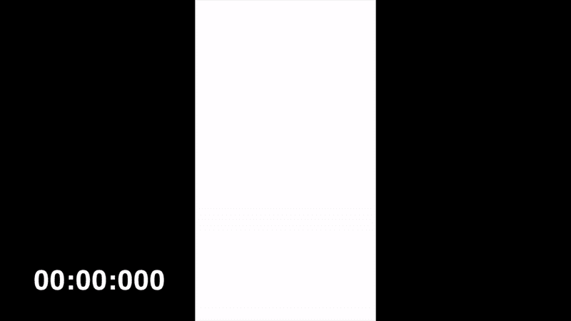
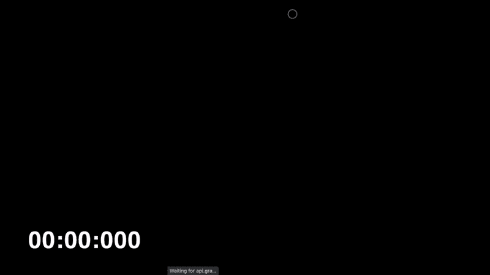
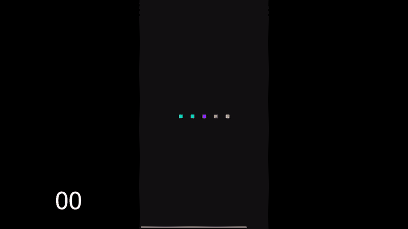

# 用 gif 解释核心网站的重要特征

> 原文：<https://medium.com/geekculture/what-are-core-web-vitals-f9aba01353cd?source=collection_archive---------34----------------------->

随着谷歌 2021 年 6 月的更新，核心网站(CWV)将成为搜索引擎优化排名的一个因素。它通过这三个指标来衡量一个站点的质量: **LCP** 、 **FID** 和 **CLS** 。

如果你通过了所有的测试，谷歌会奖励你更多的曝光率。

Passing your Core Web Vitals and google will reward you with visibility.

您可以通过以下几种方式来检查您在这些指标上的表现:

*   [页面速度洞察](https://developers.google.com/speed/pagespeed/insights/)
*   [搜索控制台](https://search.google.com/)
*   [WebDev 测量](https://web.dev/measure/)
*   Chrome 开发工具和灯塔
*   [Web Vitals Chrome 扩展](https://chrome.google.com/webstore/detail/web-vitals/ahfhijdlegdabablpippeagghigmibma?hl=en)
*   [使用谷歌分析定制事件跟踪](https://github.com/GoogleChrome/web-vitals#send-the-results-to-google-analytics)

# 最大含量涂料(LCP)

> LCP 标记页面加载时间线中页面主要内容可能已经加载的时间点。
> 
> [— web.dev](https://web.dev/lcp/)

LCP will keep changing until the Largest Contentful Paint is done, which here is at 1.766s

你让最大的内容出现得越快，你的指标就越好。

如果你已经可以预加载最大的图片了，比如用`<link rel="preload" href="...">`或者不用 Javascript 框架渲染就能显示内容，你就赢定了。

LCP 的原因:

*   缓慢的服务器响应时间
*   呈现阻塞 Javascript 和 CSS
*   缓慢的资源加载时间
*   客户端渲染

# 第一输入延迟(FID)

> FID 测量从用户第一次与页面交互到浏览器实际能够开始处理事件处理程序以响应该交互的时间。
> 
> [— web.dev](https://web.dev/fid/)

0.666s pass until you see the website working with your interaction.

Javascript 是同步和单线程的。如果用户交互发生在线程忙的时候，用户必须等待。如果你有太多在运行时加载的库，更糟糕的是，即使你并不马上需要它们，这会增加 FID。

这类似于你可能已经听说过的 [TTI(互动时间)](https://web.dev/tti/)。然而，FID 将仅从用户交互开始测量。而 TTI 将从现场装货的一开始就开始测量。

FID 的原因:

*   javascript 代码太多，无法立即执行，尤其是第三方
*   广告网络可以推送大量不需要的 Javascript
*   不使用代码分割(例如使用[网络包](https://webpack.js.org/guides/code-splitting/)、[汇总](https://rollupjs.org/guide/en/#code-splitting)、[包裹](https://parceljs.org/code_splitting.html))

# 累积布局偏移(CLS)

> CLS 是对页面整个生命周期中发生的每个意外布局偏移的最大布局偏移分数的度量。
> 
> [— web.dev](https://web.dev/cls/)

CLS is happening here that makes the content jump around.

只有当一个更高的元素使其他元素移动时，布局移动才会发生。如果元素在变化，而后面没有任何东西，这不算布局移动——还有一个宽限期(500 毫秒)内用户交互引起的 DOM 变化。

注意:移动视窗和 3G 设备会产生更多的 CLS。在针对这些指标优化您的页面时，请确保节流您的连接。

CLS 的成因:

*   没有大小属性的图像
*   稍后完成的请求将在现有内容之上注入内容
*   惰性加载组件

Simon Wicki 是柏林的一名自由开发者。在 JustWatch 做网络和移动应用。流畅的 Vue、Angular、React 和 Ionic。对前端、技术、网络性能和非小说类书籍充满热情。

**👉** [**在 Twitter 上和我一起关注我的最新动态。**](https://twitter.com/zwacky)