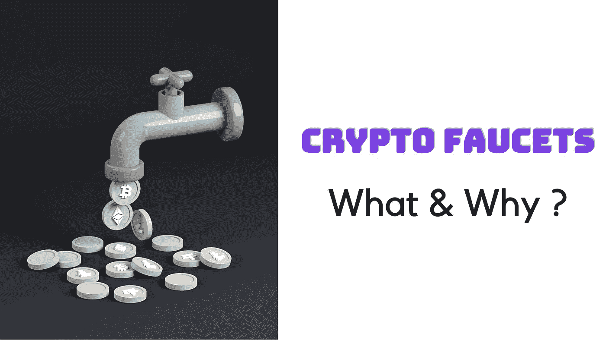

# 什么是加密水龙头&如何免费获得一些加密？

> 原文：<https://medium.com/geekculture/what-are-crypto-faucets-how-to-earn-some-crypto-for-free-79ef7cbca225?source=collection_archive---------3----------------------->

## 为什么你应该考虑加密水龙头免费赚取一些加密奖励，但有一些谨慎和责任？我们今天要探索的是

**我感觉:**

> 如果你得到任何免费的东西，它应该值得你花时间，因为现实中没有什么是免费的

## 让我们来设定一下背景:

有许多与比特币相关的白手起家的故事，尤其是与加密水龙头相关的故事。首款加密水龙头于 2010 年开始投入使用，在那里，为了促进比特币的采用，他们将大约 1-2 枚比特币(在撰写本文时其价值为 49999.85 美元)提供给那些愿意在他们的门户网站上执行诸如解决验证码等活动的用户

在那个时候，比特币的价值只有一便士，但那些长期持有比特币的早期采纳者，许多幸运者可能已经凭借他们赚到的那部分比特币成为了千万富翁。

现在，随着比特币获得如此大的吸引力和受欢迎程度，价值 49999 美元(在撰写本文时)，几乎没有任何门户网站提供这样的比特币奖励，他们向用户提供比特币的最小部分，称为 Satoshis，用于参与他们门户网站上的多种活动

*   点击验证码
*   参与广告
*   在社交媒体上分享内容等。

但是，如果你是一个初学者，并想获得一些免费的比特币或 ETH 或任何加密令牌，加密水龙头可以成为你开始的方式之一，如果你足够聪明和勤奋，你甚至可以通过保持耐心获得可观的金额。

*话虽如此，但你必须始终看到，是否值得你花时间去接触那里的加密水龙头。*

现在背景已经确定，是时候揭穿真相了

# 什么是加密水龙头&为什么这么叫？

加密龙头是一种加密货币奖励系统，奖励加密货币持有者在网站或移动应用程序上完成特定任务。

它不指望你成为任何类型的专家，你只需要执行一些无脑的任务，包括查看广告或完成验证码任务或分享内容等，为此你不需要成为密码交易专家或区块链专家。

## 为什么叫水龙头？

为了理解这一点，我们需要看看“水龙头”这个词的字典含义

根据字典:

> 水从你的*水龙头*流出，进入你的水槽或浴缸。水龙头是一种可以让你开关水流的装置。

所以水龙头是控制水流并帮助水流一滴一滴落下的东西，世界加密货币水龙头从中获得了灵感，并表示人们将获得很小的奖励，就像从漏水的水龙头滴下的小水滴一样。

> 例如，在比特币水龙头的情况下，奖金以 Satoshi 支付，即一个比特币的一亿分之一= 0.0000000001 BTC。

你从这些水龙头中赚取的任何微小金额都会转移到你的钱包中，任务的种类和复杂性决定了奖励值，比如观看教程或博客视频可能会给你更多奖励，但仅仅点击链接或完成验证码可能会给你更少奖励。

**记住！**

加密水龙头不是你的快速致富计划，你必须与这些水龙头接触一天或一周，以积累和达到所需的阈值，然后才能从钱包中取出。因此，耐心和时间的投入是必要的。

# 处女龙头:比特币龙头

比特币水龙头是最受欢迎的水龙头形式之一。第一个比特币水龙头是由 Gavin Andresen 在 2010 年开发的，在早期，比特币水龙头曾经价值 5 个 BTC。

> 以太坊，Dogecoin 和 Litecoin，Monero 水龙头也出现了。

# 加密水龙头是如何工作的？

如所讨论的，加密水龙头很大程度上是由用户为了赚取加密奖励而需要执行的一组任务驱动的。所以水龙头设置了以下类型的活动

*   完成验证码
*   看视频
*   点击广告
*   完成教程和尝试测验。

运行加密水龙头的网站或移动应用程序通常配置要分配给水龙头池的加密的阈值。他们在用户可以要求领取所收集的奖励之前设置最低支付阈值。此外，他们还为用户设置了领取奖励的时间锁。

每个参与者都必须通过提供他们的基本信息以及他们将获得奖励的钱包地址来注册加密水龙头。他们会看到上面提到的任务列表，他们需要完成，一旦他们完成这些任务，他们继续赚取奖励，这些奖励将转移到微型钱包

> 微型钱包是一种类似于传统钱包的钱包，但是具有收集少量加密资产的能力。对于大多数加密水龙头，微型钱包在注册时自动创建。

一旦在微型钱包中达到所需的阈值，累积的加密奖励将自动发送到用户的主钱包。

# 一些著名的水龙头例子:

如上所述，比特币水龙头是第一个开始这个概念的奖励微加密奖励，简单的目标是提高人们对加密的认识。

之后，以太坊、莱特币等其他流行的密码公司推出了多种水龙头。

## 以太坊水龙头:

以太坊水龙头开始奖励完成不同任务的用户乙醚。一些以太坊流行的水龙头选项有:

*   【Ethereum-faucet.org】T2 提供[代币](https://coinmarketcap.com/alexandria/glossary/token)用于解决验证码和其他活动
*   Allcoins.pw 是另一个加密水龙头，提供矿工和自动水龙头功能以及一些游戏。
*   [消防龙头](https://firefaucet.win/)奖励你 ETH 代币，用于浏览器挖掘和完成验证码。
*   [达奇公司](https://dutchycorp.space/?__cf_chl_jschl_tk__=83aab08005f6c1c2c77631c3dcc52046c24d71de-1611723602-0-Ae_WpfoYn6mmsPcpLDbvrKd0EodQXZvi4YZKeKgEPjdIFzLaHcpRvLJNyGypngbdILy100VJE9QKXH2956Mcp-mJYtKEfRptdSicLIAuQc6AEyKt60ozTaabtBGxsotGedc-6ns6wT_41DdpqdQtrgzoJcwnGcFnyjTq2gFDgEBVRnBmNOxS441gDT1ltnaKMNDuS7G1N_rbGaPKoxrG6HVV2tSJMWtad5YTNyp-xjmQmpxGfOO1am0V14Y0UkcH7MRE_Hvl0xMUxonSjNZadzxO-r1bp-2uAKPBBvfOVlzz2FCyqGGY6KAkmN1_WOimPkjWtrJMzSM4-KLmMMNJTMw0WhBcS0dPN2gguAV52nhu3aKKCH3Ua_HwpmN1UwSL9A)是另一个以太坊门户网站，帮助你通过解决验证码和玩游戏来获得奖励。

## 莱特币水龙头

对于需要在其门户上执行的一组任务，一些向用户授予 LTC 令牌的流行水龙头是:

*   [Moon Litecoin](https://moonliteco.in/) 为完成多项任务的用户提供免费 LTC。使用 Coinpot.co 微型钱包存储用户获得的小额奖励。
*   [消防龙头](https://firefaucet.win/?__cf_chl_jschl_tk__=da7fadc51a8857e703e10138114d3b36db4ce0ff-1611723654-0-AZJ1VORHa8a8rs2DXPtocP4FXed2k7s3MT9vaV4p3_25mRajiqwpeu0JrzHn5U_bULhj7orCOeHuAyXCZ4UYf0z0B9uO1X1A65tU1r3UGRFjiI3E0MO3i4eNO0sT1_nKLZkkMjAQ38KtJ5UzynrkLhs7o6IexFtTGOvvXzTsv-tggEYT4Tg6EKaaC0552CmA_lDEZuQmjy3FipwxSUFA98RBVRrQf6pac1jN3VYkEly32RofcDcZrI49coXXaqaTv8NC2OxiUTOhiOkA5tFC-DvQOAH_ByuLxgxZGq87DIkzs3kH0wP9agadBiyOGAE5Ww)是除了 BTC 和其他加密货币之外，只要你持有自动索赔点(ACP)就向你支付莱特币的另一个龙头。要获得免费的 ACP，您需要在网站上注册。水龙头会自动运行，直到你的空调水用完。您可以通过礼品盒和执行任务(如访问短链接、点击广告等)赚取更多的 ACP。

**Monero 水龙头:**

同样，也有一些受欢迎的水龙头奖励 Monero 代币

*   [Monerofaucet.info](http://monerofaucet.info/) 允许您每份奖励赢取 0.000005 至 0.025 Monero 代币，每 1 小时可申领一次。
*   [快递龙头](https://expressfaucet.com/)还可以让你每四个小时领取高达 0.00042754 XMR 的奖励。水龙头也有一个彩票游戏，你可以玩，如果你赢了，赚取额外的免费 Monero。

更多水龙头的例子可以访问 faucetdump.com，它号称拥有 48 种不同加密货币的 420 个水龙头。

# 当心水龙头骗局！

当涉及到提供免费奖励时，并不是所有的事情都是合法的，许多人将此作为欺骗用户的工具。一些加密水龙头所有者拒绝向用户支付费用，即使他们通过点击广告赚了很多钱，也有许多骗局在加密水龙头的掩盖下运行，一旦达到支付阈值，他们就让用户退出他们的网站或应用程序。

所以，在把你的宝贵时间借给这些诈骗网站之前，做好你的功课，如果你发现有人在鬼混，就报告并在社区中传播这种意识。

# 总结:

2021 年，许多加密项目已经被广泛采用。除了比特币和以太坊，还有许多基于区块链协议的平台，如[、Solana](/crypto-wisdom/solana-all-about-solana-blockchain-sol-token-you-ever-wanted-to-know-88933a5fa234) 、Avalanch、Cardano、Polygon(Matic)、Fantom，它们已经出现并受到了关注，但仍有数百万人不知道它们的效用和潜力。

有像 [Audius](/crypto-wisdom/what-is-audius-audio-token-how-it-is-decentralizing-music-industry-7dfeeaa6cf9f) 这样的项目，它正在创新音乐产业，还有许多分散的金融项目，如 AAVE、UniSwap、PanCakeSwap、Compound，它们提供独特的金融服务，如加密贷款、收益农业、赌注等等，可以帮助用户赚取被动收入。

所以像水龙头，空投这样的概念，需要通过这些加密项目，以必要的责任来使用，这些项目可以帮助他们教育他们的用户，并获得关键的观众群，为了人类的更大利益来改变游戏。

比特币以太坊给了数百万人新的希望，让他们获得某种金融意识和自由，这需要讨论和谈论。

**所以我觉得**

> “每个人都应该自学区块链和加密货币，至少达到能够做出明智投资决策的水平。每一个为好而创新的加密项目都需要投资，并确保不会失败。”

# 免责声明！

CryptoWise 在此表达的观点不是投资建议，仅用于教育目的。投资者应该在对比特币、加密货币或数字资产进行任何高风险投资之前进行尽职调查。请注意，您的转账和交易风险由您自己承担，您可能遭受的任何损失由您自己负责。