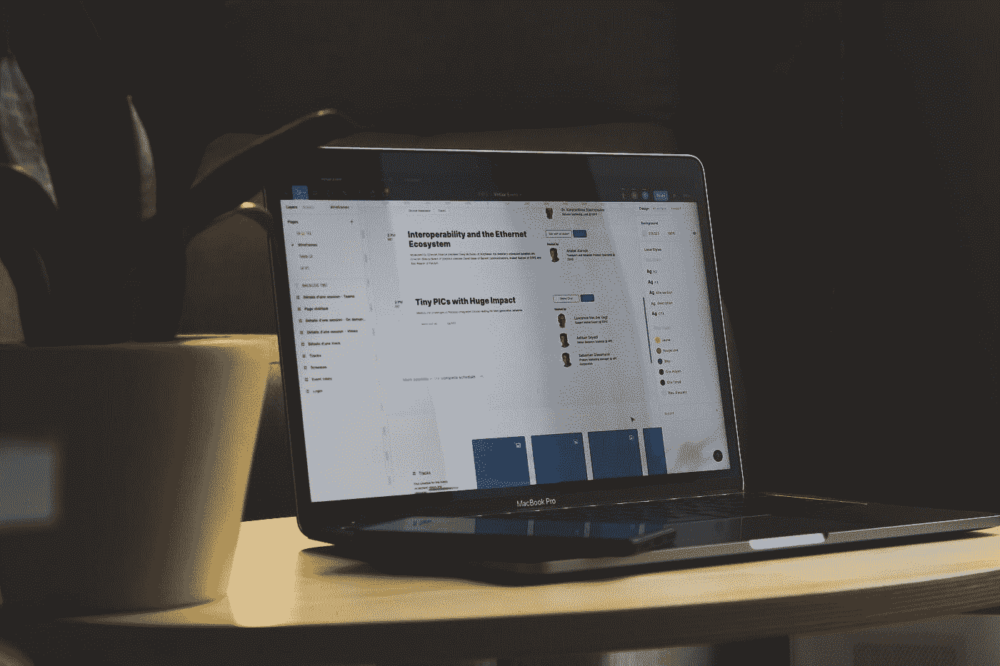

# Xcode 中的调试和发布模式是什么？如何检查 App 在调试模式下运行？

> 原文：<https://medium.com/geekculture/what-are-debug-and-release-modes-in-xcode-how-to-check-app-is-running-in-debug-mode-8dadad6a3428?source=collection_archive---------2----------------------->

## 更好地理解构建配置

Photo by [Sigmund](https://unsplash.com/@sigmund?utm_source=medium&utm_medium=referral) on [Unsplash](https://unsplash.com?utm_source=medium&utm_medium=referral)

作为一名从零开始自己开发一些应用程序的 iOS 开发者，我花在测试和调试应用程序上的时间比开发应用程序的时间还要多。我想与初级开发人员分享的最有用的技巧之一是:如何检查您的…