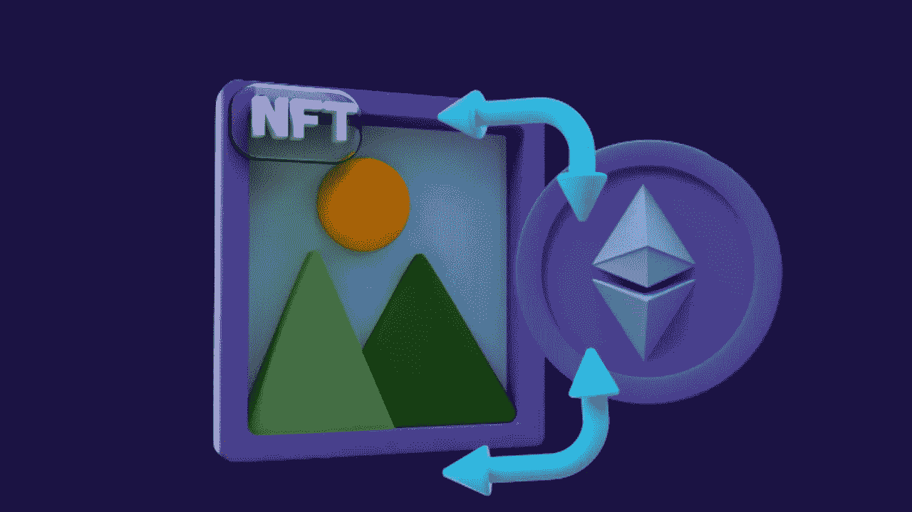

# 什么是绿色 NFT，它们真的对环境有帮助吗？

> 原文：<https://medium.com/geekculture/what-are-green-nfts-and-are-they-really-helping-the-environment-ed7bddcb927a?source=collection_archive---------15----------------------->

Fig: What Are Green NFTs, And Are They Really Helping The Environment?

在这个数字时代，一切都是相互联系、相互依存的。也就是说，当世界上任何一个地方发生变化，最终都会对另一个地方产生影响。NFTs 是最近的热门话题，在城市的每个角落都有讨论。自从它出现以来，随着时间的推移，非功能性测试已经取而代之。然而，问题是这是否会使未来的数字资产可持续发展。环保的是绿色的。这个术语对你来说是新的吗？那么，正常的 NFT 和绿色的 NFT 会有什么区别呢？有什么相似之处吗？让我们来讨论绿色 NFTs，你应该知道的必要信息。穿过去！

# 在此之前，了解一下不可替换令牌(NFT)

NFTs 代表 [**不可替代令牌**](https://www.turnkeytown.com/non-fungible-token-development) ，是具有唯一识别码的数字资产，彼此可以区分。它可以是任何数字文件，如艺术、音乐、游戏中的物品，甚至是迷因、gif 等。一般来说，这些非功能性测试是在工作证明区块链上铸造和创建的。这个过程需要大量的能量。

例如，考虑在以太坊区块链上创建的不可替换令牌(NFT)。在以太坊区块链网络上开发的每台 NFT 消耗 223.85 千瓦时的电力。

## 那么，绿色 NFT 是关于什么的？

然而，在另一方面，绿色的非功能性贸易是在利益攸关的区块链上铸造和创造的。否则，它将使用一个微不足道的碳铸造过程。这种铸造过程不会消耗太多的计算能力。绿色 NFT 也称为冲击 NFT。不可否认，这些都是环保的，因此对气候有利。看起来，NFT 的未来——绿色 NFT 的环境足迹要少得多。

# 密码领域的公司正在利用环境友好的 NFTs

现在，密码领域的大多数公司都在考虑采取重大举措，通过绿色 NFTs 走向可持续发展的未来。这也是为什么 Impact/Green NFTs 的概念变得流行并在世界范围内被采用的主要原因之一。例如，像 Solana 和 Cardano 这样的区块链技术公司正在采用绿色 NFTs 概念。

## NFTs 的可持续未来

美国数字艺术家迈克·温克尔曼(Mike Winkelmann)相信用更少的计算能力制造 NFT 的概念，而不需要消耗太多的能量。他的 NFT 收藏为 NFT 热奠定了基础。你听说过“每天:前 5000 天”吗？这是最贵的 NFT，售价 6900 万美元。他提出了一个对抗，即他即将到来的 NFT 项目将完全是碳中和的，显著地节约能源。

Rica Amaral(Project Ark 的营销主管)认为，全球采用可持续和保守的绿色 NFT 可能需要两到三年的时间才能完全实现。另一方面，慕克吉认为，影响 NFTs 的转变很可能正在进行中。更有可能的是，这是因为 Beeple 对即将到来的可再生和可持续的 NFTs 的公开承诺。

## 谁在关注绿色 NFT？

美国说唱歌手 Doja Cat 和美国歌手兼词曲作者约翰·传奇与昆西·琼斯 NFT 音乐市场签约销售绿色 NFT。尽管如此，南希·贝克·卡希尔(美国新媒体艺术家)和朱利安·奥利弗(艺术家)也在专注于绿色 NFT。

## NFTs 在短时间内获得了如此多的关注

毫无疑问，NFT(不可替代的代币)在最近几年得到了很多关注，在 Beeple 的 NFT 出售后也是如此。

“预计到 2028 年第四季度，全球 NFT 市场规模将从 2021 年的 15.536 亿美元跃升至 73.909 亿美元的复合年增长率(CAGR)。”

这一数据表明，NFT 市场正在蓬勃发展，未来的范围有利于企业家深入研究 NFT 部门。

## 结尾的音符

继续前进 [**NFT 市场发展服务**](https://www.turnkeytown.com/nft-marketplace-development) 如果你有想法创建&推出 NFT 并在 NFT 市场上市以实现货币化。要做到这一点，与一家 NFT 开发公司/机构合作，在你选择的区块链上创造出优秀的标志。