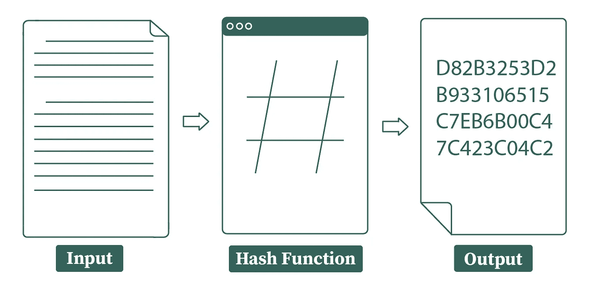
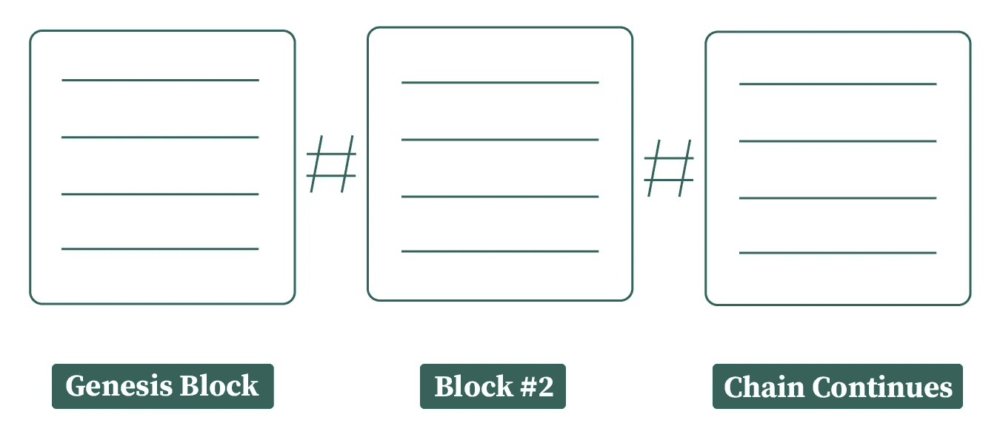

# 什么是哈希函数，它们是如何工作的？

> 原文：<https://medium.com/geekculture/what-are-hash-functions-and-how-do-they-work-3177553e429e?source=collection_archive---------7----------------------->

## 揭秘区块链

## 将区块链连接在一起的粘性物质

*欢迎来到我的系列，“揭开区块链的神秘面纱”在每篇文章中，我用不到 5 分钟的时间(可能不是真的)分解并解释一个与区块链相关的基本概念/主题。这篇文章的讨论集中在哈希上…不，虽然我确实喜欢偶尔吃一顿丰盛的哈希早餐，但你可能不想被发现吃这种哈希(现在我想起来，我甚至不确定你将如何管理这样的任务)。*

# Hashes，区块链家族中的老二

如果不提到哈希函数，很难深入解释区块链——它们实际上是区块链最不可或缺的部分。然而，不幸的是，他们也是最容易被忽视和解释不足的人之一——当他们的祖母或他们试图打动的女孩/男孩忽略了他们正在进行的超级酷的 Solidity 项目，而是问:“那么区块链是如何工作的？”时，区块链爱好者不知所措

从理论上讲，你可以继续你的一天，忘记你曾经看过这篇文章，并且当你出去的时候，冒着未来非常尴尬的风险——被坐在你后面的人讨厌(并且专注地听你和你朋友的谈话)。或者，你可以做出正确的决定，现在就花 5 分钟，永远不再被人讨厌。😏

# 哈希函数:基本定义

散列函数基本上是一种数学函数，它接受任意长度/大小的输入，并产生固定长度的加密输出。例如，我可以输入我理论上上周到期的 3000 字的英语论文*(对不起，未透露姓名的老师)，*，哈希函数会产生一串数字，大小完全相同，就像我输入理论上我写的 7000 字的电子邮件，解释为什么我的 3000 字论文没有按时提交。例如，在阿沙-1 散列函数的情况下(世界上有数百个散列函数的例子，SHA-1 是其中之一)，我的两个输入的散列值的长度将是 40 个十六进制数字和 160 位(不同的散列函数具有不同的输出大小和长度)。

## 什么是比特、字节和十六进制数？

*   比特是计算机系统普遍接受的标准信息单位
*   字节是 8 位的简单集合
*   十六进制数字是一种书写数字的方式，它比常规的十进制系统包含更多的可能性。在以 10 为基数的系统中，除了只能放置一个从 0 到 9 的一位数之外，还可以放置一个从 0 到 15 的一位数；这是因为，在十六进制中，我们在框架中包括了字母 A 到 F(A = 11，F=15，等等)。

# 哈希函数与加密哈希函数

在其最基本的形式中，哈希函数只是简单的数学函数，用于*(大多数情况下)*安全地对数据进行编码，因此是一种非常流行的加密工具，用于广泛的行业领域——应用范围从信用卡交易到软件更新。那么，是什么让区块链/密码学特定的哈希函数变得特别呢？好吧，从某种意义上说，每个密码哈希函数都是哈希函数，但不是每个哈希函数都是密码哈希函数；为了理解为什么你需要对区块链的工作原理有一个基本的了解。

# 区块链如何工作——在 32 秒内(是的，我数过了)

区块链只是一串包含后续数据的数字立方体。每个块都链接到它后面的块，一直链接到链中的第一个块(创世纪块)。链中的每个块都包含重要的特定于事务的信息，如事务中涉及的数据的价值/数量、时间戳和地址。每个块都与一个由加密哈希函数创建的不可见链相连接，该哈希函数根据当前块中特定于事务的数据以及前一个块中的数据输出哈希值。因此，本质上，区块链特有的哈希函数需要多条数据才能运行。然而，比这更深入的理解是可能的，也可能是重要的。通常，我们可以在以下规则集下定义加密哈希函数。

## 加密函数规则:

**雪崩效应:**输入中微小的变化都会导致输出中至少一半的比特发生变化。也就是说，当你对你的输入进行微小的改变时，输出应该是完全不同的/不可识别的。

**单向函数:**一个合适的加密散列必须在不可能逆向工程和发现交易数据的百分比之内。

**确定性:**相同的输入必然总是导致相同的输出。如果您在散列函数中输入单词“支付 Michael $10”并使用该键在稍后收到消息“支付 Sally $10，000”，那将是非常不幸的。

**抗冲突:**基本上不可能找到散列到相同输出的两个输入，即场景 F(g) = F(c)永远不会发生。

**不可预测:**相同的输入应该总是产生相同的输出，并且所述输出应该是不可能预先预测的，意味着输出必须是完全随机的。

# 是时候重复了😏

让我们回顾一下。哈希函数最基本的形式就是接受输入并提供固定长度的随机且不可预测的输出的函数。在区块链特定应用中使用的散列函数被称为加密散列函数，虽然它们被归类在散列函数的保护伞下，但是它们有一组特定的准则，它们必须满足这些准则才能实现它们所要求的目的。这些准则确保由所述函数创建的散列产生区块链著名的不变性。

## 更多资源:

> [https://www . tutorialspoint . com/cryptography/cryptography _ hash _ functions . htm](https://www.tutorialspoint.com/cryptography/cryptography_hash_functions.htm)—教程点
> 
> [https://www . thesslsstore . com/blog/what-is-a-hash-function-in-cryptography-a-初学者指南/](https://www.thesslstore.com/blog/what-is-a-hash-function-in-cryptography-a-beginners-guide/)—SSL 商店
> 
> 【https://blockgeeks.com/guides/cryptographic-hash-functions/】T4——街区极客