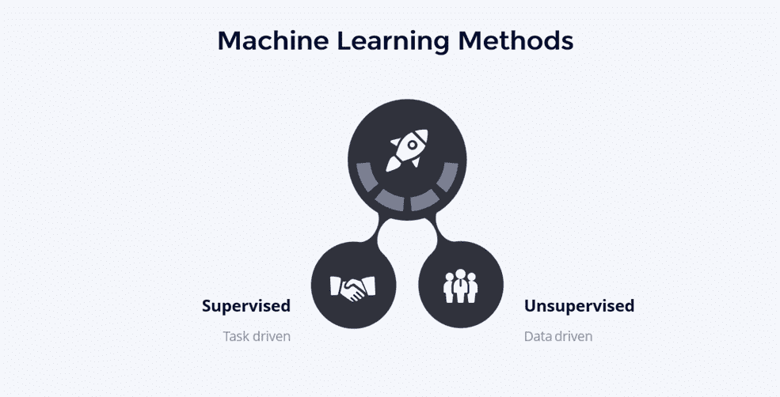
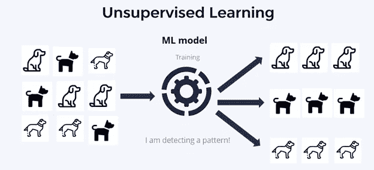
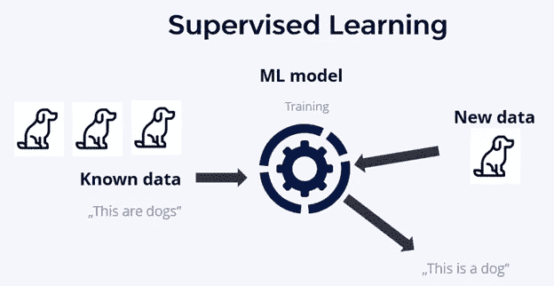
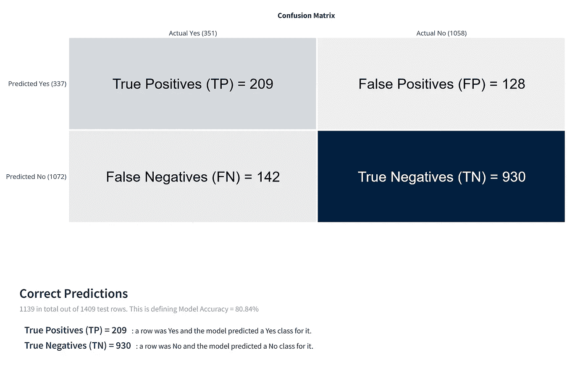

# 什么是机器学习方法？石墨钞票

> 原文：<https://medium.com/geekculture/what-are-machine-learning-methods-graphite-note-ed182d96adfc?source=collection_archive---------22----------------------->

## 除非你一直生活在岩石下，否则你可能在某个时候听说过机器学习。那么，什么是机器学习方法呢？这一强大的数据科学工具已经帮助分析师、数据科学家和企业主做出准确的预测，对数据点进行排序，并找到信息中的模式。

虽然这种概述本身听起来令人印象深刻，但它只是提供了机器学习为人类同行所做的一瞥。

好奇想了解更多关于 ML 的工作原理吗？在本文中，我们将带您了解关于机器学习的所有知识。

Image by the author: What are machine learning methods?

# 什么是机器学习？

[机器学习](https://www.ibm.com/cloud/learn/machine-learning) (ML)是计算机科学和人工智能的联姻。这是一项使用计算机算法进行的研究，随着时间的推移不断改进。它可以应用于各种领域，从网络安全到语音识别。

# 机器学习是如何工作的？

如果你想了解 ML 是如何工作的，心理学是一个很好的地方。[亚伯拉罕·卡普兰](https://oac.cdlib.org/findaid/ark:/13030/c86q1z11/entire_text/)曾经说过，“给一个小男孩一把锤子，他会发现他遇到的一切都需要敲打。”这句话完美地展示了机器学习背后的驱动力。

当一台计算机被设置为学习某种东西时，它的算法将重复测试几个变量，直到计算机找到可行的解决方案。它测试的变量越多，它可以与其结果进行比较的数据就越多。它越频繁地比较其结果，机器学习就越快找到解决方案。这是一个简单而有效的过程，在现实生活中无时无刻不在发生。

# 机器学习方法

机器学习可以分为三个主要类别:无监督、监督和半监督。

# 无监督学习

通过无监督学习，计算机从收集的数据中得出结论，而无需任何外部来源告诉它这些结论应该是什么。

这种类型的学习有利于分析目的，但它的发展是有限的，因为没有什么可以与之比较。此外，因为你提供的是未标记的、仅输入的数据，所以没有真正的方法来衡量结果的[准确性。](https://www.guavus.com/technical-blog/unsupervised-machine-learning-validation-techniques/)

Image by the author: unsupervised learning

无监督学习在机器学习中有其一席之地，但它通常用于探索性分析或生成数据，这些数据后来成为其他分析的输入。

例如，如果您正在寻找消费者消费习惯的模式，您可以对原始购买数据执行无监督学习。这样做可以让你发现趋势，预测你的消费者可能会有什么其他的消费习惯。

# 监督学习

另一方面，监督学习提供了一种人类指导的分析。人类告诉计算机哪些数据点是相关的，哪些是不相关的。假设你在寻找消费者消费习惯的模式。在这种情况下，你可以对原始购买数据进行监督学习，这样计算机就可以告诉你，例如，购买花生酱的人也倾向于购买果冻。

Image by the author: supervised learning

作者图片:监督学习

监督学习比非监督学习更有可能产生准确的结果，因为它依赖于人的输入而不仅仅是观察。你甚至可以用它来做预测和采取纠正措施(如果必要的话。)

例如，如果一家公司有一个休眠客户，他们可以对数据进行监督学习，以预测该客户停止购买的可能性有多大。这可能有助于公司识别有流失危险的用户，从而给他们时间来实施留住他们的策略。

# 半监督学习

当无监督学习和监督学习结合在一起时，你就得到半监督学习。像监督学习一样，它使用人类指导的分析。然而，它也允许计算机根据其观察得出结论。

无监督学习是输入数据的被动收集。相比之下，半监督学习是输入和观察数据的混合。这种类型的机器学习使用一种称为聚类的过程来分离相关和不相关的数据。

例如，您可以使用无监督学习来寻找电子邮件数据中的模式。然后，您可以使用监督学习来确定这些模式中哪些是相关的，哪些是不相关的。然后，您可以使用半监督学习将相关模式聚集在一起，并一次检查一个。

这种机器学习非常强大，因为它允许同时和整体地检查多种类型的数据。

# 机器学习的应用

以下是一些很容易回答的问题:

1.  从现在起的 6 个月内我们会有多少收入？
2.  为了满足需求，我们明天或 30 天后应该储备多少库存？
3.  我们的产品推广效果如何？我们能从另一个未来的晋升中期待什么？
4.  想找到花了很多钱的次品客户。
5.  我最重要的产品或客户是什么，给我带来最多收入的“少数关键人物”(？)
6.  谁将取消我的订阅，为什么？
7.  哪台机器很快会出故障？
8.  这是欺诈交易吗？
9.  对我的产品进行客户细分的最佳方式是什么？
10.  我的哪个潜在客户会转变？

Image by the author: [Graphite Note](https://graphite-note.com/) churn analysis

以下是机器学习的一些可能应用:

# 预测分析

[预测分析](https://www.bmc.com/blogs/machine-learning-vs-predictive-analytics/#:~:text=Both%20machine%20learning%20and%20predictive,likelihood%20of%20a%20future%20outcome.)使用机器学习来开发可以使用实时数据预测结果的算法。例如，销售人员可以使用预测分析来预测哪些客户将会流失。

# 网络安全

机器学习已经成为[网络安全](https://www.securityroundtable.org/the-growing-role-of-machine-learning-in-cybersecurity/#:~:text=With%20machine%20learning%2C%20cybersecurity%20systems,active%20attacks%20in%20real%20time.)的流行工具。为什么？简单。网络犯罪分子不断改变模式和攻击方法，由于机器学习可用于检测数字安全中的异常模式，因此有助于识别和预防网络威胁。

# 声音识别

机器学习可以用来提高[语音识别](https://www.sciencedirect.com/science/article/pii/S221478532102931X)。通过分析人类的语音模式，机器算法可以理解某些单词和短语听起来像什么。

例如，很多人把“超级航母”读错了。当你问 Alexa 你应该怎么说《欢乐满人间》的全名时，它会知道即使你说的是这个词的缩写，它听起来也不是这样。

# 虚拟助手

我们确信你熟悉 Alexa、Siri、谷歌助手。但是你知道吗，所有这些虚拟助手都是由机器学习支持的。所以每次你发出指令——打电话、播放音乐、访问你的电子邮件等等。—你的虚拟助理正在利用机器学习来理解和行动。

# 医学预测和诊断

机器学习正在帮助研究人员开发能够在医疗事件发生前预测它们的人工智能。例如，这可以用来预测中风和心脏病发作。

但它也能够预测哪些人首先可能会生病，这将有助于医生更好地了解哪些人可能需要预防性药物等东西。

# 结论

机器学习正在改变我们开展业务的方式，监视我们的孩子，甚至做出家庭装修的决定。它为你的网飞 feed，你的 CRM 软件，甚至无人驾驶汽车提供动力。如果你现在想知道如何为你的业务利用机器学习，请前往 [Graphite](https://graphite-note.com/) 并查看可用的[无代码机器学习模型](https://graphite-note.com/machine-learning-automl-models)。

*原载于 2022 年 3 月 8 日*[*【https://graphite-note.com】*](https://graphite-note.com/what-are-machine-learning-methods-out-there)*。*