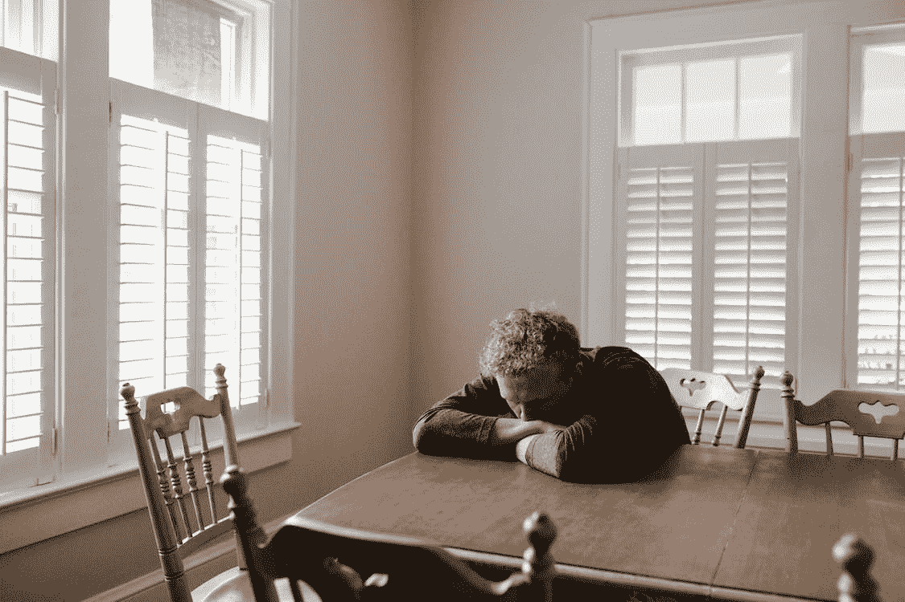

# 在经济衰退来临之前，大多数人都在做什么？

> 原文：<https://medium.com/geekculture/what-are-most-people-doing-before-the-recession-hits-2f6b4763c16f?source=collection_archive---------14----------------------->

让我们考虑一个游戏计划

Photo by [Andrew Neel from Pexels](https://www.pexels.com/photo/man-in-gray-long-sleeve-shirt-sitting-on-brown-wooden-chair-5255996/)

我们都同意，过去几年确实改变了许多人的生活。当新冠肺炎疫情撞击我们时，整个地球都被它震动了。它来得出乎意料，而且是突然的。突然，所有的人和事都停止了。

# 以下是我们看到的影响: