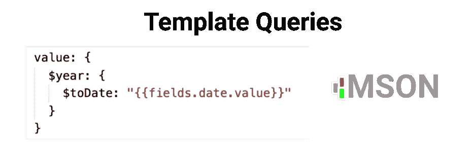

# 什么是 MSON 模板查询？

> 原文：<https://medium.com/geekculture/what-are-mson-template-queries-f6a508adf8ae?source=collection_archive---------9----------------------->

模板查询是用 MongoDB 风格的操作符构造的动态模板。它们允许您用更少的代码定制 MSON 组件，并且非常具有可扩展性。

## 好吧，但是 MSON 到底是什么？