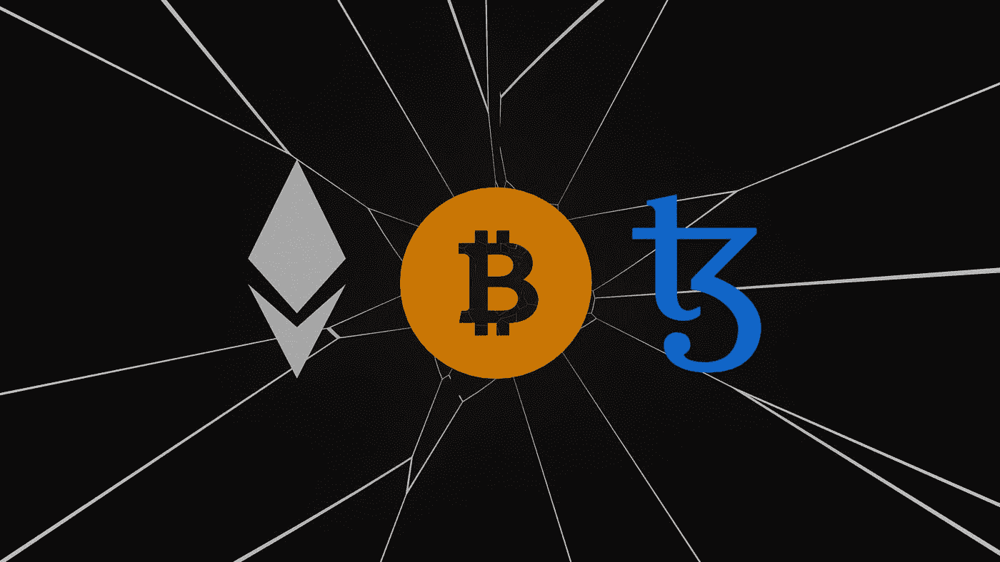

# 什么是非功能性测试，为什么你应该知道它们？

> 原文：<https://medium.com/geekculture/what-are-nfts-and-why-should-you-know-about-them-55ab9f1ad04e?source=collection_archive---------12----------------------->

NFT 是区块链技术中令人兴奋的发展，因为它们允许前所未有的数字稀缺和虚拟财产所有权。

Photo by [Shubham Dhage](https://unsplash.com/@theshubhamdhage?utm_source=medium&utm_medium=referral) on [Unsplash](https://unsplash.com?utm_source=medium&utm_medium=referral)

不可替代令牌(NFT)是一种新型的数字资产，能够创造稀缺的数字商品。