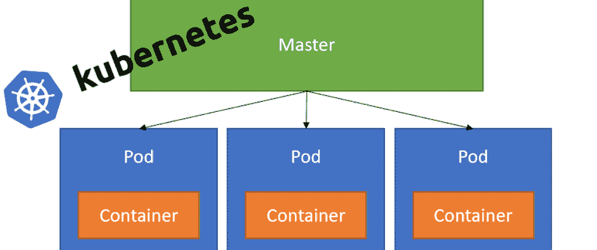
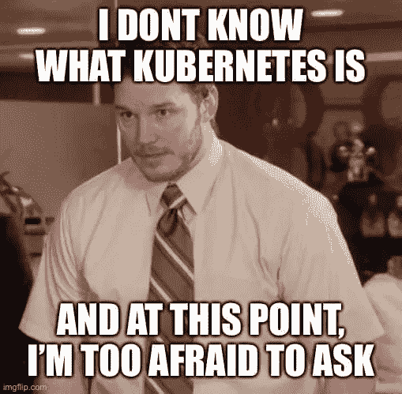
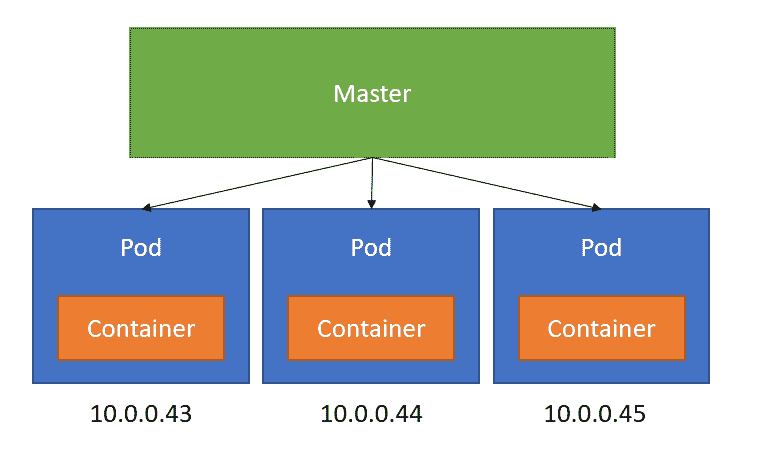
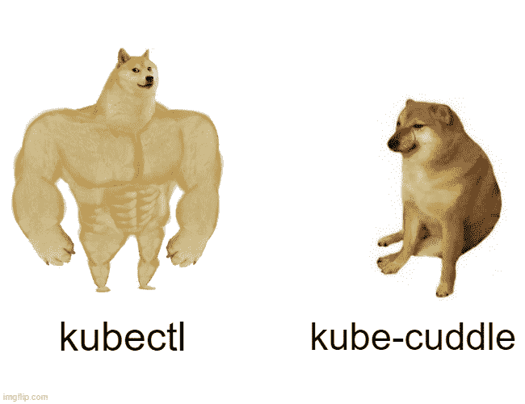

# Kubernetes 里的豆荚是什么？

> 原文：<https://medium.com/geekculture/what-are-pods-in-kubernetes-861beb65e138?source=collection_archive---------4----------------------->

## 什么是 Kubernetes 豆荚？我们如何使用它们来运行我们的容器呢？我们如何使用 kubectl 和 YAML 与他们互动？



在开了很长时间的玩笑说我要学 Kubernetes 之后，我终于在两周前认真地开始学了。我和我的老板聊了聊，他鼓励我学习一些我的领域之外的东西，所以这似乎是一个好机会，让我最终开始认真对待它。



我是一个自学成才的程序员。我的大部分基础知识都来自于晚上在电脑前阅读文档、在线观看教程和实际操作。我一直是一个分享的学习者，这意味着当我学到一些技术时，我喜欢写一篇关于它的博客。部分原因是当我必须再次查找它时，我可以很容易地搜索它，但也是因为我可以与他人分享我所学到的东西，希望它能帮助任何碰巧找到它的人。


我仍然处于我的 Kubernetes 旅程的早期阶段，但是我已经为自己设定了一个目标，那就是今年获得我的认证 Kubernetes 应用程序开发人员(CKAD)认证。那还有很长的路要走，因为我还在思考一些基本的东西，但是我已经给自己设定了一个目标。

带着这个目标，我的短期目标是理清基本思路，创建一系列涵盖每个主题的博客帖子。

介绍完毕后，让我们开始讨论第一个主题，豆荚！

在这篇博文中，我们将讨论:

*   什么是豆荚？
*   单集装箱和多集装箱有什么区别？
*   如何在 Kubernetes 中创建 pod？
*   我们如何使用 kubectl 部署我们的 Pods 并与之交互？
*   我们如何确保我们在 Kubernetes 的豆荚是健康的？

# 什么是豆荚？

Pods 是 Kubernetes 对象，是在我们的 Kubernetes 集群中运行容器的基本单元。事实上，豆荚是 Kubernetes 模型中最小的物体。

Kubernetes 使用 pod 来运行我们应用程序的一个实例，一个 pod 代表该应用程序的一个实例。我们可以通过添加更多 Pod 副本来横向扩展我们的应用程序。

Pod 可以包含一个或多个容器作为一个组，这些容器在 Pod 中共享相同的资源(存储、网络资源、名称空间)。Pod 通常与容器有一对一的映射，但是在更高级的情况下，我们可能在一个 Pod 中运行多个容器。

Pods 是短暂的资源，这意味着 Pods 可以在任何时候终止，然后在 Kubernetes 集群中的另一个节点上重新启动。他们活着又死去，但是豆荚永远不会复活。



Pod 容器将共享名称网络命名空间和接口。容器流程需要绑定到 Pod 中的不同端口，并且端口可以由单独容器中的容器重用。Pods 不跨越 Kubernetes 集群中的节点。

# 单集装箱和多集装箱有什么区别？

像我之前提到的，pod 可以包含单个或多个容器。

在 Pod 中运行**单个容器是一个常见的用例。在这里，Pod 充当单个容器的包装，Kubernetes 管理 Pod，而不是直接管理容器。**

我们还可以在一个 Pod 中运行**多个容器**。在这里，Pod 包装了一个由多个容器组成的应用程序，并共享资源。

如果我们需要在一个 Pod 中运行多个容器，建议我们只在容器紧密耦合的情况下这样做。

# 如何在 Kubernetes 中创建 pod？

我们可以使用 YAML 文件在 Kubernetes 中定义 pod。使用这些 YAML 文件，我们可以创建与 Kubernetes API 交互的对象(Pods、名称空间、部署等。).在幕后，kubectl 将我们在 YAML 文件中定义的信息转换成 JSON，从而向 Kubernetes API 发出请求。

我是 YAML 的粉丝，它很容易理解正在发生的事情，并且感谢像 Visual Studio 代码这样的工具中的扩展，它们很容易创建和管理。

我知道压痕会很痛。我使用红帽在 Visual Studio 代码中开发的 [YAML 代码扩展](https://marketplace.visualstudio.com/items?itemName=redhat.vscode-yaml)来帮助我编写我的 YAML 文件。对于 Kubernetes 的 intellisense，我使用了 [Kubernetes 代码扩展](https://marketplace.visualstudio.com/items?itemName=ms-kubernetes-tools.vscode-kubernetes-tools)。

让我们来看看 YAML 对 Kubernetes Pod 的定义示例:

```
apiVersion: v1
kind: Pod
metadata:
  name: nginx-2
  labels:
    name: nginx-2
    env: production
spec:
  containers:
  - name: nginx
    image: nginx
```

让我们把它分解一下。要使用 YAML 创建 Kubernetes 对象，我们需要为以下字段设置值。

**apiVersion** —这定义了我们想要在这个 YAML 文件中使用的 Kubernetes API 版本。你可以在 Kubernetes [这里](https://kubernetes.io/docs/reference/using-api/#api-versioning)阅读更多关于 API 版本的内容。

**种类** —这定义了我们想要创建哪种 Kubernetes 对象。

**元数据** —这是帮助我们唯一识别想要创建的对象的数据。在这里，我们可以为我们的应用程序提供一个名称，并为我们的对象应用标签。

**spec** —这定义了我们想要的或我们的对象的状态。我们用于 spec 的格式。对于我们的 Pod 文件，我们已经提供了关于我们希望在 Pod 上托管的容器的信息。

要查看我们还可以在 Pod YAML 文件中定义什么，【Kubernetes 的这个文档将会帮助您。

# 我们如何使用 kubectl 部署我们的 Pods 并与之交互？

有几种方法可以让我们使用 kubectl 来部署我们 pod 并与之交互！

*等等，kubectl 是什么？*

kubectl，(kube-control，或者有人称之为 kube-cuddle)是 Kubernetes 的命令行工具。它允许我们对 Kubernetes 集群运行命令。



通过 kubectl，我们可以使用 YAML 定义文件创建一个 Pod，如下所示:

```
kubectl apply -f mypod.yaml
```

我们可以像这样列出我们所有的 pod:

```
kubectl get pods
```

我们可以使用 kubectl 对外公开一个容器端口。记住，默认情况下，pod 和容器只能在 Kubernetes 集群中访问。使用 Kubectl，我们可以运行以下命令:

```
kubectl port-forward mypod 8080:80
```

我们也可以删除 pod。我们可以这样直接删除 pod:

```
kubectl delete pod mypod
```

这将导致圆荚体被摧毁和创造。我们还可以删除管理 Pod 的部署(我将在以后的文章中讨论 Kubernetes 部署)，如下所示:

```
kubectl delete deployment mydeployment
```

# 我们如何确保我们在 Kubernetes 的豆荚是健康的？

Kubernetes 依靠探针来确定一个 Pod 是否健康。探针是由 Kubelet 在容器上定期执行的诊断操作。

有三种类型的探头:

*   **活性探测器** —这些探测器用于确定一个 Pod 是否正常运行。如果活跃度探测失败，kubelet 将终止容器，然后容器将根据其定义的策略重新启动(我们可以将这些定义为总是、失败和从不)
*   **准备就绪探测器** —这些用于确定一个 pod 是否应该接收请求。如果探测失败，端点控制器将从所有与该 Pod 匹配的服务的端点中删除该 Pod 的 IP 地址。
*   **启动探针** —用于确定集装箱是否已经启动。如果提供了启动探测，则所有其他探测都将被禁用，直到它成功。

为了执行诊断检查，Kubelet 将调用一个由容器实现的处理程序。这些类型的处理程序是:

*   **执行动作** —这在容器内部执行一个动作
*   **TCP 检查操作** —针对指定端口上的容器 IP 地址执行 TCP 检查。
*   **HTTPGetAction** — HTTP Get 请求针对指定端口和路径上的 Pods IP 地址执行。

这些探针可能导致*成功*、*失败*或*未知*的结果。

# 结论

希望这篇文章已经帮助你理解了 Kubernetes 中 pod 的基础知识！

如果你想更多地了解 Kubernetes 中的 Pods，我可以参考以下资源:

*   【Kubernetes Pod 官方文档
*   [Kubernetes Pod YAML 参考](https://kubernetes.io/docs/reference/kubernetes-api/workload-resources/pod-v1/#PodSpec)
*   [Pod 生命周期](https://kubernetes.io/docs/concepts/workloads/pods/pod-lifecycle/#container-probes)

快乐编码💻👩‍💻👨‍💻