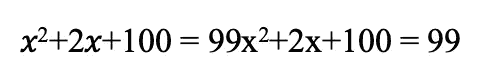
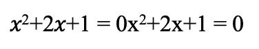
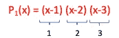
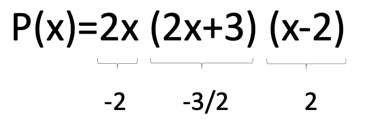
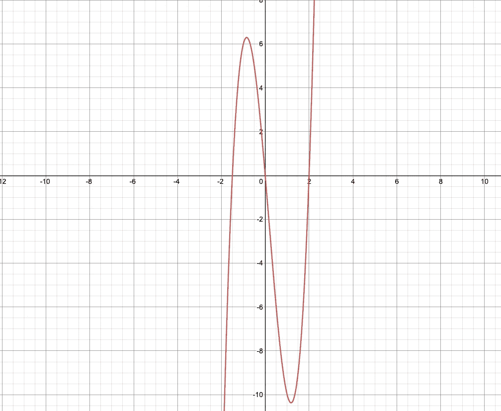

# 什么是多项式零点？(3/5)

> 原文：<https://medium.com/geekculture/what-are-polynomial-zeros-3-5-c7e17e5c4a6f?source=collection_archive---------33----------------------->

什么是多项式的零点？
如果你更喜欢看，那就去 [youtube](https://youtu.be/OBW0r_ir2Sc) 。

我们需要它们只是因为我们经常在物理和其他情况的建模中使用多项式！零非常有用，因为它有助于找到根。那么，为什么要找到根源呢？

好吧，假设我们知道我们有问题，

那么，x 能是什么呢？

如果我们把一边化为零，问题就变得简单多了。

现在，我们可以把它代入二次公式，求出 x。

当然，你可能会说这只适用于二次型。然而，给定任意一个多项式，如果让它等于零，求根就变得容易多了。

所以，回答你的问题，我们实际上不需要零，然而它们真的，**真的很方便**！

如果我们取下面的因式分解多项式:

P1(x) = (x-1)(x-2)(x-3)

好吧，那么 x 的任何值，其中上面的等式=“零”。

因此，任何时候上述 3 个表达式中的任何一个为零，那么自然地，所有 3 个的乘积也将为零。

因式分解后，这变得很容易推导，正如我们可以看到，当 x 是 1，2 或 3，P1(x)的结果将是零。

让我们再举一个例子，我们可以用图表来表示。

从上面我们可以看到，当 x = [-2，-3/2，2]时，我们的 3 个项都为零的点。当我们画出这个多项式时，它在图中也很明显。

我相信这可以清除零，这些可以在下一篇文章中看到，当我们讨论多项式的重数时。

准备好下一篇文章了吗？

[https://Shaun-enslin . medium . com/multiplicity-in-多项式-3-3-55dc7e0a51fb](https://shaun-enslin.medium.com/multiplicity-in-polynomials-3-3-55dc7e0a51fb)