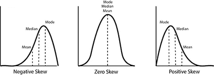
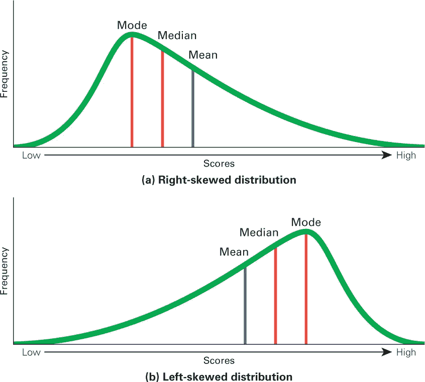
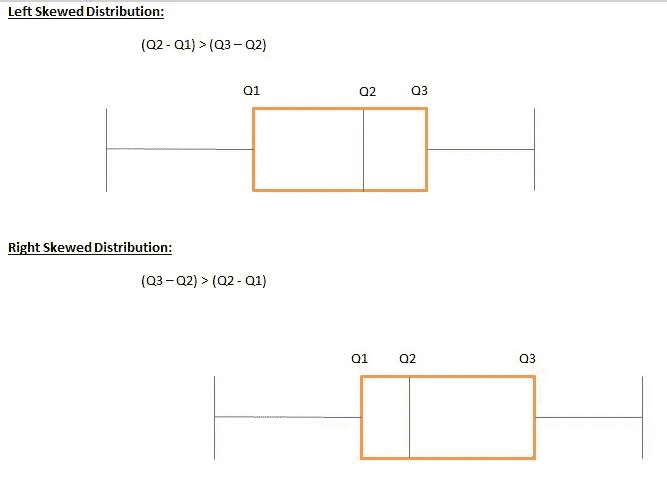

# 什么是右偏和左偏分布？

> 原文：<https://medium.com/geekculture/what-are-right-skewed-and-left-skewed-distributions-a29b3def7598?source=collection_archive---------3----------------------->

统计学面试问题:第二部分

你好，欢迎回到统计学面试问题系列。在本文中，我们将讨论右偏和左偏分布。在转向左右偏态分布之前，了解正态分布是很重要的。

正态分布是钟形分布。如果我们从中间把钟切成两个形状，那么两个部分的形状是一样的，也就是说，左半部分和右半部分是一样的。均值、中值和众数三者都由这个中间点表示。在正态分布中，平均值、中值和众数都相等。正态分布也称为无偏斜或零偏斜或对称分布，因为左右部分彼此对称。

[https://study.com/cimages/multimages/16/skewness9001268247718463390.png](https://study.com/cimages/multimages/16/skewness9001268247718463390.png)

但是，当左右部分不对称时，分布就会出现偏斜。偏斜度描述了数据的形状。要知道偏斜度，看分布的形状就知道分布的哪一边有长尾。

问题:解释右偏和左偏的分布。与正常的对称钟形相比，这些情况下的平均值和中值在哪里？

偏斜度分布有三种类型:

1.  **右偏分布:**

当分布有一条向右的长尾时，就称为右偏或正偏分布。在右偏分布中，数据点朝右尾的集中程度大于左尾。

**右偏态分布:均值>中位数>模式。**

[https://www.macmillanhighered.com/BrainHoney/Resource/22292/digital_first_content/trunk/test/griggs4e/asset/ch01/c01_fig05.jpg](https://www.macmillanhighered.com/BrainHoney/Resource/22292/digital_first_content/trunk/test/griggs4e/asset/ch01/c01_fig05.jpg)

2.**左偏分布:**

当分布有一条向左的长尾时，这就是所谓的左偏或负偏分布。在负偏态分布中，数据点向左尾的集中程度大于右尾。

**在左偏态分布中:众数>中位数>均值**

3.**零偏态分布:**

当分布的左侧与右侧对称时，它被称为零偏斜或正态分布。在零偏态分布中，数据点向左尾的集中程度与向右尾的集中程度相同。

**在零偏态分布中:众数=中位数=均值**

## 一些额外的要点:盒须图的偏斜度

盒须图是一种显示五个数字汇总(Q0、Q1、Q2、Q3、Q4)数据的图表，其中包括一个集中趋势中位数 Q2 的测量值。

分布的偏斜度可以通过许多不同的方法来确定。使用四分位数是这样做的一种方法。

如果(Q 2 -Q 1) > (Q 3 -Q 2)，我们可以说一个分布是左偏的，反之(Q 2 -Q 1) < (Q 3 - Q 2)表示一个分布是右偏的。

记住如果左边的矩形比右边的大，那么分布是左偏的，如果右边的矩形比左边的大，那么分布是右偏的，这可以帮助你记住这个规则。

**这里有一些粗略的准则，用于计算分布的偏斜度:** —确定偏斜度:

1.  如果你收到一个分布图，寻找图的尾部。
2.  如果您收到一个方框图，找到较大的矩形来确定歪斜。
3.  如果只有数据，尝试创建一个箱线图或图形，并使用它来计算偏斜。
4.  如果这些技术都不成功，就通过比较平均值、中值和众数来找出偏差。

我希望你会喜欢这篇文章。感谢您抽出宝贵的时间阅读这篇文章。如果你喜欢这篇文章，那就给它一个掌声，发表评论，并在 medium 上关注我，继续关注下一篇文章。