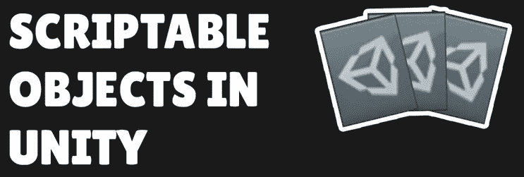
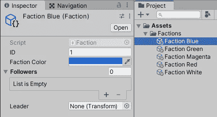
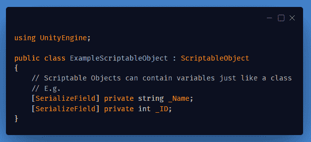
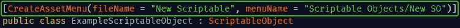
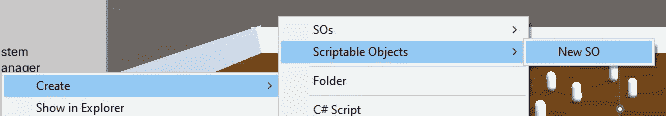
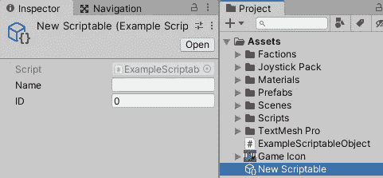

# Unity 中的可脚本化对象是什么？

> 原文：<https://medium.com/geekculture/what-are-scriptable-objects-in-unity-1fbbf2aae2bc?source=collection_archive---------6----------------------->

## 可脚本化的对象是 Unity 的一大特色。它们允许存储独立于游戏对象、单一行为、场景和任何类型的保存文件的数据。

Image from Boundfox Studios — Youtube

> 可编写脚本的对象是一个数据容器，可以用来保存大量数据，独立于类实例。— Unity 文档

*可脚本化对象*的主要用例有:

*   在编辑器会话期间保存和存储数据。
*   将数据作为资产保存在项目中，以便在运行时使用。

Example Scriptable Object

## 编写可脚本化对象的代码:

一个**可脚本化的对象**的编写类似于普通的*单行为*。但是，它必须继承自 ***UnityEngine。ScriptableObject*** 基类。

您也可以选择添加***CreateAssetMenu*****属性**。通过在*创建*菜单中添加一个条目(在**项目**面板中*右键单击*)，使得创建 SO 实例更加容易。

**Right-click/Create/**The string specified for “**menuName**” in the **Attribute**

The new **Scriptable Object** is created in the **Project** files, and you can set the variables by selecting it