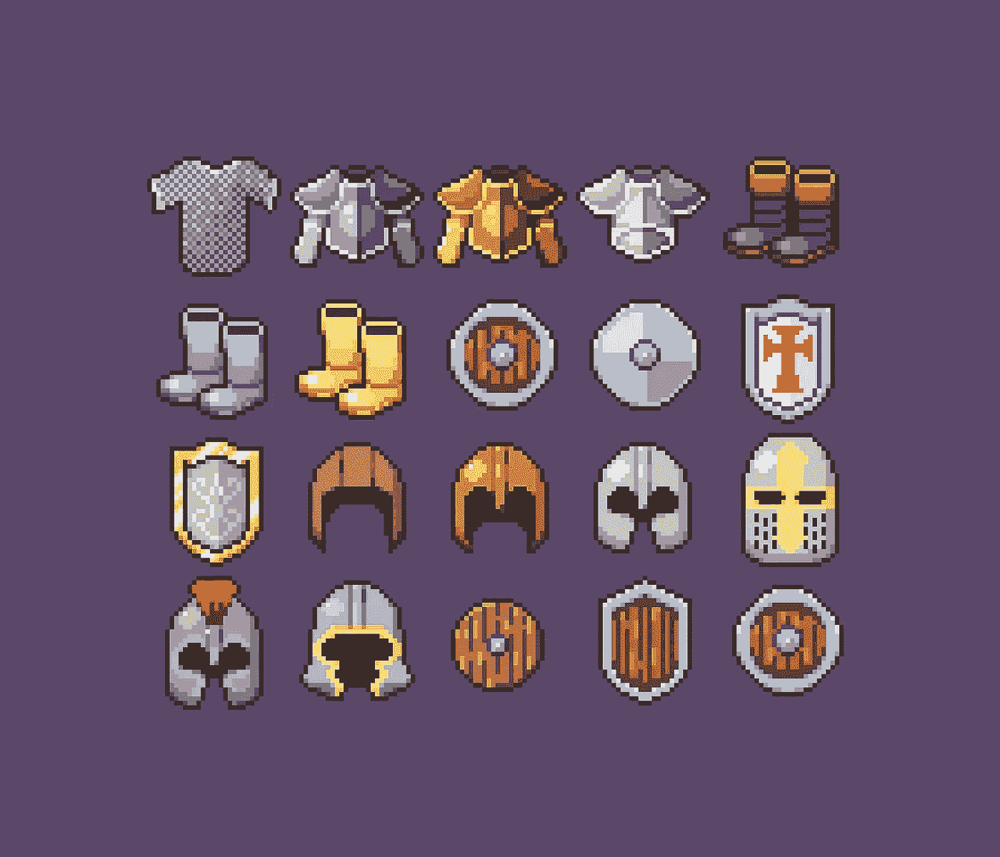

# 有哪些减少认知负荷的健康小贴士？

> 原文：<https://medium.com/geekculture/what-are-some-healthy-tips-to-reduce-cognitive-load-4f91b695a3cb?source=collection_archive---------22----------------------->

## 启发式是我们人类在日常生活中用来做决定和解决问题的快捷方式

如果你问一位国际象棋大师为什么一步棋被认为是好的，他们可能会给你一堆支持最佳决定的理由。