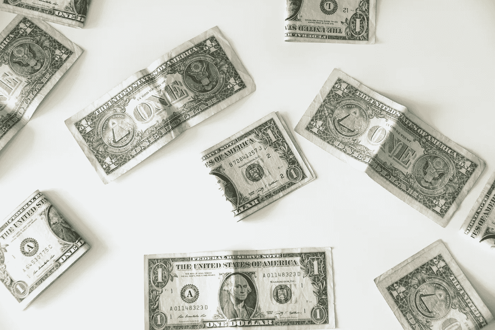

# 如果有一些闲钱，有哪些高风险投资可以考虑？

> 原文：<https://medium.com/geekculture/what-are-some-high-risk-investments-to-consider-if-you-have-some-spare-cash-95f23f596d38?source=collection_archive---------27----------------------->

Photo by [Emilio Takas](https://unsplash.com/@emiliotakas?utm_source=unsplash&utm_medium=referral&utm_content=creditCopyText) on [Unsplash](https://unsplash.com/s/photos/money-exchanging-hands?utm_source=unsplash&utm_medium=referral&utm_content=creditCopyText)

你可能听说过高风险投资策略，当你想建立自己的投资组合时。这些类型的策略通常包括投资涉及高风险投资的产品。

对大多数人来说，这些高风险投资的高回报率和增长率可能非常诱人。俗话说…