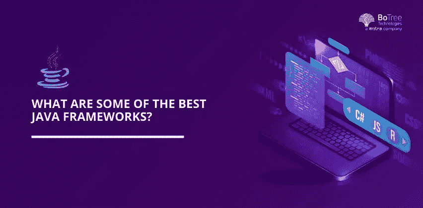

# 2022 年最好的 Java Web 应用框架有哪些？

> 原文：<https://medium.com/geekculture/what-are-some-of-the-best-java-web-application-frameworks-in-2022-a8b03224b002?source=collection_archive---------12----------------------->

你知道超过 5000 万个网站，包括一些最著名的如谷歌、LinkedIn、易贝、亚马逊和 Stack Overflow，都是由哪种语言组成的吗？这个回应不是别的，正是最著名的 Java web 开发。

Java 刚刚迎来了它的 25 周年纪念日，但与此同时，它以“旧如金”的品质统治着产品业务。 [Java 开发服务](https://www.botreetechnologies.com/java-development-company)支持在 Android、分布式计算、大数据和机器学习项目上创建各种应用。然而，就 web 开发而言，对于任何学位的工程师来说，Java 都是理想的选择。

要创建一个 Java 应用程序，框架是必不可少的。各种各样的 Java 框架都在寻找，但是都没有提供主要的解决方案；因此，组织倾向于挑选合适的和最好的。事实上，在为应用程序选择最佳框架时，大多数组织都会感到困惑，正因为如此，他们无法做出正确合理的选择。

本文将重点介绍 Java web 应用程序开发的一些最佳框架。它将强调每个框架的不同特性以及它在开发过程中的应用。

> ***阅读更多:*** [***现实世界中十大流行 Java 应用实例***](https://www.botreetechnologies.com/blog/java-applications-examples/)

# 顶级 Java Web 应用程序开发框架

尽管事实上有许多基于 Java 的框架，但这里有一些经常使用的各种框架——web 应用程序、网络应用程序、日志记录、测试、ORM 等等。请注意，其中每一种都有自己的优势，并且最适合各种业务用例。我们不能说哪个更好，因为它们在不同的情况下都很好。

1.  **弹簧**

*   Spring 超越了 web 框架。这是一个基于 Java 的完整的编程模型，从 Spring Boot 开始，它是一种用无关紧要的设计和不需要应用服务器就能使 Spring 应用程序就绪的方法。
*   与之相反的是 Spring Cloud，它是各种部件的混合体，允许设计人员开发坚固可靠的云本地应用程序，这些应用程序影响了微服务工程等最新的分散设计，这两种模型融合了应用程序安全性和集群处理。

**2。Java 服务器面临**

*   它是从根本上用于 Java 开发的基于 Java 的 web 应用框架。甲骨文的创新跟上了 JSF 的步伐，主要是重新安排 JavaServer 应用程序的用户界面。
*   该框架的基本目标是优化不同的客户端开发，突出 Java web 开发服务中的展示层。

**3。瓦丁**

*   Vaadin 是一个 web 应用程序框架，用于简化 Java 开发。提供[软件开发服务的公司](https://www.botreetechnologies.com/software-development-company)使用 Vaadin，因为它使工程师能够创建高质量的应用程序。这个框架的一个主要好处是它在客户机和服务器之间的平滑通信。Vaadin 允许从 Java 虚拟机直接访问 DOM。
*   Vaadin 流是一种轻量级结构，处理服务器和客户端之间的通信。Vaadin 允许您将 Vaadin 部件合并到您正在使用的任何 Java 软件开发服务 IDE 中。

**4。支柱**

*   Apache Struts 是 Java 程序员[使用的一个更加强大的 web 应用开源框架。它遵循 MVC(模型-视图-控制器)模型，并扩展了 JSP API。在习惯的 servlet-JSP 方法中，假设一个客户机呈现了一个包含其微妙之处的结构，那么数据就在那个点上进入一个 servlet 进行处理，或者控制转向下一个 JSP(Java Server Pages——在这里可以用 HTML 编写 Java 代码)。](https://www.botreetechnologies.com/blog/guide-to-hiring-java-developers/)
*   它将视图、控制器和模型(信息)分开，并通过设计文档 swaggers config.xml 给出了它们之间的界限。

**5。休眠**

*   Hibernate 是一个可靠的对象关系映射框架，它允许 Java 编程语言更真实地传递社会数据集管理框架。Hibernate 是一个帮助你战胜 Java 顾问面临的交叉挑战的系统。它什么都不保留，意味着应用程序产生/利用的信息应该比传递它的交互更长久。
*   总的来说，当您使用面向对象语言时，产品的连接会发生不协调的情况。举个例子，一个是面向对象的，另一个是数据集相关的，所以他们两个的实用策略是独特的。这经常会引发问题。创造出来的舞台应该朴实无华，与其他语言合拍。Hibernate 为您的企业提供了一次性处理大量令人困惑的问题的能力。

**6。GWT**

*   GWT，或谷歌网络工具包，是谷歌开发的 Java 网络框架。您可以利用它为 web 快速构建 Java 应用程序，因为它允许您编写客户端 Java 代码，并将其作为 JavaScript 传送给程序。
*   GWT(被称为“gwit”)是一个稳定而全面的 Java 框架。没有什么比 AdWords、AdSense、Blogger 和 Google Wallet 等谷歌产品更能证明这一点了。有了 GWT，你可以创建基于浏览器的应用程序，而无需成为 JavaScript 或响应式设计等前端系统的专家。

**7。Grails**

*   Grails 是一个使用 Groovy 编程语言的 web 应用程序框架。Groovy 是一种面向对象的 Java 语言，专注于提升设计者的效率。它的代码对 Java 是可行的，并且它被收集成 JVM (Java 虚拟机)字节码。
*   尽管一家[软件开发公司](https://www.botreetechnologies.com/)需要用 Groovy 编写代码，但 Grails 与其他 Java 相关技术配合得非常好，例如，Java 开发工具包、Java EE compartments、Hibernate 或 Spring。在引擎中，Grails 基于 Spring Boot 之上，以利用其效率调节元素，如 Spring 的 reliance infusion。

> ***阅读更多:*** [***为什么 2022 年流行 Java 应用开发？***](https://www.botreetechnologies.com/blog/why-is-java-application-development-popular/)

# 结论

本质上，有许多实用的 Java Web 框架可以用来满足您的需求。没有一个是糟糕的决定——这归结于个人的倾向。简单地知道，一旦你关注一个框架，并开始使用它的亮点，改变到另一个框架被证明不是一个不相关的工作度量。

Java 框架需要专业知识来开发，而 BoTree Technologies 是一家领先的 Java 开发公司，可以帮助企业提供令人惊叹的 Java 解决方案。

[**联系我们**](https://www.botreetechnologies.com/contact) **今天免费咨询。**

*原载于 2022 年 5 月 4 日 https://www.botreetechnologies.com**[*。*](https://www.botreetechnologies.com/blog/what-are-some-of-the-best-java-web-application-frameworks/)*