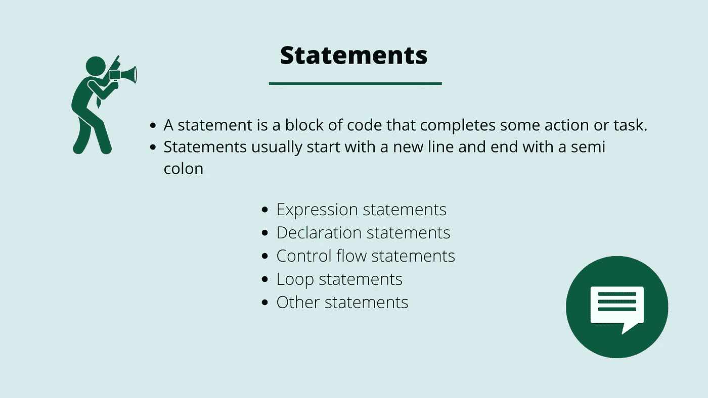

# JavaScript 中有哪些语句？

> 原文：<https://medium.com/geekculture/what-are-statements-in-javascript-6de8a56be3d3?source=collection_archive---------12----------------------->

当我们用母语交流并指示某人为我们做某事时，我们会告诉这个人我们想要达到的目标。在 JavaScript 中，这是语句的本质。

与计算出一个值的表达式相反，例如，整数 *2* 或*字符串*“Hello World”。*语句是完成某个动作或任务的代码块。这是一个…*