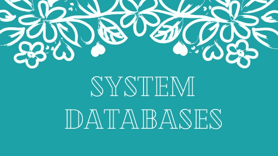
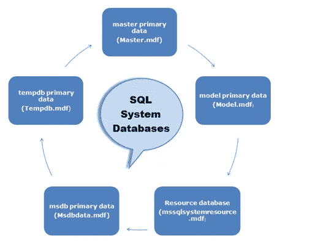

# SQL Server 中的系统数据库是什么？

> 原文：<https://medium.com/geekculture/what-are-system-databases-in-sql-server-2201c7ca5148?source=collection_archive---------9----------------------->

在这里，我们将了解 SQL server 中的系统数据库

System Databases

**简介:**

*   在服务器上安装任何 SQL server 版本的过程中，一些数据库是通过名为“**系统数据库**”的 SQL server 自动创建的。
*   这些数据库对于存储某种信息(如配置设置和所有数据库的相关信息)非常重要。

有五个系统数据库可用:

*   **大师**
*   **型号**
*   **Msdb**
*   **临时数据库**
*   **资源**

system databases in SQL server

**主:**

*   用户数据库的文件位置
*   登录帐户
*   服务器配置设置
*   链接服务器信息
*   启动存储过程

**型号**

*   复制到新数据库中的模板数据库
*   模型中设置的选项将应用于新的数据库
*   用于在服务器每次启动时创建 tempdb
*   用于在服务器每次启动时创建 tempdb

**Msdb**

*   支持 SQL Server 代理
*   SQL Server Management Studio
*   数据库邮件
*   服务经纪人
*   msdb 中提供了历史记录和元数据信息
*   数据库的备份和恢复历史
*   SQL 代理作业的历史记录

临时数据库:

*   tempdb 是 SQL Server 所有用户使用的共享资源
*   Tempdb 用于临时对象、工作表、联机索引操作、游标、表变量和快照隔离版本存储等
*   每次服务器重新启动时都会重新创建它
*   由于 tempdb 是非永久性存储，因此不允许对此数据库进行备份和恢复。

**Reporting Services 数据库:**

*   ReportServer —如果安装了 Reporting Services，则可以使用
*   ReportServerTempDB —如果安装了 Reporting Services，则该选项可用

**复制系统数据库**

*   分发—在配置复制时可用

**资源库**

*   包含所有系统信息的只读隐藏数据库
*   无法备份资源数据库
*   复制粘贴文件即可