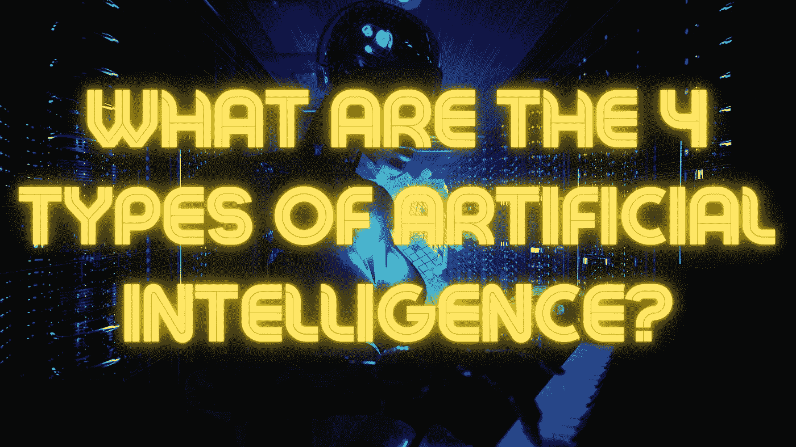

# 人工智能的 4 种类型是什么？

> 原文：<https://medium.com/geekculture/what-are-the-4-types-of-artificial-intelligence-f85ee9eb031f?source=collection_archive---------10----------------------->

Image by the Author from Canva

人工智能(AI)有四种主要类型，即机器或软件表现出的灵活智能行为。这些类型中的每一种都用于特定的应用中，但都旨在创造一些模拟人类思维的东西。

背景资料:AI 背后的关键因素包括机器学习、深度学习和**自然语言处理(NLP)** 。这些技术允许机器在不需要显式编程的情况下随着时间的推移进行学习，接受新情况下的数据并做出相应的反应。

# 监督学习

监督学习是一种机器学习，其中您有用于训练目的的输入变量，以及它们的输出值，也称为“标签”。使用该数据集，模型可以找到输入变量和输出标签之间的模式，因此可以预测未知实例的未来值。

很多人以前使用过监督学习，通常都没有意识到。

> 例如，如果你曾经让你的脸书新闻订阅算法猜测你可能想看哪些帖子，或者在 Instagram 上发布了一张包括你自己和另一个人的标签照片，那么你就利用了监督学习。

在这些情况下，人工智能已经由人类训练来识别数据(帖子或图像)中的某些模式，然后使用这些知识来猜测其他信息(你可能会对哪些帖子/照片感兴趣)。

 [## 使用人工智能写作助手的 10 个最佳实践

### 人工智能是一个很好的写作助手。他们总是紧跟最新潮流，随时准备接受任何挑战

medium.com](/geekculture/10-best-practices-for-using-an-ai-writing-assistant-b0e134da184b) 

# 无监督学习

无监督学习是指没有输出变量，模型在输入数据中发现隐藏的趋势。

这种类型的机器学习通常用于市场细分，并根据用户的行为识别用户群。其工作原理是考虑数据簇，将相似的信息组合在一起。

> 另一个很好的例子是网飞如何根据你之前的选择成功地向你推荐节目和电影——它已经使用无监督学习多年了。

# 半监督学习

在半监督学习中，模型可以访问标记和未标记的输入数据集。然后，它训练自己自动寻找它们之间最准确地预测输出标签的模式。可用的输入数据越多，其预测能力就越强。

有时候，公司不想投入太多时间和金钱来标记所有的训练数据，但仍然希望利用机器学习。半监督学习允许他们在不需要太多标记数据的情况下获得最佳结果。

# 强化学习

强化学习是指代理(模型)在执行任务时获得反馈，并从反馈中学习。这种类型的人工智能可以应用于视频游戏或机器人等领域，其中代理有一个目标，然后在其环境中尝试不同的行动，直到它达到目标。

习得行为:有两种主要类型的强化学习:基于策略和价值函数。

 [## 为什么脸书关闭了人工智能？

### 人工智能(AI)创造了自己的语言，研究人员不得不关闭它。这消息是在…

medium.com](/geekculture/why-did-facebook-shut-down-artificial-intelligence-5dede53ceded) 

基于策略的强化学习是一种算法，通过估计哪种操作最有可能带来好的结果，来确定在给定情况下采取哪种操作。这是基于代理的当前策略，这是一个状态-动作映射，可以随着采取的每个动作而更新。

相比之下，价值函数强化学习根据主体认为其环境中的某些行为有多有价值来调整主体的行为。它通过估计在给定状态下执行特定动作时的预期未来回报来做到这一点。

使用强化学习，您没有任何用于训练目的的标记数据，但这并不意味着它不需要输入信息——只是没有预定义的目标值来进行训练。相反，你从你的环境中提供直接的反馈，让它知道什么可行，什么不可行。一旦代理人学会了使用强化学习，他们就可以将这些知识应用到他们环境中的其他地方。

通过将这 4 种类型的机器学习结合在一起，一个人工智能代理可以从自己的经验和反馈中学习，以在一定的限制下自动完成任务。

> 例如，如果您告诉算法需要完成什么任务以及必须完成的格式，您可以让它完成工作申请表。根据雇主过去的反馈，他们将学习如何写一份简历或求职信，这是最有可能给他们留下深刻印象的信息。

**简而言之:**监督学习是指将带有标记输出值的数据集输入到算法中，以便通过找到它们之间的共同模式来预测未来的未知情况。非监督学习是指数据集未被标记，但算法仍能发现其中隐藏的趋势。半监督学习利用标记和未标记的数据集。强化学习是指代理通过从其环境中获得反馈来学习，以便根据有限的信息优化行为，从而提高准确性来实现目标。