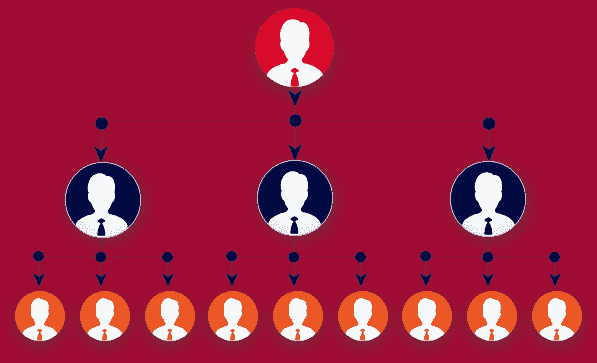
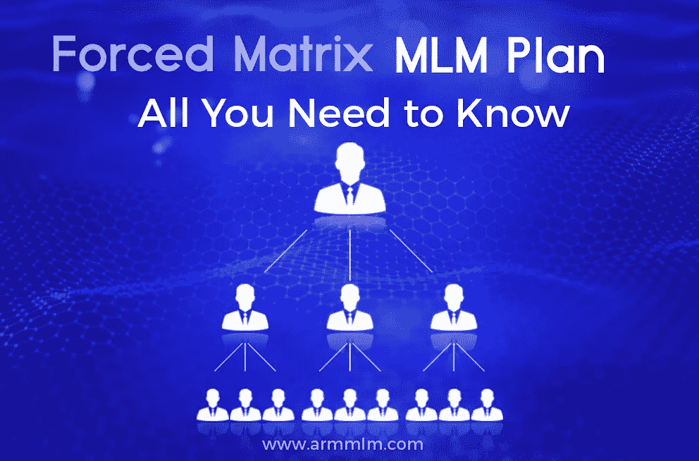

# 强制矩阵 MLM 计划的好处是什么？

> 原文：<https://medium.com/geekculture/what-are-the-benefits-of-the-forced-matrix-mlm-plan-5bc85680689a?source=collection_archive---------4----------------------->

一个[矩阵 MLM 计划](https://www.armmlm.com/forced-matrix-mlm-plan/)，也被称为强制矩阵计划，是最常用和最受欢迎的战略网络营销部门。基本上，它由两个参数组成:宽度和深度，或 M * N。M 通常被认为是方案的宽度，N 是其深度。MLM 经常使用 3*3、2*2、5*7、3*9 和 2*12 矩阵循环。

与其他 MLM 计划不同，它对你在第一关可以赞助的下线数量有限制。MLM 计划的溢出能力是其最独特的方面。因为它鼓励下线成员为该计划注册更多的参与者。

## **矩阵 MLM 计划的好处**

*   矩阵计划有一个简单的方法，很容易计算佣金。
*   这个计划很容易管理下线成员，因为它有一个固定的周期。
*   在广度和深度上的限制使网络营销业务的风险最小化。
*   溢出能力鼓励更多的成员加入这个矩阵计划。
*   一旦他们的下线空缺被填满，经销商就会被提升到一个更高的级别。
*   一个人可以通过不同的方式赚钱，如匹配，赞助，和位置/级别的成员。
*   随着网络参与者数量的增加，该计划提供了几个赚钱的机会。
*   填写完下线成员后，计划发起人可以继续其他领域，如让你的下线主管成为领导。

除了上述福利外，矩阵计划还根据企业的条款和条件提供多种薪酬选择。此外，该软件是准确和方便地跟踪奖金的最佳解决方案。

***阅读*** *:* [*迫阵 MLM 计划——你需要知道的一切*](https://www.armmlmsoftware.com/forced-matrix-mlm-plan/)

在某种程度上， **ARM MLM 软件**将是企业提升整体业绩的绝佳方式。它促进了计算佣金或管理用户数据的挑战。此外，分销商也在不断寻求提高产品销售效率的方法，因此我们的解决方案将是满足您所有需求的最佳选择！