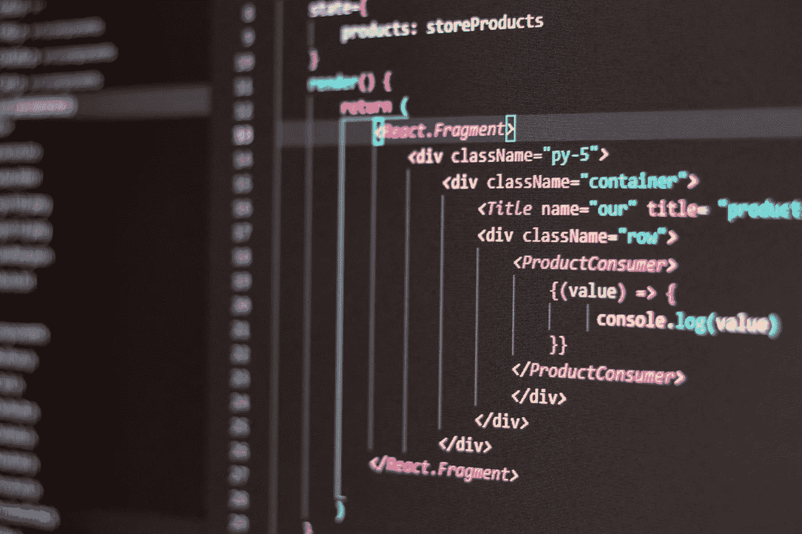
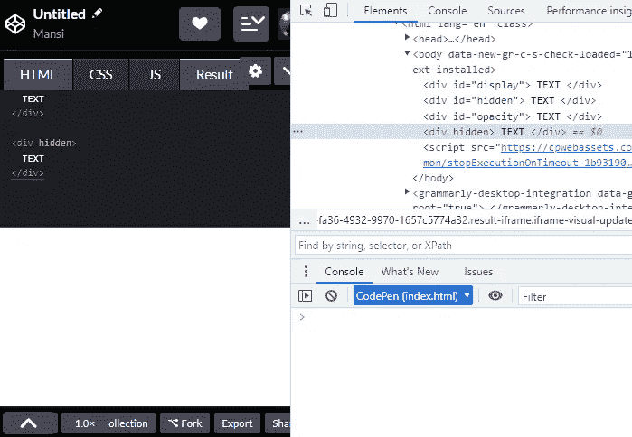
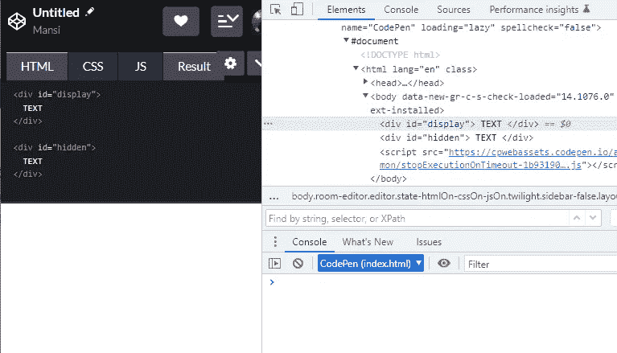
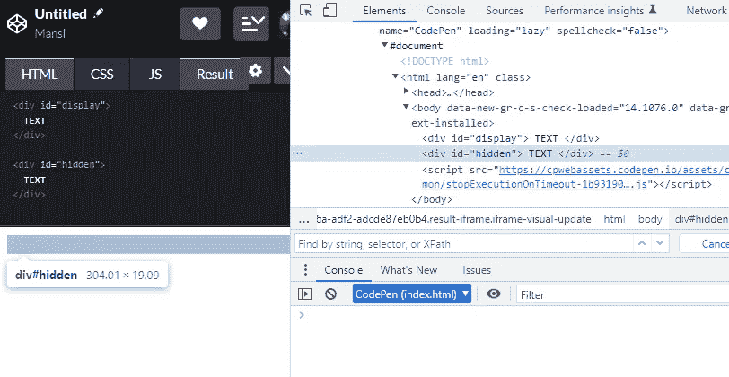
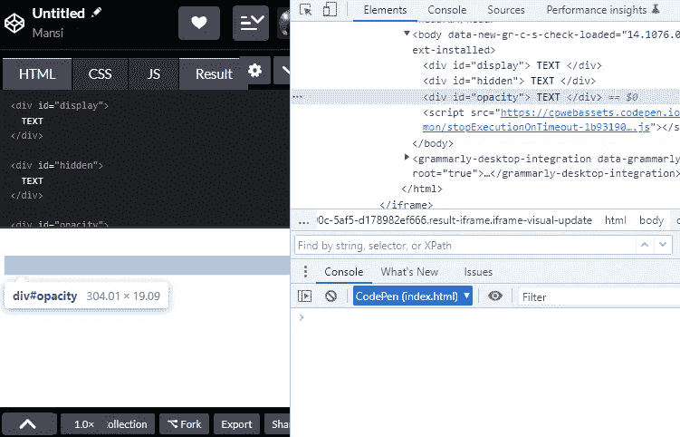

# 在 HTML 和 CSS 中隐藏元素有哪些不同的方法？

> 原文：<https://medium.com/geekculture/what-are-the-different-ways-to-hide-elements-in-html-and-css-52ab1ea302aa?source=collection_archive---------8----------------------->

## 以下是一些使用 HTML 或 CSS 隐藏网页内容的常用方法。

# 以下是一些使用 HTML 或 CSS 隐藏网页内容的常用方法。



[Photo by Antonio Batinić](https://www.pexels.com/photo/black-screen-with-code-4164418/)

## 1.HTML5 属性“隐藏”(推荐)

HTML5 提供了一个属性`hidden`,帮助隐藏你的网页内容，也是屏幕阅读器所避免的。它为你的前端提供了更好的语义。

**示例—**

```
<div hidden>
  <!-- Content Hidden -->
</div>
```



The element is selected in the DOM but does not take up any space in the UI

## 2.CSS 属性“显示:无”

我们可以使用 CSS 属性— `display: none`隐藏前端屏幕的内容。该元素不占用 UI 中的任何空间。



Does not take up space in UI

## 3.CSS 属性“可见性:隐藏”

我们还可以使用 CSS 属性`visibility: hidden`隐藏前端屏幕中的元素。

即使元素是隐藏的，它也会占用 UI 中的空间。



Takes space in UI

## 4.CSS 属性“opacity:0；`

使用 CSS 属性隐藏元素— `opacity; 0`使元素完全透明，从而看起来隐藏在 UI 中。

因为我们只改变了它的透明度，元素仍然占据了它在网页上的空间。



Takes up the space in the UI

## 5.隐藏[可及性树](https://developer.mozilla.org/en-US/docs/Glossary/Accessibility_tree)中的元素

如果有一些元素，比如图像，只是为了美化用户界面，我们可以给 HTML 元素添加一个属性`aria-hidden=true`。该元素将在网页上可见，但会被屏幕阅读器跳过。

让我知道你是否喜欢这篇文章&如果你知道任何其他隐藏网页内容的方法。