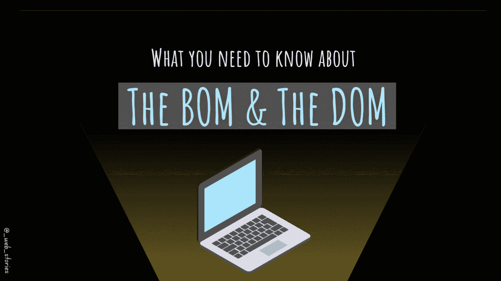

# 什么是 DOM 和 BOM？

> 原文：<https://medium.com/geekculture/what-are-the-dom-and-bom-9fb1a3ed736f?source=collection_archive---------4----------------------->

## 正在打开 BOM 和 DOM 章节…

By FAM

## 你好👋

到目前为止，我们已经完成了*[***HTML***](https://famzil.medium.com/your-html-essentials-69d9b2349355?source=your_stories_page----------------------------------------)*[**CSS**](/geekculture/recap-of-the-css-chapter-ae388d51e564?source=your_stories_page----------------------------------------)和 **JS** 章节中的 [2022 Web 程序](/geekculture/2022-web-program-is-launched-f38a3280af1a)。事情将变得更加令人兴奋，因为我们将在 BOM 和 DOM 上使用所有这些技能！**

**但在此之前，你必须先了解 BOM 和 DOM！**

# **BOM(浏览器对象模型)**