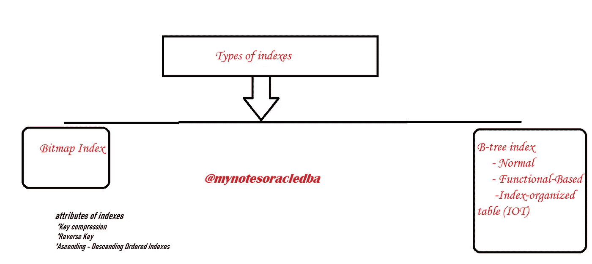
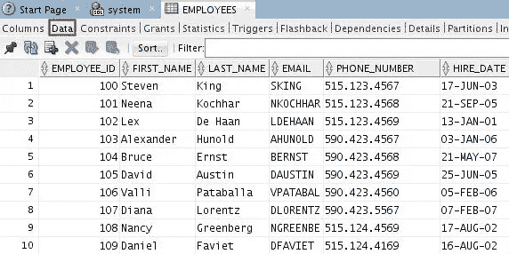
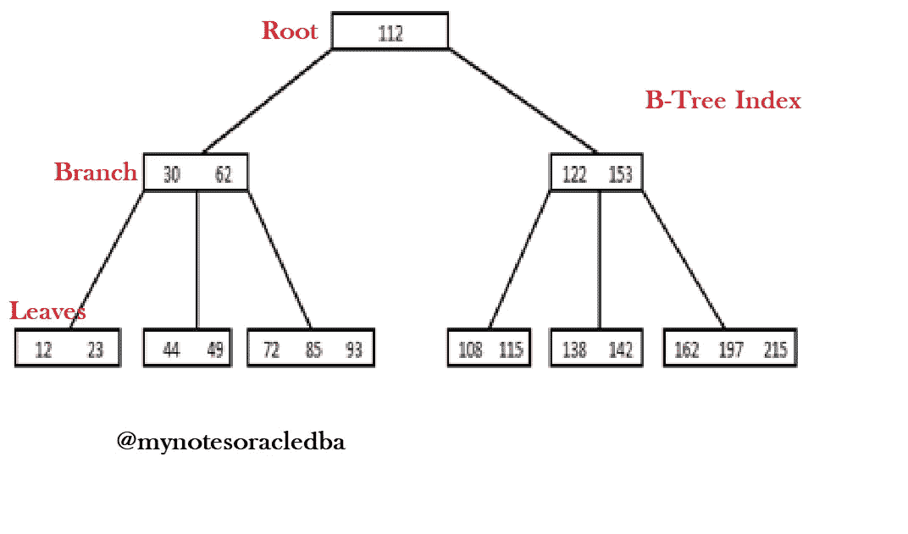
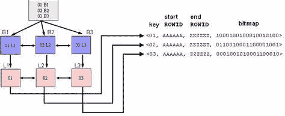

# Oracle 中有哪些索引？采访问答

> 原文：<https://medium.com/geekculture/what-are-the-indexes-in-oracle-interview-q-a-99fec3b47c40?source=collection_archive---------2----------------------->

在这里，我们将详细了解索引及其类型

**有哪些指标？**

*   索引是书籍中用来查找精确数据的对象，也就是快速访问海量数据的对象。
*   索引是对表中的数据进行逻辑索引的数据库对象。
*   它们独立于相关的表。我是说，他们在数据库里有不同的位置。
*   正如我们已经知道的，索引的基本工作是提供对类似索引的数据的快速访问。

**指数类型:**

*   有两种类型的索引，一种是 B 树(二叉树索引)，另一种是位图索引。
*   下图解释了索引的类型

**Index and Types in oracle**

*   在 B 树中，索引可以是普通的、基于函数的或按索引组织的表。

**什么是 B 树索引？**

*   它是 oracle 数据库中的默认索引。当我们编写 CREATE INDEX 时，它会创建 B 树索引。
*   它通常用于 OLTP 类型的数据库。
*   当表中列的选择性较高时，建议使用此选项
*   假设我们有员工的详细信息，它包含大量的行，以防我们查看电子邮件的详细信息。B 树适用于电子邮件列

Employee table

*   如果我们在看一般的列，我们不应该用这个 B 树，因为这个不是那么有选择性的列。
*   它有三种类型

***正常指数**

***基于功能的**

***按索引组织的表格(IOT)**

**什么是正常的 B 树索引？**

*   当我们创建 B 树索引时，如果我们不指定任何内容，它将创建普通的 B 树索引。而且，在大多数情况下，它真的很好，很高效。

**什么是基于函数的索引？**

*   如果我们在函数中使用索引列，那么在执行计划中将不会使用该索引，因此为了解决这个问题，Oracle 创建了**“基于函数的索引”**。
*   基于函数的索引不仅适用于 B 树索引，位图索引也可以是基于函数的索引。
*   如果我们创建一个基于函数的索引，而不是存储列的实际值，那么基于这些列的函数的结果将存储在索引段中。
*   因此，如果我们确定您的表将使用函数和一些列进行查询，我们可以使用基于函数的索引。

**什么是按索引组织的表索引？**

*   有时我们必须查询两到三个表，而且那个表很大，我们有一个索引。
*   这里对于一些列，我们需要使用索引，而不是创建“索引组织的表”
*   按索引组织的表有一个表的主键和几个小列，所以它不用去表，而是直接从索引中获取相关数据。

**B 树指数:**

*   这里的 B 树索引已经在这张图片中解释过了。
*   这个索引有根、枝和叶。
*   在这个例子中，我们从左右两边各有一个分支。
*   第一个分支中的数据小于 100，第二个分支中的数据介于 108 和 215 之间
*   在这里，这个区间被存储在根中，并且基于相关的区间，搜索被定向到相关的分支。这些分支也有相同的机制。

**B-Tree**

*   他们也有他们的子分支的间隔，或者如果他们是最后一个分支，他们有叶子的利益。
*   叶块包含索引的键列和 ROWIDs。
*   一片叶子可以有很多行。并且这些叶相互双重链接，以便它们可以从左边读取一行或从一个叶读取多行，或者它们可以通过使用它们之间的链接从多个叶来回读取多行。

**位图索引:**

*   如果列不是那么有选择性，您可以为该表创建一个位图索引。
*   分支-叶类型是相同的，但是在这种类型的索引中，叶中的数据存储是不同的。
*   树叶不是存储列值及其 ROWID，而是存储一个键、一个起始 ROWID 和一个结束 ROWID。
*   这些是 ROWIDs 的间隔。

**Bit-Map Index**

*   索引下一列是位图列。在这里，它们依次是 1 和 0，1 表示指定行 ID 中的该行有值，0 表示没有值。
*   例如，在这里，第一个 rowid 是这个，它的位图值是 1。这意味着那一行有我们的值。第二位代表第二个 rowid，它为零。因此指定表中的这一行没有值。就这样继续下去。
*   位图索引主要用于数据仓库。特别是对于使用多个表的报表，您可以使用位图连接索引。位图连接索引用于经常连接的多个表。

**指标属性:**

*   按键压缩
*   反向键
*   升序-降序排序索引。即使键压缩压缩了索引。

**按键压缩:**

*   它不像 zip 文件压缩。尤其是当索引是多列索引时，多余的列将使用前缀后缀算法删除。
*   用几句话解释不那么容易，但基本上，它压缩了我们的索引。

**反转键:**

*   这有点复杂
*   它将列值存储为反转值。
*   有时因为表的负载过重，下一个创建会有一些关于创建叶子的争论。如果这个问题越来越严重，您可以创建一个反向索引。
*   该索引仅适用于等式谓词。
*   它不能在索引中搜索某个范围的值。

**升序或降序索引:**

*   它按升序或降序存储列值，以便
*   索引可以很容易地按升序或降序进行范围扫描。

**结论:**

*   这里我们已经看到了索引和类型技术
*   B 树和位图索引工作结构及其索引属性