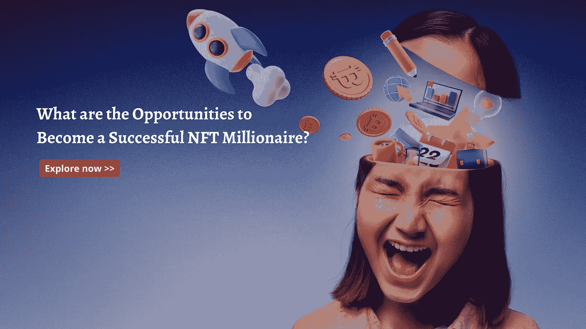

# 成为成功的 NFT 百万富翁有哪些机会？

> 原文：<https://medium.com/geekculture/what-are-the-opportunities-to-become-a-successful-nft-millionaire-3d3d35f4ae41?source=collection_archive---------13----------------------->

NFT 对艺术和音乐销售行业产生了巨大的影响。艺术家或创作者正在寻找最好的平台来销售他们的创作。这是 NFTs 发挥主要作用的地方。

当你的作品卖得好的时候，成为 NFT 的百万富翁是一件容易的事情。在 NFT 产业中，通过适当选择销售平台，NFT 艺术家的创作具有良好的经济价值。

短期内成为百万富翁的机会很多。这篇博客详细介绍了 NFT 市场如何打开新的大门来赚取高收入，以及将收入提升到新高度的各种机会。

## **NFTs:投资少赚高**

在 NFT 开始一段漫长的旅程之前，你需要弄清楚什么类型的艺术品在国家艺术博物馆被创作和出售。创作利基艺术品并在 NFT 销售有助于你以更好的方式获得技能。

例如，如果你是一个喜欢创作和销售数码肖像的艺术家，那么 NFT 域名是最好的选择。选择 NFT 是一个简单的动作，它可以是以下形式的摄影、绘画或涂鸦中的任何一种。

大部分的非功能性汇款都在 10 美元到 500 美元之间。一位艺术家制作了可爱的图片，买家可以得到这些 gif 图片，并在心情不好的时候展示出来。确定 NFT 艺术利基后，你需要决定编辑的种类。

NFT 为销售他们的作品树立了里程碑和新方法。许多艺术家有更好的机会出售自己的作品，并以良好的方式赚取收入。社交媒体是智能互动媒体，它将你的广告和创作个性化。

NFT 已经成为富人和熟人的最新玩法。吸引 587000 美元投资的常见元素之一是 Nyan Cat GIF，这是一项明智的投资。

好了，现在我们来谈谈环境影响。假设投资者计划购买比特币，那么以太坊将很快达到能耗较低的股权证明功能。NFT 是一种独特的数字资产，而 NFTs 是无法用其他东西替代的。

随着 NFT 越来越受欢迎，许多加密营销人员和企业家都渴望测试什么是 NFT 市场和技巧，知道如何在短期内取得成功。

## **快速浏览成功建立 NFT 市场的技巧**

建立 NFT 市场的时机就是现在！建立 NFT 市场的技巧更多。对于密码领域的新企业主来说，了解这些技巧是至关重要的。这些都是尝试过的，它们肯定会让每个人都获得成功。

## **打造 NFT 社区**

社区决定了 NFT 项目的成功程度。建立一个与电影、音乐、艺术和创作等任何领域相关的强大社区，可以让创作者获得更高的收益。

对于潜在的创作者来说，这是一个明智的选择，他们可以创造、销售产品，并获得丰厚的收入。

通过脸书、Twitter 和 telegram 等社交媒体账户开始建立 NFT 社区，极大地吸引了潜在买家和卖家。这是建造 NFT 的最高提示。

推出 NFT 社区的恰当时机。打造品牌形象的努力比较多。建立 NFT 社区的主要步骤如下:

*   搜索优质投资者花时间的地方。
*   联系 NFT 买家和密码爱好者。
*   购买并支持 1/1 NFT 原创艺术品
*   在 twitter 空间上分享想法。

**与有影响力的知名人士和公司合作**

当所有者雇佣“大牌”区块链影响者和社交媒体名人在平台上推广他们的创作时，许多 NFT 项目落入了这个陷阱。选择对你的行动和整个 NFT 空间有信心的合作伙伴。

**催收下降前推销 NFT 的技巧**

加密领域的人们不会等到产品发布和发布的宣传。尽快分享 NFT 是非常重要的。

*   创建社交媒体活动
*   长期愿景的份额
*   出版创作
*   创造游戏，鼓励参与。

**定价提示**

实际上，下面描述了设置价格值的技巧。

*   花时间和你的社区谈谈什么是公平的价格
*   通过考虑您的愿景来提供长期价值
*   为成功的项目设定铸币厂的价格值
*   邀请支持者参与
*   从最初的造币费中赚取 NFTs 的钱。

**用 NFTs 赚钱的最佳方式**

用 NFTs 赚钱取决于最好的方法。其中，scratch 和区块链模式位于顶部。

**NFT 市场从无到有的发展**

你可以从零开始发展 NFT 市场。从头开始设置 NFT 市场的步骤定义如下:

*   确定利基市场
*   记录必需品
*   建立商业模式的原型
*   NFT 市场发展
*   测试和执行
*   部署和性能
*   维护和升级

NFT 市场的成本取决于

*   特征
*   技术堆栈
*   开发商的账户
*   发展的时间
*   第三方 API

**区块链模式下的 NFT 市场发展**

下面列出了在区块链模式下通过 NFTs 赚钱的方法。

**玩即赚(P2E) NFT 游戏**

大多数零售交易商现在都不再使用密码朋克了。作为一个新的企业主在地下室的空间，你需要找到最好的 NFT 来赚钱。你们中的许多人想知道如何产生利润。从 NFT 游戏中赚钱是流行的方法。

丝绸是一个特殊的 NFT 游戏，因为它背后的概念。丝绸有着巨大的潜力，其价格不断上涨。

**造币协议—被动模式投资方式**

如何通过 NFT 赚钱就是铸造你自己的 NFT。这是创业者获取高收入的常用方法。铸造通常是指获取数字资产并将其放入区块链的过程。之后，在 NFT 市场交易可以让你有效地赚钱。

NFT·霍德林

NFT 创收的最佳策略。HODL 代表“抓紧宝贵的生命”。这种方法在散户中很流行。希望通过这种霍德林方法购买加密货币的投资者。

**翻转 NFTs**

这被定义为低买高卖的过程。这会产生正回报。主要过程是找到最好的 NFT，然后翻转它们产生高利润价值。

**NFT 交易**

为了获得高资本收益，NFT 交易类似于 NFTs 霍德林和翻转 NFTs。NFT 交易的投资者经常买卖 NFT，即使只有很小的利润，然后不断重复这个过程。

**结束前的单词**

NFTs 和投资的可靠性通常是混合的。有一点是肯定的，你可以通过 NFT 交易赚很多钱。无论你是创造者还是投资者，你都需要研究哪些项目会达到顶峰，为什么它们会脱颖而出。

你有兴趣把你的生意发展到下一个层次吗？让我们现在就开始开发您的 NFT 市场平台，让领先的 [**NFT 市场开发公司**](https://www.cryptocurrencyscript.com/nft-marketplace-development) 在这方面做得最好。

我希望这个博客涵盖具体的领域，技巧，以及赚取巨额收入的最佳方式。坚持住。了解所有的细节，并在今年开始自己的计划。万事如意！