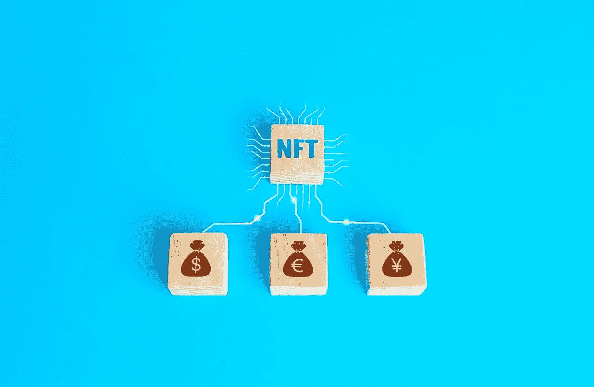

# 非功能性测试在未来的前景如何

> 原文：<https://medium.com/geekculture/what-are-the-prospects-for-nfts-in-the-future-320cd0891dd8?source=collection_archive---------15----------------------->

社交媒体和技术的兴起使得假冒他人的作品并从中获利变得非常容易，而原创者却得不到任何报酬。因为不可能在每次使用时识别创作者并对他们的作品进行补偿，所以 NFTs——一种代表数字文件的独一无二的令牌——就派上了用场。

此外，2021 年第[季度，NFT 的销量已经超出预期。在引入 NFT(不可替代的代币)之前，艺术家们对于在互联网上大量复制和修改他们的原创作品犹豫不决。这很自然，因为艺术家只能从别人的作品中获得很少的利润。](https://www.cnbc.com/2021/04/13/nft-sales-top-2-billion-in-first-quarter-with-interest-from-newcomers.html)

[艺术家毕普](https://twitter.com/beeple)最近震惊了艺术界，他在佳士得以 6900 万美元的价格卖出了一幅[的画，使他成为世界上三大最有价值的在世艺术家之一。音乐家打破 NFTs 的记录最近占据了新闻，Beeple 是一个有抱负的艺术家抓住这个机会的增长趋势的例子。](https://www.theverge.com/2021/3/11/22325054/beeple-christies-nft-sale-cost-everydays-69-million)

# NFT 用于不同的领域

# 虚拟艺术

因为区块链技术可以验证原创性和所有权， [NFTs 现在可以](/swlh/everything-you-need-to-know-about-buying-your-first-nft-ba2c43d7b90)用于数字艺术。例如，多年来，达芬奇的《蒙娜丽莎》被复制了无数次，但没有一件与原作相似。

# 收藏品

其中包括数码卡片套装，比如 125，000 张 NFT 交易卡，上面有从 20 世纪 30 年代到现在威廉·夏特纳私人生活和职业的照片，2020 年，区块链蜡像馆仅用 9 分钟就卖出了这些照片。满足了人们收藏和获取真品卡牌藏品的欲望。

# 音乐

NFTs 也可以用于音乐行业，艺术家可以将他们的音乐符号化。著名摇滚乐队莱昂国王推出了他们的首张 NFT 专辑《当你看到自己》此外，美国说唱歌手 Lil Pump 与 NFT 平台 Sweet 合作，打造了独一无二的 NFT 系列。

除了这些领域，NFT 在许多其他领域也蓬勃发展，如时尚、金融等。

# 日常生活中的 NFT

我们的生活每天都变得越来越虚拟。NFT 是真正的游戏规则改变者，因为它们是独一无二的，不可攻击的，不可分割的。换句话说，它们在数字世界中是最安全的。

一个虚拟的环境和文明，就像我们的物理世界一样，需要法律才能正常运作。例如，关于谁控制什么以及他们用它做什么的规定。例如，只有 NFT 所有者可以在虚拟世界中下载和使用艺术品、工具、程序、仪器、所有权或者用 NFT 标记的任何其他东西。

因此，从当今世界的观点来看，对非技术工人的批评是有道理的。然而，在虚拟环境中，它们仍然很有意义。NFT 让你可以做更多的事情，而不仅仅是出售数字艺术品和古董。有了 NFTs，一个完整的虚拟现实可以出现，以一种独特的方式识别事物并将其与所有者联系起来。

# 疫情对非功能性甲状腺炎的影响

NFT 已经存在了一些年，但是最近的兴趣引发了市场的繁荣。根据支持者的说法，NFT 将继续存在，因为它们更安全，并能利用由新冠肺炎疫情加速的数字革命。虽然狂热分子对 NFT 长期生存能力的看法可能是正确的，但一旦最初的狂热消退，它们将不再是数字市场的重要组成部分。

# 来自 NFTs 的未来期望

关于 NFT 令人兴奋的事情是，它们消除了实现虚拟、数字未来的最重要障碍之一。它们使诸如排他性、稀缺性和独特性等想法成为可能。对价值和金钱的看法已经改变。

人们开始认识到任何东西都可能是有价值的。货币的概念不再受中央集权的控制。国家森林信托已经迎来了[财政分权](https://www.vice.com/en/article/g5gydx/indian-artists-art-nft-cryptocurrency-wazirx)的正式主流化。

对一些人来说，这是关于保持作品的真实性，而对另一些人来说，这是关于快速增长的价格和巨大回报的潜力。无论如何，NFT 为数字内容创作者铺平了道路，允许他们从自己的创作中获得更多成就和收获。对于创作者来说，通过 NFT 获得潜在所有权的前景是光明的。

# 结论

尽管越来越多的人支持和相信非技术人员在 T4 的潜力，但他们的未来仍有很多不确定性。然而，从长远来看，将非金融资产视为一种需要特定规则的新资产类别将是一个好得多的策略。