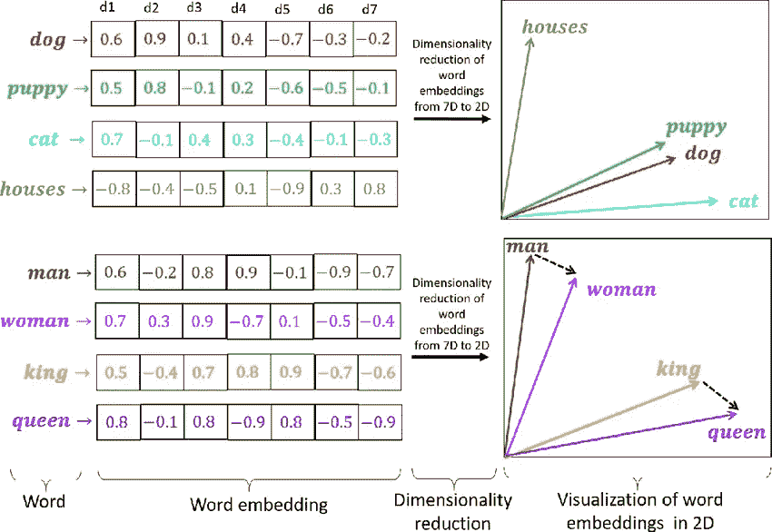
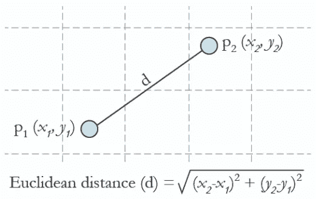
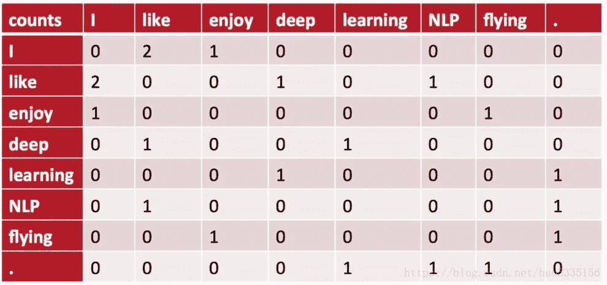
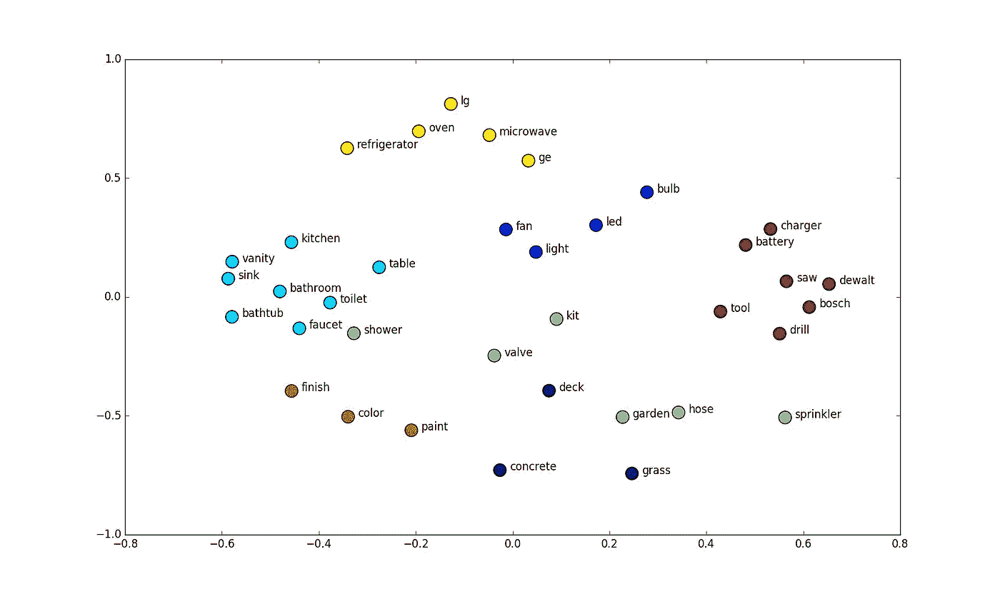
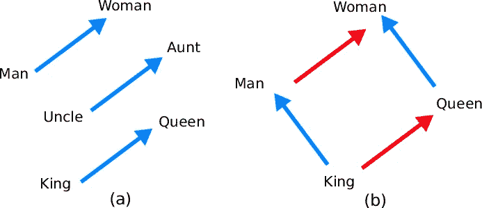
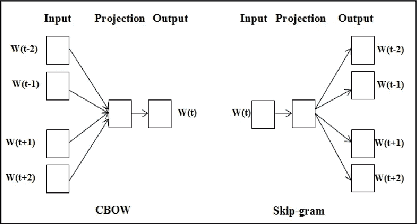
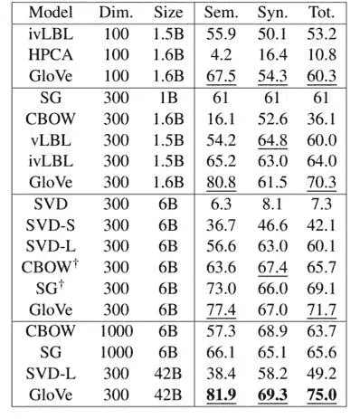

# 什么是单词嵌入？

> 原文：<https://medium.com/geekculture/what-are-word-embeddings-6f6f677b13ce?source=collection_archive---------26----------------------->

## 增强语言理解能力的人工智能简介


Photo by [Robert Lukeman](https://unsplash.com/@robertlukeman?utm_source=medium&utm_medium=referral) on [Unsplash](https://unsplash.com?utm_source=medium&utm_medium=referral)

单词嵌入几乎用于每一个涉及人工智能和人类语言的商业应用。一些[示例应用](https://github.com/SocialQu/Borges/blob/v.0.0.5-UX/whitepaper/1.%20Applications.md)包括搜索引擎、社交媒体推荐算法、语言翻译、语音识别、市场研究、自动交易和语言生成。

单词嵌入是单词含义的数字表示**。它们是基于意义是语境的假设而形成的。也就是说，一个词的意义取决于它的邻居:**


A sliding window to find the word’s neighbors. [1]

> 例如，如果单词“冰”通常出现在“水”的旁边，人们可以推断这两个单词有相似的意思。

单词嵌入被表示为**数学向量**。这种表示法能够用文字进行标准的数学运算，如加法和减法。

这些操作在语言中有着有趣的应用，比如查找同义词、对文档进行分类或推荐内容。此外，可以绘制二维向量来产生对文档或人的语言的视觉理解。



Sample word embeddings and their respective graphical representation.

# 应用程序:查找同义词

查找同义词是单词嵌入最简单的应用之一。同义词是指与另一个单词或短语意思完全相同或几乎相同的单词或短语。因为单词嵌入是单词意义的数字表示。为了找到同义词，我们只需要**找到最接近单词的向量。**


Clusters of words based on their similarity.

寻找同义词的第一步是**选择一个距离度量**来比较两个向量之间的接近度或相似度。最常见的度量之一是欧几里德距离，它是每个向量维度的平方差之和:



Euclidean Distance Calculation

另一个常用的距离度量是**绝对值**。在 TypeScript 中，这是度量绝对值距离的方法:

```
/* Similarity: compute the absolute distance for two vectors */
const similarity = (a:number[], b: number[]) => {
  // Only compute the distance if the vectors have the same length.
  if(a.length !== b.length) return Infinity // Sum the absolute value difference across every dimension. 
  const delta = a.reduce((d, i, idx) => d + Math.abs(i — b[idx]), 0) // Return the distance as a proxy of a vector's similarity.
  return delta
}similarity([3,4], [1,2]) // Returns 4
// Math.abs(3–1) + Math.abs(4–2) = 2+ 2 = 4similarity([3,4], [1,6]) // Also returns 4
// Math.abs(3–1) + Math.abs(4–6) = 2 + 2 = 4// 3D Vectors Distance
similarity([3,4,5], [4,6,8]) // Returns 6
// Math.abs(3–4) + Math.abs(4–6) + Math.abs(5–8) = 1 + 2 + 3 = 6
```

有趣的是，使用单词嵌入也可以找到反义词。唯一的区别是找到最大化单词距离的向量。

# 应用:主题分类


Topics can be labeled using word clusters.

单词嵌入和距离度量对于按主题标记文档也是有用的。该过程从按主题分类的标记文档数据集开始。然后，**将文档内容转换成单词嵌入**并平均每个向量的位置:

```
/* 
 * getCenter: find the average the position of a matrix of 
 * word embeddings to find the "center" of a document. 
 */
export const getCenter = (vectors: number[][]) => {
  const dimensions = vectors[0].length 
  const dimensionArr = [...Array(dimensions)] // Iterate through each dimension.
  const center = dimensionArr.map((_ , idx) => { // Sum the value of the dimension (idx) for each vector.
    const dimensionSum = vectors.reduce((d,i) => d + i[idx], 0)
    const dimensionAvg = dimensionSum/vectors.length // Return the average for each dimension.
    return dimensionAvg
  }) // Return a vector with the same shape, and averaging values.
  return center}getCenter([[1,2], [3,4]]) // Returns [2,3]
// [(1+3)/2, (2+4)/2] = [4/2, 6/2] = [2,3]getCenter([[2,3,3], [4,4,-1], [0,2,4]]) // Returns [2,3,1]
// [(2+4+0)/3, (3+4+2)/3, (3-1+4)/3] = [6/3, 9/3, 6/3] = [2,3,1]
```

> 我们可以把文档的中心看作文档的嵌入:它是内容的数字表示。

下一步是导出主题的中心。在类似的过程中，我们为每个主题找到其文档的平均位置。最后，当我们想要对一个未标记的文档进行分类时，我们可以将其内容转换为向量表示，并使用距离度量来找到最近的主题。

**反思:** *你如何专门使用未标记的数据对文档进行分类？那就是无监督学习。*

# 如何构建单词嵌入？

如前所述，单词嵌入背后的思想是单词的含义与其上下文相关。因此，单词嵌入是**映射频繁接近的单词**的结果。该过程包括 3 个步骤:

1.  **标记化:**在一个语料库上进行拆分、分类、寻找唯一词。
2.  **共现矩阵:**映射彼此接近的单词。
3.  **降维:**压缩共生矩阵的大小。

## 1.标记化

在自然语言处理(NLP)中有一个长期的传统，即**分离单词**，包括词干化和词汇化。为了举例说明我们在拆分文本时需要考虑的一些困难，请考虑以下内容[1]:

*   具有相同含义的单词，包括复数和动词变化。
*   代词、介词和冠词经常出现，但几乎没有额外的意义。
*   **缩写**和复合词如 N.Y.C .或 New York。
*   带有内部连字符或撇号的单词。
*   数字、符号和标点符号，如括号或省略号。
*   拼写错误。

为了简单起见，我们将使用一个简单的正则表达式:

```
/* @function tokenize: split the words in a text or document. */
const tokenize (text:string) => text.match(/(\b[^ $]+\b)/g)
```

随着深度学习的出现，标记化已经部分失去了相关性。因为从理论上来说，**最好的人工智能模型可以自己处理不规则性**，而构建记号化器是一个缓慢的手工过程。但是，使用标记化器或其他输入转换会大大降低训练速度并提高准确性。

## 2.Co- **产状**矩阵

共现矩阵包含两个单词相邻出现的频率。构建矩阵有四个步骤:

1.  用训练数据集中的所有**唯一单词**定义一个集合。
2.  创建一个**方阵**，其中每行和每列代表一个单词。
3.  基于 **N 字窗口**对相邻字的出现次数进行计数。
4.  **将计数**插入矩阵中相应的单元。

以下三个句子的共现矩阵如下所示:

```
1\. I like deep learning.2\. I enjoy flying.3\. I like NLP.
```



上面的例子使用了一个只有一个单词的窗口。为了说明**基于窗口大小的不同**，考虑下面的句子:

```
// For an 3-word window:
const text = ‘I enjoy learning about Natural Language Proccesing.’// enjoy & learning are adyacent.
// enjoy & about are adyacent.
// enjoy & Natural are adyacent.
// enjoy & Language are NOT adyacent.
```

关于如何构建共生矩阵，存在微小的变化。这些可能包括基于紧密程度的不同考虑、不对称窗口以及使用标点符号来确定动态大小的窗口。你可以查看**完整代码，在[故事的资源库](https://github.com/SocialQu/Borges/blob/main/borges/src/views/Home.tsx)中构建一个共生矩阵**。

## 3.降维

理论上，我们已经完成了。我们可以使用共现矩阵的行作为单词嵌入。但是再看看矩阵，注意它有多稀疏。与此相关的有几个问题:

*   向量会占用太多的存储空间。
*   在这些向量之上的训练模型会**慢**。
*   单词之间的关系很难被注意到。

在这种意义上，构建单词嵌入的最后一步是**降低共现矩阵的维度**。一个小的文本语料库可以有数万个独特的单词，但单词嵌入往往小于 1000 个维度。例如，TensorflowJS 中的通用句子编码器向量具有 512 维的大小。

深度学习中有复杂的方法来压缩矩阵。但是为了保持简单，我们将使用**主成分分析** (PCA) 方法:

```
import { PCA } from 'ml-pca'const reduceDimensionality = (dimensions:number) => {
  const pca = new PCA(embeddings) const newSize = {nComponents:dimensions}  
  const reducedVectors = pca.predict(embeddings, newSize) return reducedVectors
}
```

如果我们将单词嵌入维数减少到只有 2，我们可以绘制它们，并且**获得不同单词之间关系的视觉理解**。此图表显示了 60K 单词语料库中选定的单词嵌入:



Sample word-embeddings map.

# 应用:解决类比

加减法单词嵌入有一个有趣且令人惊讶的应用:解决类比。传统上，类比用于衡量学生的推理和语言技能。今天，他们还评估单词嵌入的准确性。考虑以下类比:

国王之于人，犹如王后之于 ______。

解决这个问题的思路是找到这样一个词，即**到**到*皇后*的距离与“人”到“王”的距离相同。这是向量的样子:

```
// Measure the distance between 2 vectors.
const distance = (a:number[], b:number[]) =>
    a.map((i, idx) => i - b[idx]
)// Get the word embedding vectors for king, man and queen.
const king = wordEmbeddings['king']
const man = wordEmbeddings['man']
const queen = wordEmbeddings['queen']// Get the distance between king & man:
const delta = distance(king, man)// The solution is located at the same distance starting from queen.
const solutionLocation = distance(queen, delta)// Find the words embeddings closest to the solution's location.
const analogy = findClosest(solutionLocation)
```

单词嵌入词典可以位于数据库中，也可以从包中加载。第二个选项在 Python 中很常见；第三种选择是使用 TensorflowJS 从浏览器实时计算单词嵌入。为了计算距离，您可以使用我们在同义词一节中得到的相似性函数。而如果你想学习如何寻找最近的向量，你可能会有兴趣阅读教程:**[**如何构建一个文本推荐引擎。**](/geekculture/how-to-develop-a-text-recommendation-engine-99d3b46effdb?sk=508c65e2139bfdfbd8043b2090ee1bd7)**

****视觉上，这是解决类比的方式:****

********

****Graphically, the distance between queen and woman is similar to the distance from king to man.****

# ****应用:检测偏差****

****不幸的是，我们倾向于根据不相关或不公平的属性做出价值判断。人工智能可以帮助自动分析、测量和报告这些偏差。下面的单词云显示了**基于性别的工作偏见**。医疗保健行业的工作更有可能与女性联系在一起，而工程行业的情况则相反:****

********

****Word cloud of biases in jobs based on gender.****

****检测偏差的过程也很简单:找到你要比较的两个概念或两个组的单词嵌入。然后，选择**测量潜在偏差的术语。**最后，计算每个术语的相对距离:两个术语之间的距离越大，偏差越大。****

```
**// Arbitrary threshold to determine if there is a bias.
const biasThreshold = 2 // Evaluate if there is a gener bias for a particular job.
const jobBiasDetection = (job:string) => { // Find the word embeddings of woman, man and the input.
  const woman = wordEmbeddings['woman']
  const man = wordEmbeddings['man']
  const jobEmbedding = wordEmbeddings[job] // Measure the distance of the job to both concepts.
  const distanceToWoman = distance(woman, jobEmbedding)
  const distanceToMan = distance(man, jobEmbedding) // Determine if the job is usually associated to men.
  if(distanceToMan/biasThreshold > distanceToWoman) return true // Determine if the job is usually associated to women.
  if(distanceToWoman/biasThreshold > distanceToMan) return true // There is no bias for the specified job and threshold.
  return false
}**
```

****因为人工智能模型包含了我们作为一个社会持有的偏见，所以它仍然是一个未解决的问题，**如何在没有偏见的情况下训练单词嵌入。**诚邀您在评论中反思和分享:对于如何训练不偏不倚的单词嵌入，您有哪些新颖的想法？正如康德所说:****

> ****"真理是整体判断的谓词，而不是部分表述的谓词."****

# ****高级主题:深度学习****

****构建单词嵌入的过程是基于 20 世纪 80 年代的研究，称为潜在语义分析(LSA)。但是在过去的十年中，它已经发展到包含神经网络。在计算机视觉中成功实现后，**神经网络很快被自然语言处理学术界采用**。****

****四篇研究论文塑造了当前单词嵌入的构建方式:****

1.  ******Word2Vec:** 向量空间中单词表示的高效估计。****
2.  ******GloVe:** 单词表示的全局向量。****
3.  ******ELMO:** 深层语境化的话语表述****
4.  ******BERT:** 用于语言理解的深度双向转换器的预训练****

****在这篇介绍中，我将只关注前两个。****

## ******Word2Vec:根据预测训练的单词嵌入******

****谷歌科学家的论文 Word2Vec 基于这样一个前提，即如果被训练来预测一个单词的出现，单词嵌入会更加准确。该论文介绍了两种互补的神经网络架构来进行预测并随后导出单词嵌入。****

****使用相同的 N 单词窗口概念，Word2Vec 提出了**连续单词包(CBOW)** 架构，根据其邻居预测一个单词。类似地，**跳格结构**试图根据特定单词预测邻居。****

********

****CBOW & Skip-Gram: Novel Neural Network Architectures****

****这篇论文的创新之处还在于用于训练神经网络的数据集的规模。它还引入了第二个数据集，成为衡量新模型准确性的标准。它主要由类比构成，包括两个部分:句法部分和语义部分。****

## ******手套:寻找单词间隐藏的关系******

****仅一年后(2014 年)，由斯坦福研究人员开发。GloVe 融合了两个世界的精华:通过潜在语义分析发现的**微妙的语义关系**和 Word2Vec 预测的语法准确性。****

****GloVe 基于一种强大的直觉，即一个单词的真正含义来源于两个相邻单词出现的预期概率的差异。手套减少了由经常出现的单词产生的噪音。这意味着，如果两个单词相对不常见，但经常相邻出现，则这种特定关系的影响更有助于确定它们的单词嵌入值。****

****GloVe 设计了一个聪明的方法来识别、转换和映射那些“高价值”的关系。因此，先前稀疏的**同现矩阵被转换成密集的矩阵。**在一个漂亮的数学推导中，新矩阵的单元是原始矩阵的行和列之间的点积的结果。****

****通过保持共生矩阵较小，有可能保持训练时间较短。更重要的是，GloVe 被证明是当时唯一一个受益于训练数据集规模增长的模型**(从 60 亿到 420 亿个令牌)。******

********

****GloVe’s state of the art results.****

# ****结论:单词嵌入的未来****

****我在这篇文章的开头提到，单词嵌入渗透到每一个涉及人工智能和人类语言的应用程序中。但未来甚至更光明:我看到单词嵌入的地方与 10 年前移动开发的地方相似。对于企业家和软件开发人员来说，这项技术在未来十年有无限的机会。我将其归因于 4 个主要原因:****

1.  ******开发的容易程度**:与常识相反，将人工智能，尤其是单词嵌入，集成到现有的应用程序中是很容易的。这个领域已经足够**成熟**，可以在不理解其背后的高级数学的情况下使用这项技术。****
2.  ******快速采用**:计算机视觉在过去十年中备受瞩目。但其产品和应用需要专门的硬件，如摄像头和处理器，这对用户的隐私和采用速度提出了挑战。TensorflowJS 使用标准手机或台式机无缝集成 AI-NLP 软件。****
3.  ****本地化:多语言世界创造了有趣的进入壁垒。多个参与者可以利用相同的技术应用服务于不同的本地市场。****
4.  ******成长**:这个领域正在经历重大变革，吸引了全世界最聪明的头脑的关注。就在 2019 年，最先进的模型和突破性创新不断重塑该技术的极限和应用。这方面的例子包括 **BERT 的**研究论文，它极大地促进了迁移学习和 OpenAI 的文本生成 **GPT-3 API。******

****我邀请你思考以下几点:人类语言是一种压缩机制。它使复杂的想法能够快速有效地传递。但是它也有其局限性:当说话时，只传输 39 位信息。相比之下，通过 USB 2.0 传输的信息为 480Mbps。那是 1000 多倍！****

> ****最终，单词嵌入将通过增加我们可以处理的信息量来提高生产率。****

****如果你对这个内容的**说教版本感兴趣，我邀请你访问 [borgez.ml](https://borgez.ml/) 。这是一门在线互动课程，你可以使用这些概念来查找同义词，并使用 TensorflowJS 对文档进行分类。您将训练您的单词嵌入，通过测验验证您的知识，并找到具有有趣见解的图表。******

*****感谢您的阅读！我计划在接下来的几周里写一些关于情感分析、注意力和变形金刚的内容。如果你有兴趣，请考虑给我一个关注和分享这个故事。我祝你有美好的一天，你的掌声将会非常感谢。🙏*****

****真诚地，
圣地亚哥·米****