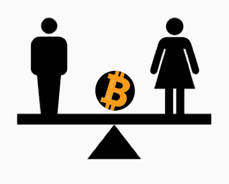

# 对于女性来说，比特币解决了什么，或者没有解决什么

> 原文：<https://medium.com/geekculture/what-bitcoin-fixes-and-doesnt-fix-for-women-da316d1289e8?source=collection_archive---------15----------------------->

# 那我们该怎么办呢？

一个常见的比特币格言是:
*“比特币修复了这一点。”*

这是真的，比特币解决了很多问题。

在女性面临的问题中，比特币解决了什么？还有什么是比特币没有修复，但仍然在其他方面帮助女性的。

# **女性从银行获得的美元较少**

在目前的法定银行系统中，妇女面临歧视。

妇女的商业贷款申请获得批准的比例低于男子的商业贷款。

即使妇女的商业贷款获得批准，妇女拥有的企业也只能获得相应的小额贷款。

但不仅仅是女性拥有的企业。

我个人知道，作为一名年轻女性，你不可能一边兼职工作一边去读研究生，从而获得非常少的抵押贷款(6 万美元)。

你的个人储蓄可以超过贷款金额，但大多数银行会拒绝你，因为你不符合他们的信用标准。

比特币解决了这个问题。

以比特币为资产，你可以用你的比特币来借款。

# **女性更没有银行账户**

全世界没有银行账户的人中有 55%是女性。

没有银行账户的人非常贫穷。

在这些穷人中，女性所占的比例略高。

比特币部分解决了这个问题。

拥有比特币可以为女性提供一个数字银行和价值储存库，并为她们和她们的家庭创造更多财富。

# 女人比男人长寿

平均而言，女性比男性多活 5 年。

年复一年，通货膨胀复合。

由于通货膨胀增加了日常开支，在目前的法定制度下，妇女有额外的五年时间来管理更高的基本生活和医疗保健开支。

如果女性希望保护她们的钱的价值，以便在她们更长的女性生活中持续下去，比特币——作为一种固定的供应限制——有助于解决通胀问题。

# 女性的时间以美元计算价值较低

在美国，对于同样的任务，同样的“工时”，同样的工作，女性一小时时间的价值大约是男性时间的 90%到 95%。

想象一个人在做一份工作…

现在想象一个女人做着同样的工作……平均工资却少了 5%。

这是平均水平——年轻女性认为工资差距较小。

女性一小时的价值随着年龄的增长而下降——女性年龄越大(寿命越长),工资差距就越大。

你可以把它看作是在不同国家之间转账时的汇款费。

和我待在这里。

当人们给在另一个国家的亲戚寄钱时，他们要支付汇款费。有时在 20%到 50%的数量级。

女性支付汇款费——因为她们是女性。这个费用至少是 5%，而且这个费用随着我们年龄的增长而增加。

Kristen Schilt 和 Matthew Wiswall 在《经济分析与政策杂志》上发表的一项研究表明，改变性别的人随后会看到工资上升或下降的趋势，这取决于他们是变成了男人还是女人。

比特币并没有修复这个工资差距，这个性别费用。

然而，拥有比特币会让你得到一笔钱，这笔钱随着时间的推移不断增加，增加的速度超过了每年性别汇款费用的差异。

# 亚马逊不会因为是女人而打折

你当地的商店也不知道。

作为一名女性，你可能会挣得少一些，但在商店里你仍然要付同样的钱。

妇女没有得到性别折扣来抵消性别工资差距。

比特币作为一种持续增长的价值储存手段，并不能解决这个问题。

但拥有比特币有所帮助。

# **女人需要钱，也需要“选择权”**

当你有钱的时候——无论相对比例是多少——你就有了选择。

比特币的大部分大赢家都是男性，许多人都在用自己的金钱和时间做着自己选择的伟大事业。

向贾森·威廉姆斯、阿历克斯·格拉德斯坦、彼得·麦科马克、庞姆以及更多人大声呼喊。

这不是竞争，这是平等的选择。

比特币女人能用比特币和多余的时间做什么？

更多的女性比特币制造者意味着女性手中有更多的钱和资产。

更多的选择。

# **钱走了**

比特币帮助人们——包括女性——带着他们的资产离开他们的国家。

同样，由于金钱的原因，许多女性无法轻易离开充满暴力的婚姻或糟糕的工作环境。

在美国，如果你不做某一份工作，你会面临更少的医疗选择，却要花更多的钱。

比特币作为一种可移动资产和对冲医疗费用上涨的工具，有助于解决这一问题。

# **金钱万能**

人们想在播客上听到谁的声音？

有钱有权有知识的人。

更多拥有大量比特币知识、权力和金钱的女性，更多拥有比特币知识的女性，以及更多女性对播客的看法。

说够了。

# 金钱建议生活

在菲亚特金融服务部门，男性主宰着这个领域，并建议女性应该如何使用自己的精力和辛苦赚来的钱。

比特币不能解决这个问题。但的确如此——在某些方面。

买比特币就行了。就这么简单。

但是听好了，女人们！

**努力理解比特币，并将这些知识传授给其他女性。**

比特币的大部分知识都是男人积累的。不是全部，而是大部分。

Lyns、Alyses、Caitlins、Natalies、Elizabeths、Cathies 和许多其他知识渊博的比特币女性——与男性总数相比，人数仍然很少。

# **女性占潜在比特币用户的一半**

大约一半的世界人口是女性。

当然，我们生活在一个男人拥有大部分法定货币的世界里。

这就是我们对比特币的期望吗？

或者，为了一个更美好的世界，我们希望平等地采用比特币吗？

# **比特币作为女性和男性的解决方案**

比特币中有更多女性，难道不会有助于解决我们所有人——女性和男性——希望比特币解决的许多问题吗？

## **我们所有人** — **男人和女人** — **都在做些什么来解决这个问题？**

# 来源:

*   "小企业贷款状况:聚焦女企业家":[https://www . fundera . com/blog/the-State-of-online-Small-Business-Lending-Q2-2016](https://www.fundera.com/blog/the-state-of-online-small-business-lending-q2-2016)
*   [“世界银行全球金融包容性数据库:衡量 148 个国家的人们——包括穷人、妇女和农村居民——如何储蓄、借贷、支付和管理风险](http://www.worldbank.org/globalfindex)”:【https://globalfindex.worldbank.org】T4
*   [“性别薪酬差距”https://en.wikipedia.org/wiki/Gender_pay_gap#cite_note-2](https://en.wikipedia.org/wiki/Gender_pay_gap#cite_note-2)
*   研究:全球性别薪酬差距已经缩小，但仍然存在[https://www . shrm . org/resources andtools/HR-topics/behavioral-competency/Global-and-cultural-effectiveness/pages/study-Gender-Pay-Gap-narrows-but-Still-existing . aspx](https://www.shrm.org/resourcesandtools/hr-topics/behavioral-competencies/global-and-cultural-effectiveness/pages/study-gender-pay-gap-narrows-but-still-exists.aspx)
*   克里斯汀·席尔特和马修·维斯瓦。[之前和之后:性别转变、人力资本和职场经验](https://www.ilga-europe.org/sites/default/files/before_and_after_-_gender_transitions_human_capital_and_workplace.pdf)。英国工程学院经济分析杂志&政策，第 8 卷，第 1 期。2008.2021 年 3 月 10 日访问。

​​