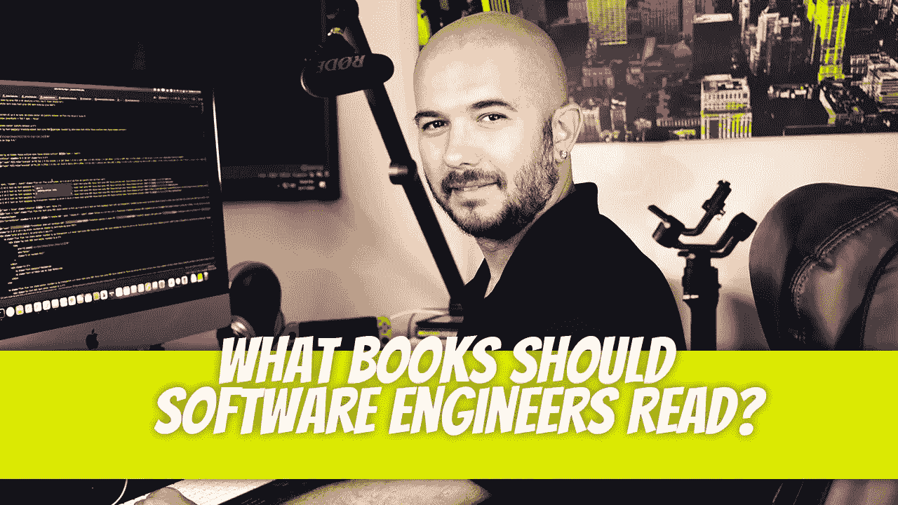

# 软件工程师应该看什么书？

> 原文：<https://medium.com/geekculture/what-books-should-software-engineers-read-d80b4ffc0039?source=collection_archive---------6----------------------->

作为一名软件工程师，你可能对术语“新潮”代码很熟悉，这些术语指的是在过去 10 年中编写的任何类型的代码。但是在花时间在博客和论坛上阅读了关于软件工程的内容后，我注意到一些旧的书籍已经不再流行了。这篇文章将为任何想学习的人介绍一些经典和永恒的书籍…