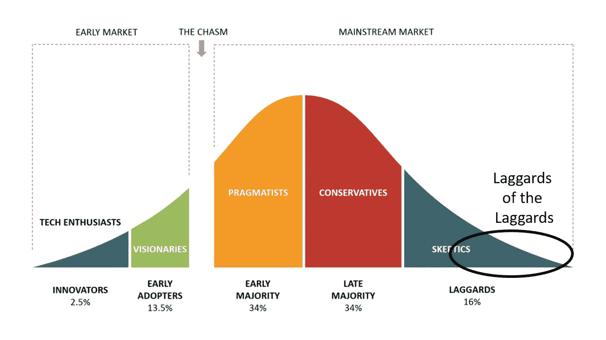

# 一个 50 年前的软件产品能教给现代 SaaS 公司什么？

> 原文：<https://medium.com/geekculture/what-can-a-50-year-old-software-product-teach-modern-saas-companies-7fa07fed0752?source=collection_archive---------52----------------------->

[Technology Adoption Life Cycle](https://www.business-to-you.com/crossing-the-chasm-technology-adoption-life-cycle/)

# 一个 50 年前的软件产品能教给现代 SaaS 公司什么？

软件市场一直在变化。从大型机到迷你电脑到个人电脑到通用 Linux 服务器再到云服务(AWS、google Cloud 等)的市场演变。)，推动了软件技术的发展。正如阿尔多斯·赫胥黎一样