# 在 Choreo 的开发者入口可以做什么？

> 原文：<https://medium.com/geekculture/what-can-you-do-in-the-developer-portal-of-choreo-c7006cf9fefd?source=collection_archive---------59----------------------->

[Choreo](https://wso2.com/choreo/?utm_source=me&utm_medium=link&utm_campaign=me_link_KavishkasMedium_211001) 的 API 开发者门户允许 API 发布者托管和宣传他们的 API，API 消费者可以安全地发现、评估、订阅和使用 API。

在这篇博文中，我们来讨论一下 Choreo 的[开发者门户](https://console.choreo.dev/?utm_source=me&utm_medium=link&utm_campaign=me_link_KavishkaMedium_211001)中的各种特性。

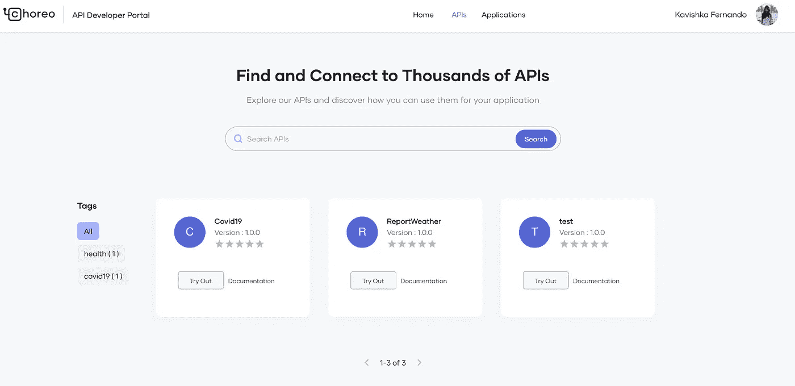

有了 [Choreo 开发者门户](https://console.choreo.dev/?utm_source=me&utm_medium=link&utm_campaign=me_link_KavishkaMedium_211001)你就可以，

1.  试用可用的 API
2.  创建应用程序和订阅 API

**API**

在“API”选项卡下，您可以查看所有可用的 API。您也可以选择通过过滤**标签**来查看 API。你可以查看我在[上的文章，你可以用 Choreo 的 Publisher Portal](/@kavishkafernando/what-can-you-do-in-the-publisher-portal-of-choreo-15558d5b248b)做些什么，看看你如何给你的 API 添加标签。

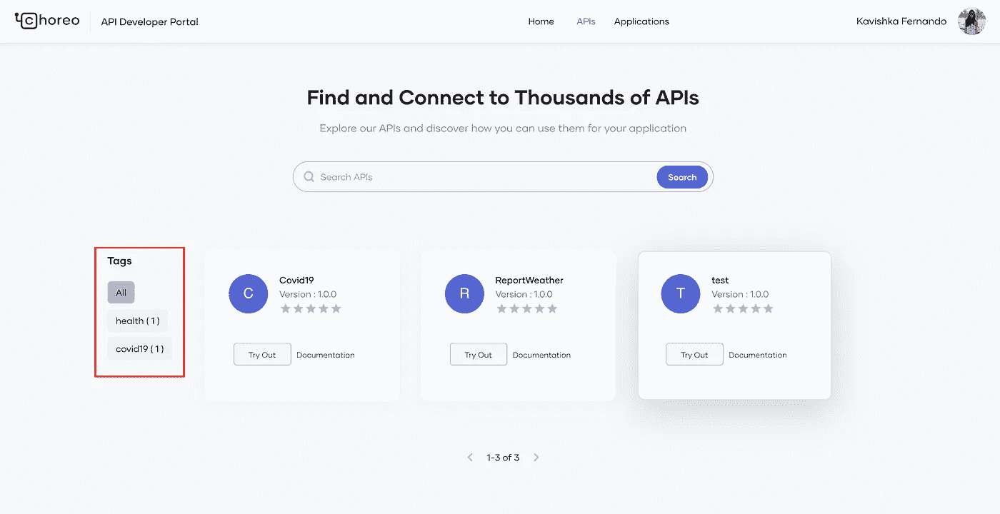

单击 API 后，您将能够，

1.  查看与 API 相关的信息
2.  试用 API
3.  查看文档
4.  下载 SDK
5.  查看合同

1.  **概述** —概述页签显示以下与 API 相关的信息，
    i. **端点**:API 的端点
    ii。**概述**:API 说明
    三。**标签**:API
    iv 的标签。**注释**:可以查看 API 的注释，也可以给 API
    iv 添加注释。**评级**:可以对 API 进行评级。
    五、**文档**:显示与 APi 相关的文档。

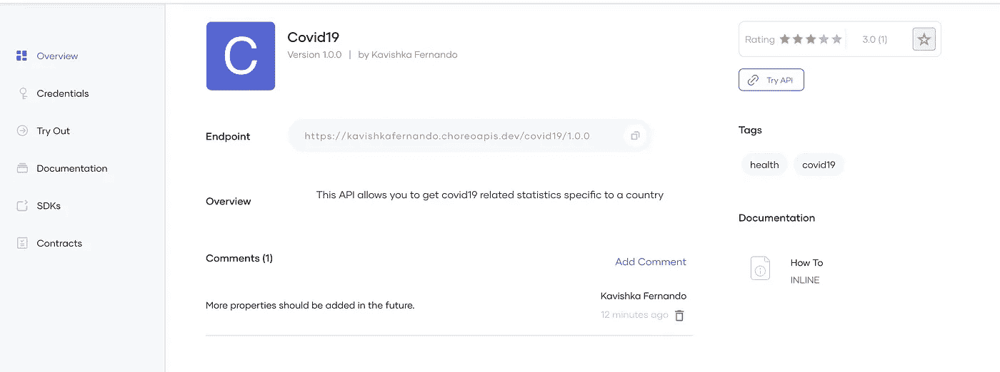

2.**凭证** —该选项卡允许您生成消费者密钥和消费者机密，并生成访问令牌以调用 API。

您可以选择自己喜欢的授权类型，并点击**生成凭证**。

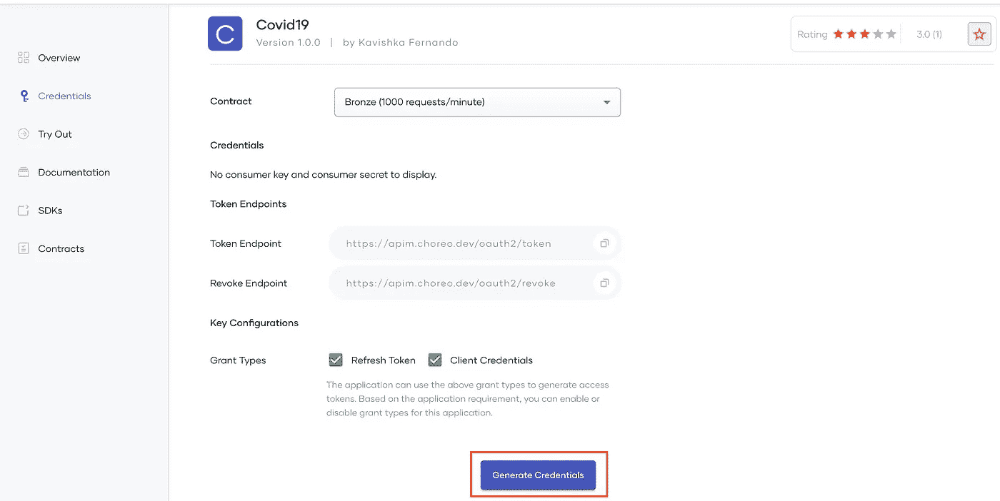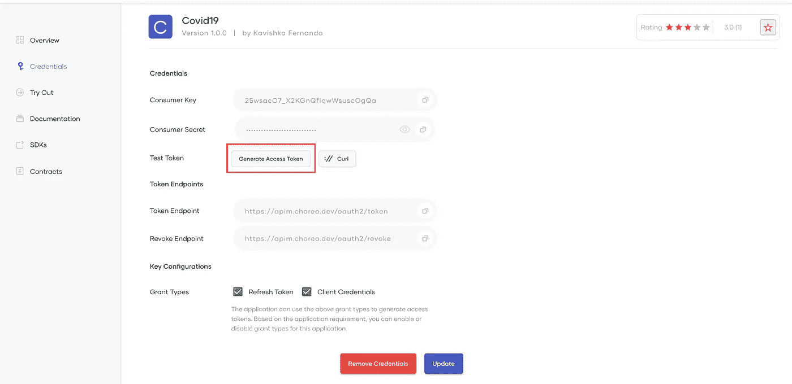

此页面显示以下详细信息，
i. **合同** —包括每次允许请求的比率。
二。**消费键**
iii。**消费者秘密**
四。**测试令牌—** 允许您生成访问令牌。您可以，
a)生成一个访问令牌或

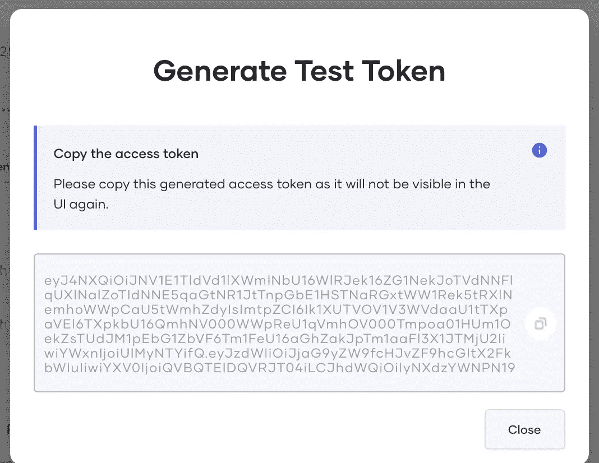

b)使用 curl 生成访问令牌

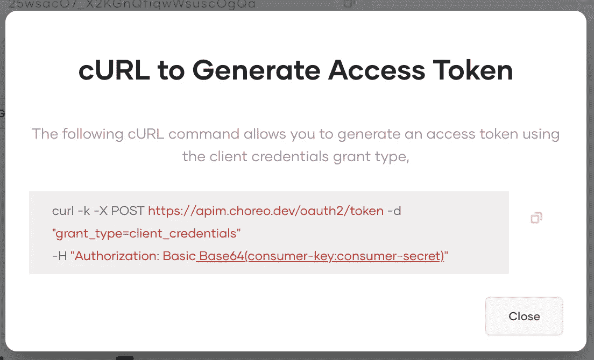

动词 （verb 的缩写）**令牌端点**
vi。**撤销端点**七世
。选中**授予类型** viii。你也可以**更新**键

3.**试用** —该选项卡允许您试用 API。

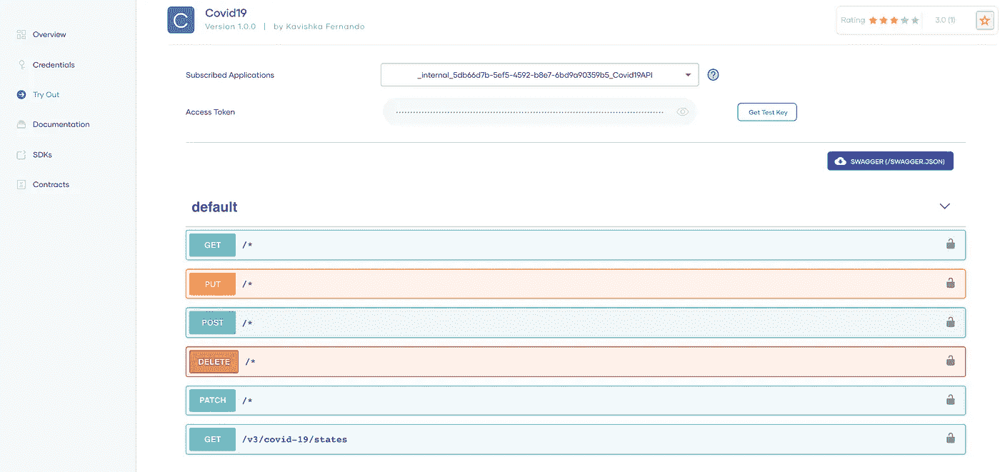

I .您可以从
ii 中选择想要调用 API 的应用程序。您可以粘贴生成的访问令牌，也可以单击**获取测试密钥**来获取测试密钥以调用 API。
三。您可以在 API 中看到可用的资源。您可以单击想要调用的资源，提供必要的详细信息，并试用该 API。您将能够看到您的调用的响应。

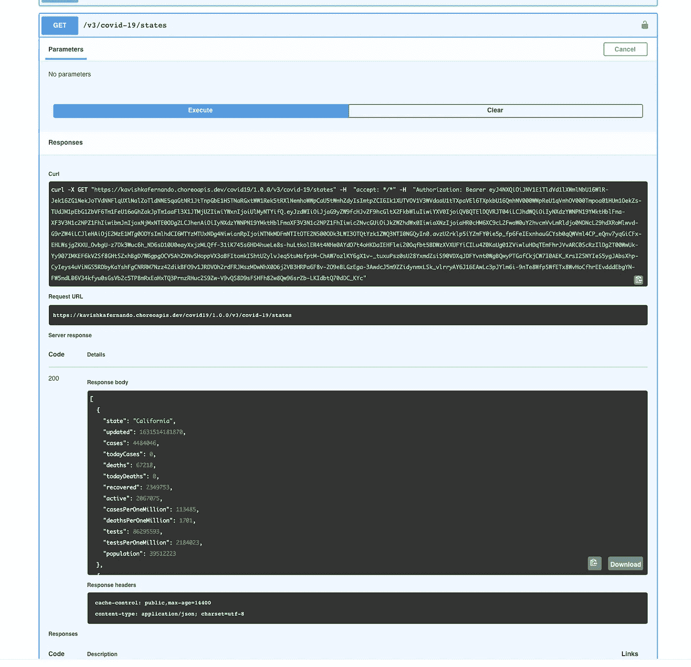

4.**文档** —显示与 API 相关的文档。
文件按类型分类。Choreo 支持 How To，Sample & SDK，公共论坛，支持论坛等文档。

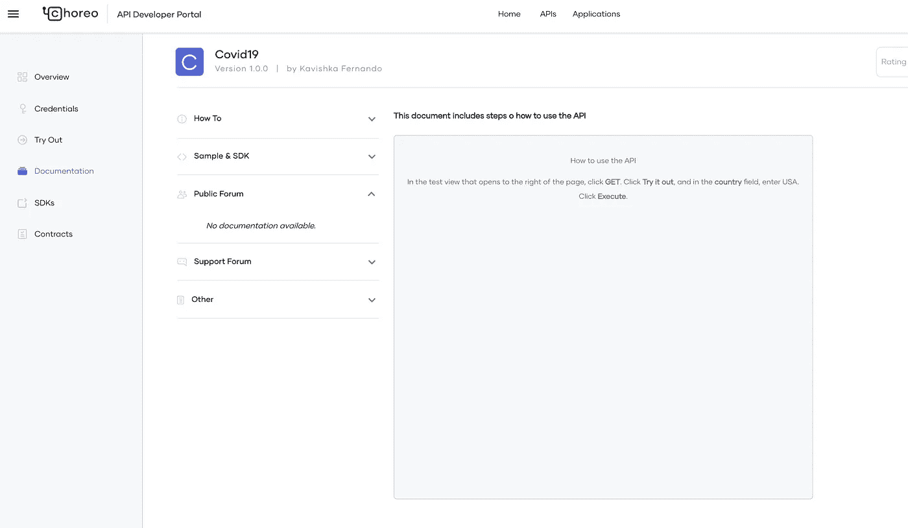

5.SDK—你可以下载 API 的 SDK。

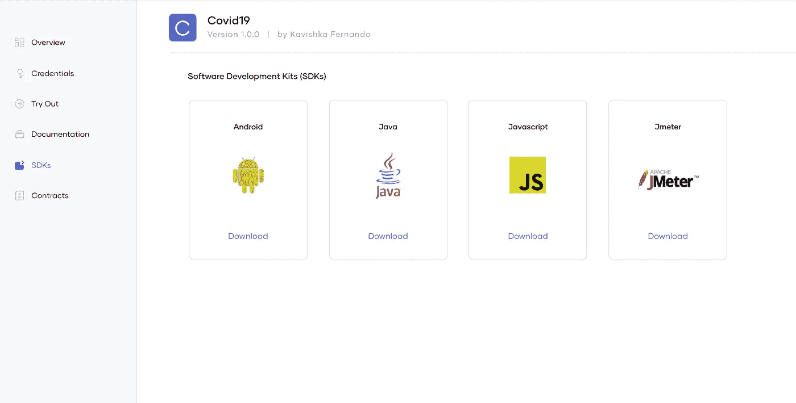

6.**合同** —显示与 API 相关的可用业务计划。您可以从可用的业务计划中选择一个合同。

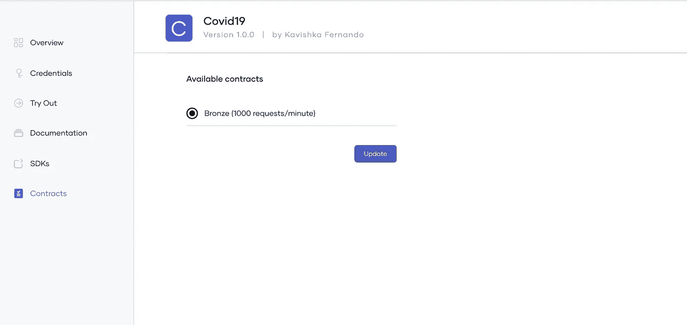

**应用**

应用程序是物理应用程序的逻辑表示，如移动应用程序、设备等。应用程序应该订阅 API 才能使用它。您可以在选定的商业计划上订阅 API，该商业计划决定了订阅的报价。应用程序有一个消费者密钥和秘密，作为应用程序的凭证。

您可以**创建**和**查看**应用程序。

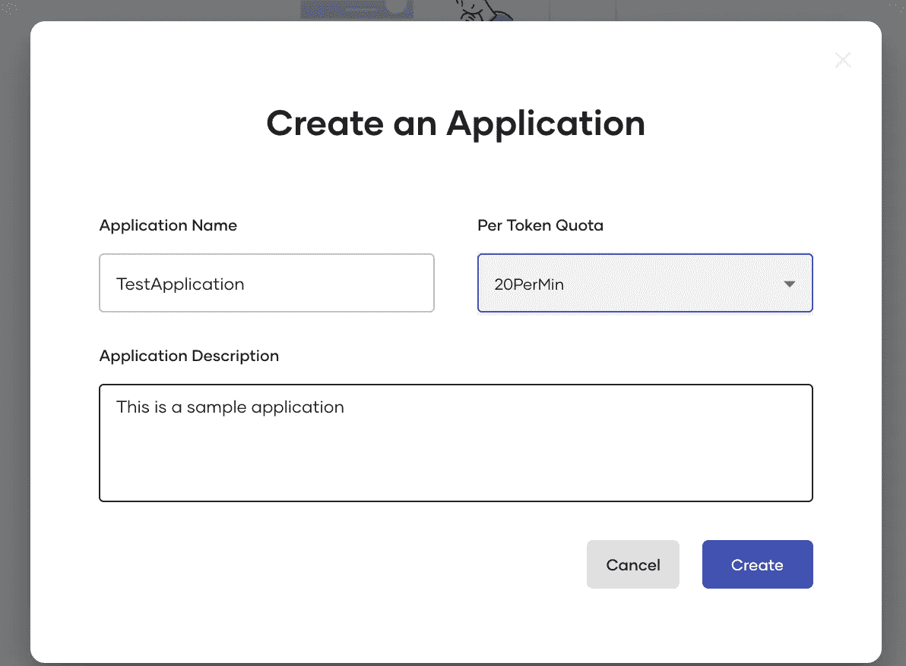

这些是每个应用程序下可用的信息，

1.**概述** —应用程序的详细信息

一、**描述** —应用描述
二。**节流层** —在某个时间段内应用程序允许的请求数量
iii。**令牌类型**—app 的令牌类型。默认情况下是 JWT。
四。**应用程序所有者** —应用程序的所有者

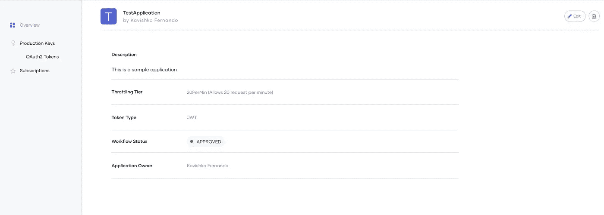

您还可以选择编辑和删除右上角的应用程序。

2.**生产密钥** —生成访问令牌。
您可以为以下内容提供必要的详细信息，然后单击**生成凭证。** 一、接入令牌到期时间
二。刷新令牌到期时间
iii。ID 令牌到期时间

生成凭证后，您将看到消费者密钥、消费者机密，现在您可以生成访问令牌。

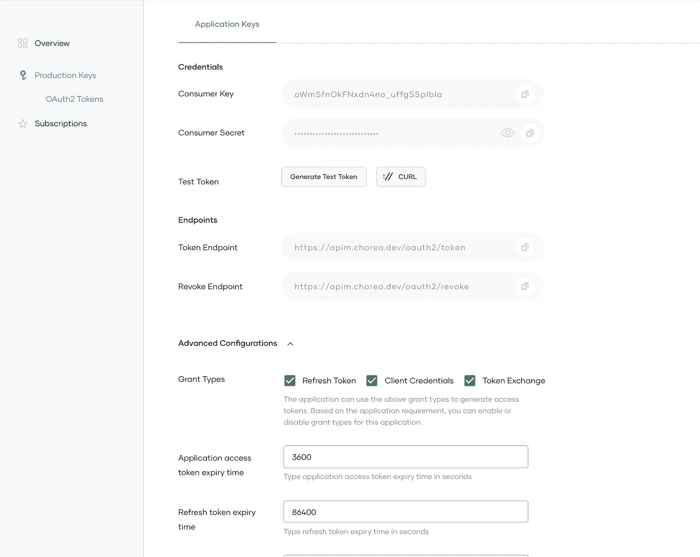

3.**订阅** —您可以从创建的应用程序中订阅多个 API。

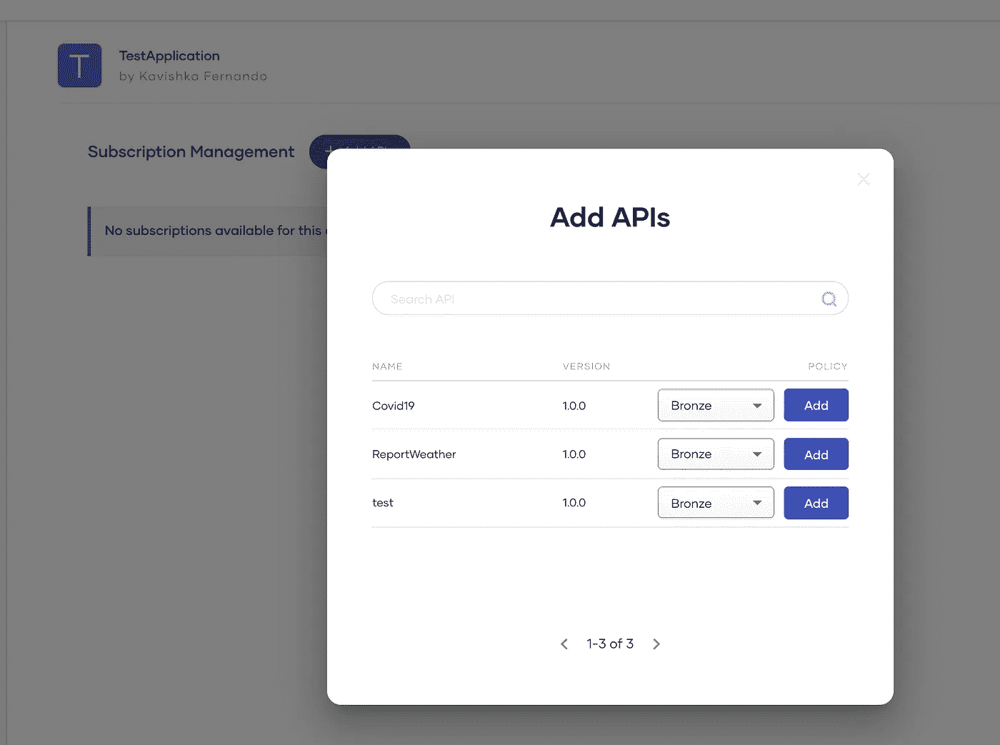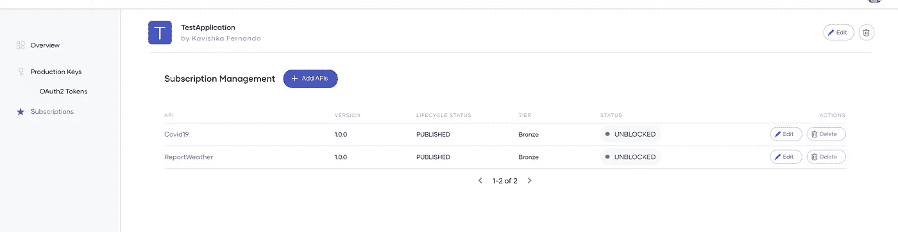

您可以创建一个应用程序、订阅一个 API、生成一个访问令牌并试用您的 API！

我们刚刚看了一下 [Choreo 开发者门户](https://console.choreo.dev/?utm_source=me&utm_medium=link&utm_campaign=me_link_KavishkaMedium_211001)的特性。

用 [Choreo](https://wso2.com/choreo/?utm_source=me&utm_medium=link&utm_campaign=me_link_KavishkasMedium_211001) 发现并试用 API！

想了解更多关于 Choreo 的信息，你可以访问[家务资源库](https://wso2.com/choreo/resources/)和 [Choreo 文档。](https://wso2.com/choreo/docs/)