# 在 Choreo 的 Publisher 门户中可以做什么？

> 原文：<https://medium.com/geekculture/what-can-you-do-in-the-publisher-portal-of-choreo-15558d5b248b?source=collection_archive---------26----------------------->

Choreo 的发布者门户是开发者创建集成、服务和 API 的地方。他们还可以连接远程应用程序并查看可观察性。Publisher 门户为您提供了一个低代码编辑器和一个芭蕾舞者代码视图来开发您的 API。

在这篇博文中，我们来讨论一下 Choreo 的[出版商门户](https://console.choreo.dev/?utm_source=me&utm_medium=link&utm_campaign=me_link_KavishkaMedium_211001)中的各种功能。

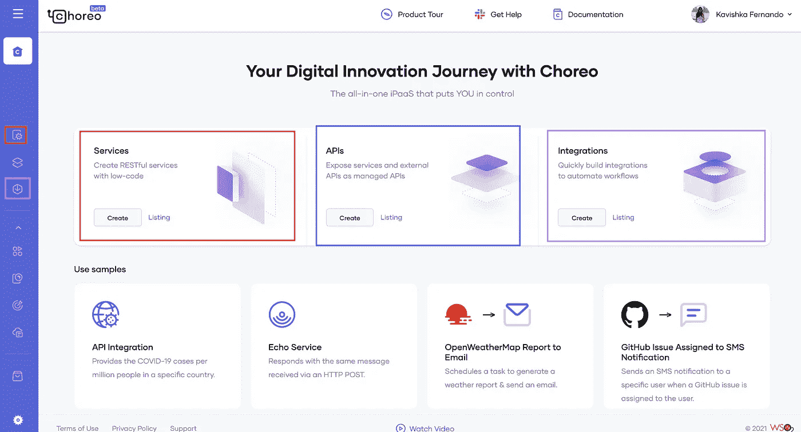

有了 [Choreo Publisher Portal](https://console.choreo.dev/?utm_source=me&utm_medium=link&utm_campaign=me_link_KavishkaMedium_211001) 你就可以，

1.  创建**服务** — Choreo 服务允许您创建具有复杂业务逻辑的集成服务。
2.  创建**API**—Choreo API 管理特性允许您创建 API、管理 API，并将服务和外部 API 作为托管 API 公开。
3.  创建**集成** — Choreo 集成允许您创建集成来自动化工作流。
4.  **连接远程应用程序** —您可以连接并观察用 Ballerina 编写的外部应用程序。
5.  **可观察性** —您可以可视化并监控部署在 Choreo 中的服务的性能。

# **服务**

服务是通过 REST API 公开的集成服务。您可以克隆、编辑和试用预先构建的服务示例。

**API 调用:**允许您通过 Choreo 集成连接到外部服务。它支持 HTTP、SMTP、POP3 和 IMAP 连接。它允许你连接到第三方 API，如新冠肺炎 API，天气 API，MySQL，Slack，Google Drive，Medium 等等。您可以实现的服务是无穷无尽的。

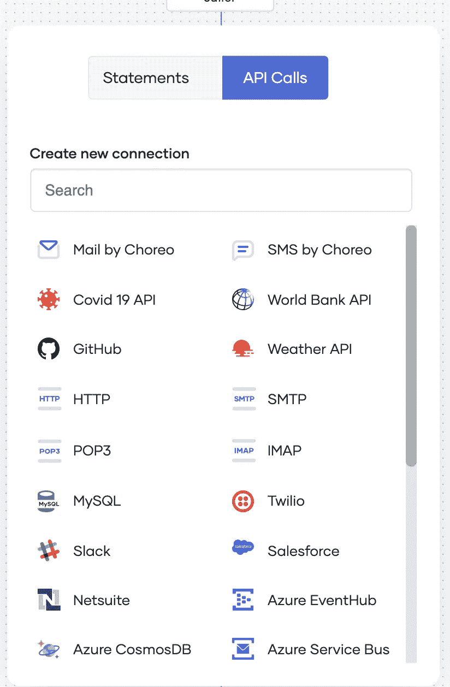

**语句**:是代码片段的集合。它指定了服务需要执行的操作。

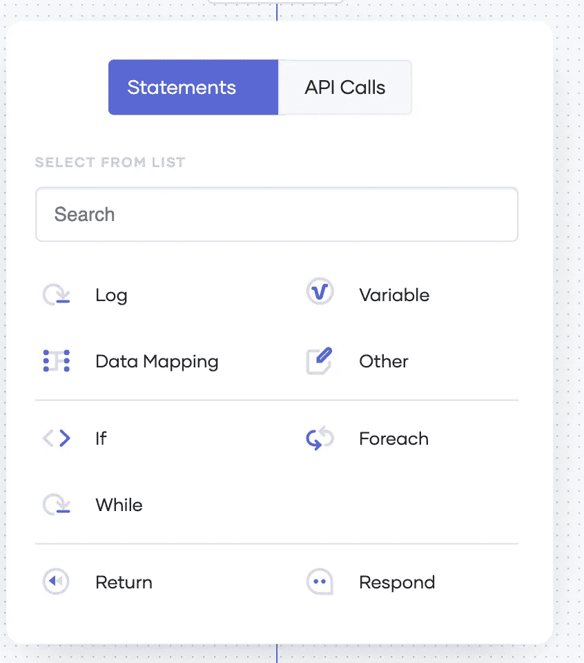

它支持以下语句，
**Log** :记录带有语句或错误的事件。
**变量**:声明稍后在服务
**数据映射**中使用的变量:允许通过映射一个或多个变量
**If** 来创建变量:条件执行
**Foreach** :迭代项目列表的控制流语句。
**While** :循环连续执行一个语句块。
**响应**:向客户端发回一个特定的响应

# 应用程序接口

API 是一个中间层，充当消费者和服务之间的通信协议。Choreo 使用开放 API 规范(OAS)格式。

1.  您可以导入一个 **swagger 定义**并创建一个 API。
    您可以查看、编辑、导入或下载 OAS 格式的 API 定义。

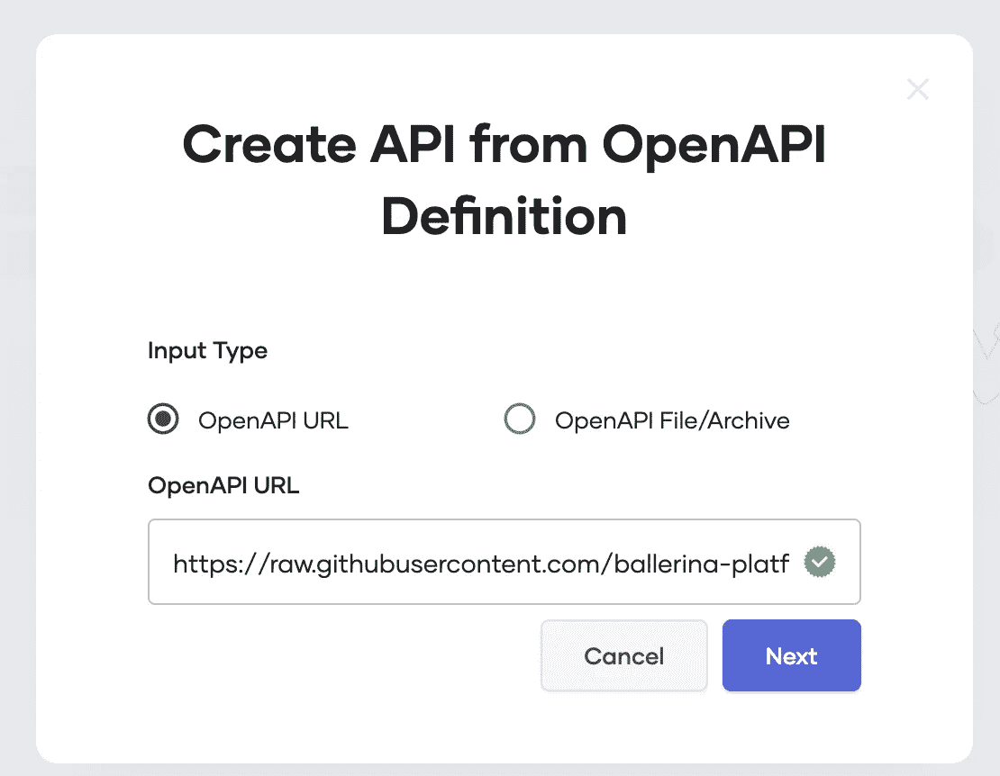

2.API 要经历多个阶段。Jorge 中支持的 **API 生命周期**状态有`Created`、`Prototyped`、`Published`、`Deprecated`、`Blocked`、`Deployed`和`Retired`。

每个 API 下都有以下配置。

1.  **概述** —显示 API 的概述。您也可以从 Overview 选项卡直接访问开发人员门户。

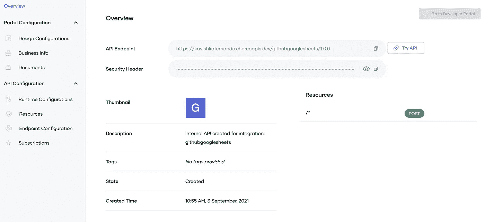

2.**设计配置** —您可以编辑 API 名称、描述并为您的 API 添加标签。

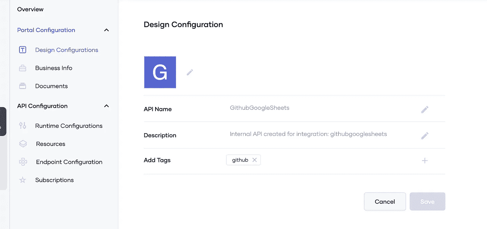

3.**业务信息** —可以添加业务负责人和技术负责人信息。

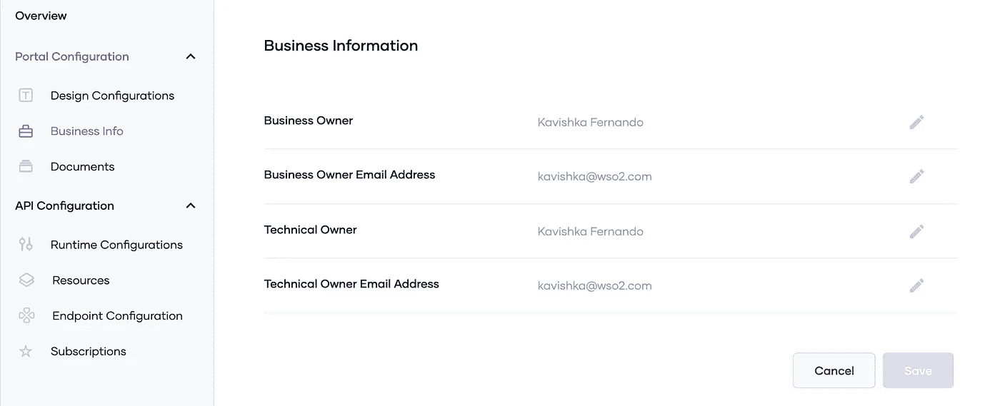

4.**文档** —可以添加与 API 相关的文档。苦差事支持的文档类型有 How to，Sample & SDK，公共论坛，支持论坛等。它还支持 inline、markdown、url 和 file 类型的文档源。

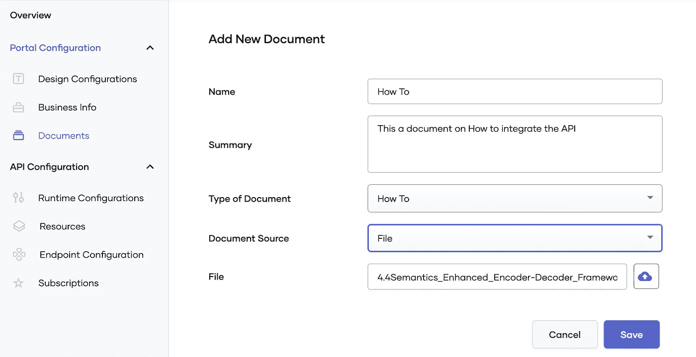

5.**运行时配置** —您可以配置 CORS，也可以选择应用程序级安全性。

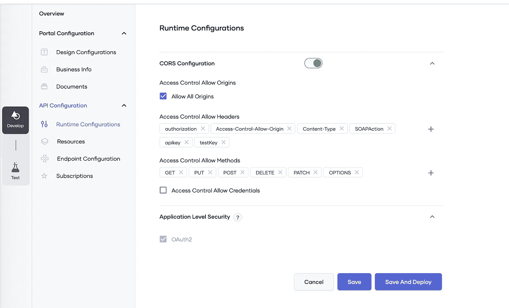

6.**资源**—Choreo API 支持以下 **HTTP 方法**、
、`GET`、`POST`、`PUT`、`DELETE`、`PATCH`、`HEAD`和`OPTIONS`

您可以在 API 层或工序/资源层添加速率限制。速率限制限制了在指定的时间范围内允许对 API 的请求数量

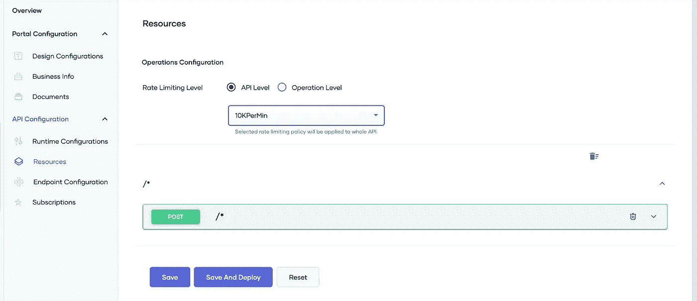

7.**端点配置** —您可以提供生产和沙盒端点。

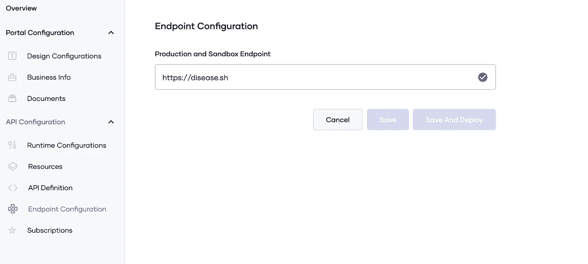

8.**订阅** —你可以为你的 API 附上一份商业计划，告诉它允许向 API 发出的请求的数量。您还可以阻止和取消阻止您的 API。

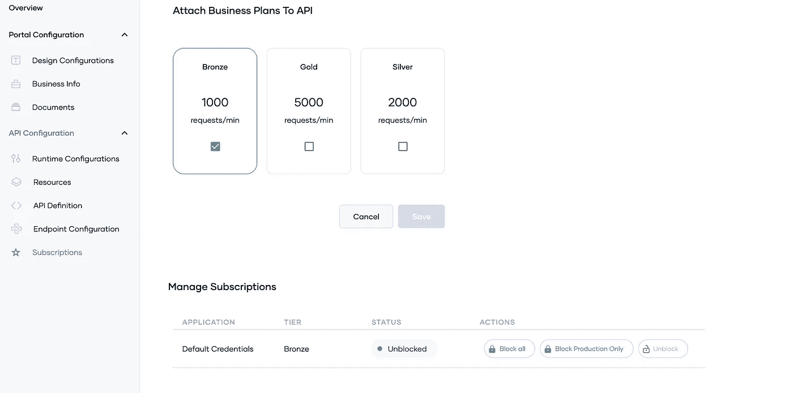

# 综合

集成将 API、事件和流连接起来，并允许它们作为一个单元运行。

**触发**

触发器是导致 Choreo 集成开始执行的事件或操作。

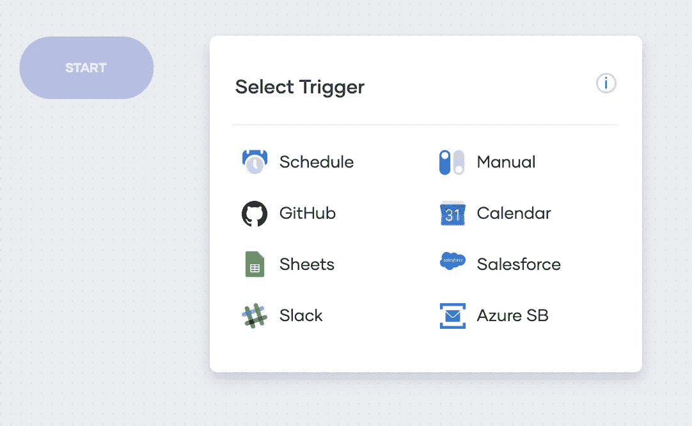

Choreo 支持以下触发器，

*   **调度:**根据给定的调度触发执行。
*   **手动:**手动触发执行。
*   **GitHub:** 根据 GitHub 事件和动作触发执行。
*   **日历:**根据 Google 日历中的事件触发执行。
*   **工作表:**根据 Google 工作表事件触发执行。
*   **Salesforce:** 基于 Salesforce 事件触发执行。
*   **松弛:**根据松弛事件触发执行。
*   **Azure SB:** 基于 Azure 服务总线事件触发执行。

集成还以与服务相同的方式支持 API 调用和语句。

# 可观察性

可观察性仪表板允许您观察以下内容:

*   给定时间段内请求的吞吐量和延迟。
*   查看给定时间段内生成的日志。
*   给定期间生成的火焰图(诊断视图)。
*   跟踪请求。

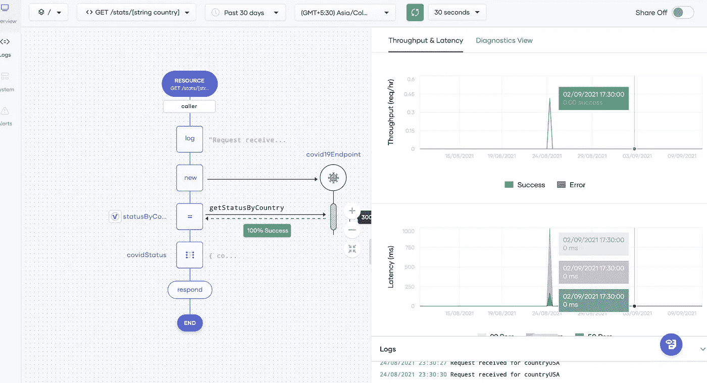

**诊断视图**能够同时查看特定事件的错误、吞吐量、延迟、CPU 使用、内存使用和日志。

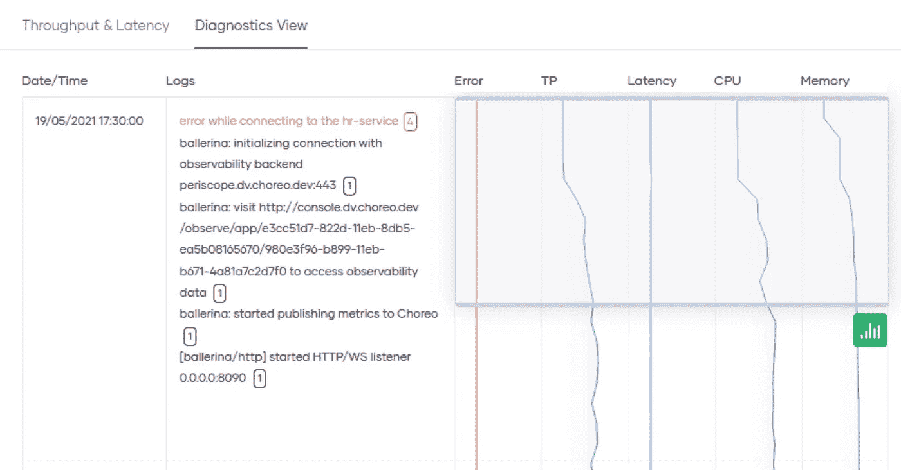

Choreo Publisher 门户网站提供了如此多的功能。它使得 API、集成和服务的创建更加高效和简单。

继续尝试使用 [Choreo](https://wso2.com/choreo/?utm_source=me&utm_medium=link&utm_campaign=me_link_KavishkasMedium_211001) 创建一些 API 和服务！

想了解更多关于 Choreo 的信息，你可以访问[家务资源库](https://wso2.com/choreo/resources/)和 [Choreo 文档](https://wso2.com/choreo/docs/)。