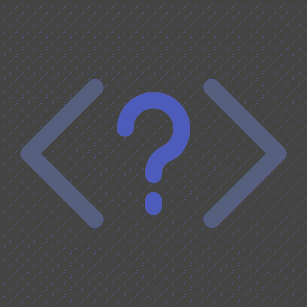

# 应该先学什么编码语言？

> 原文：<https://medium.com/geekculture/what-coding-language-should-i-learn-first-436d05c5a270?source=collection_archive---------65----------------------->

我知道你的感受，这看起来让人不知所措。有几十种语言可供选择，即使你只选择前三种，每个人都说最终要学会所有的语言，但是当你甚至不知道从哪里开始时，这是一个很大的承诺。在接下来的 3 分钟里，我们将回答你从哪里开始的问题，或者更准确地说，你将通过与我的一点对话来回答你自己的问题。