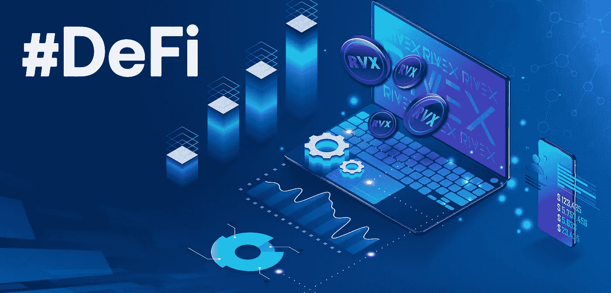
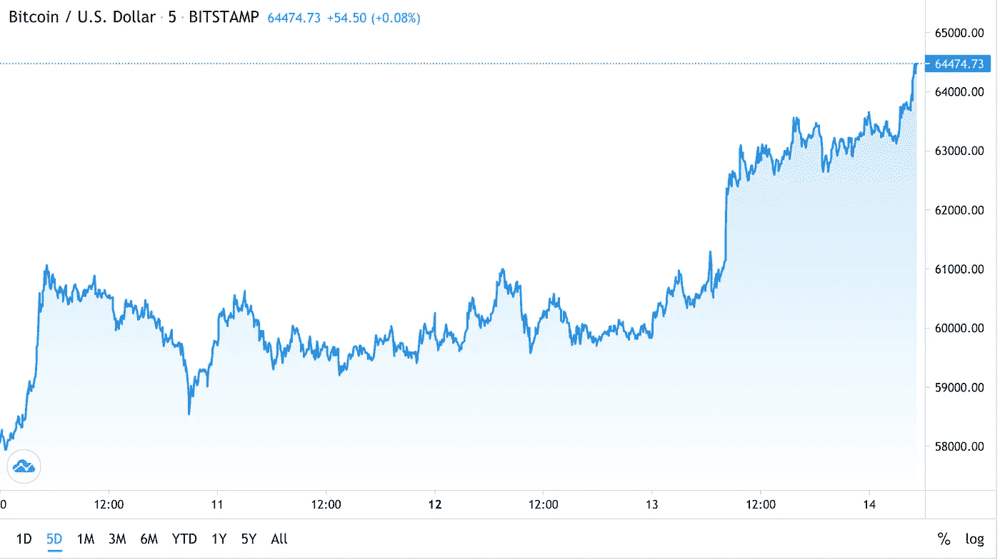
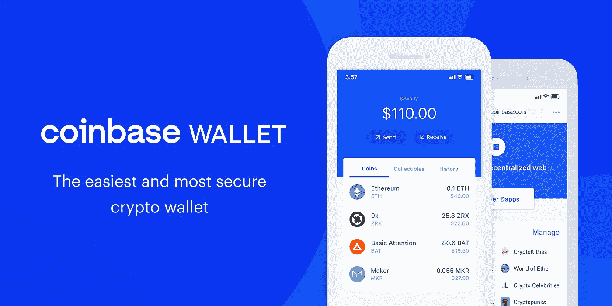
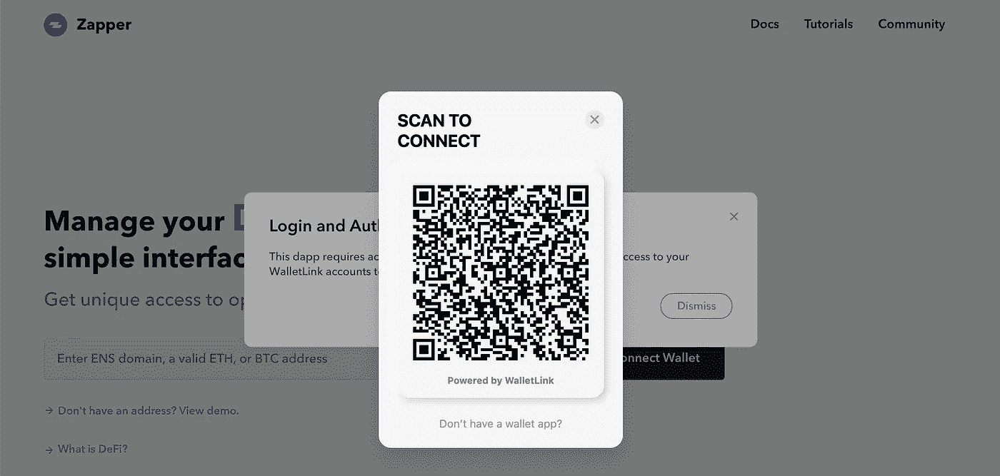
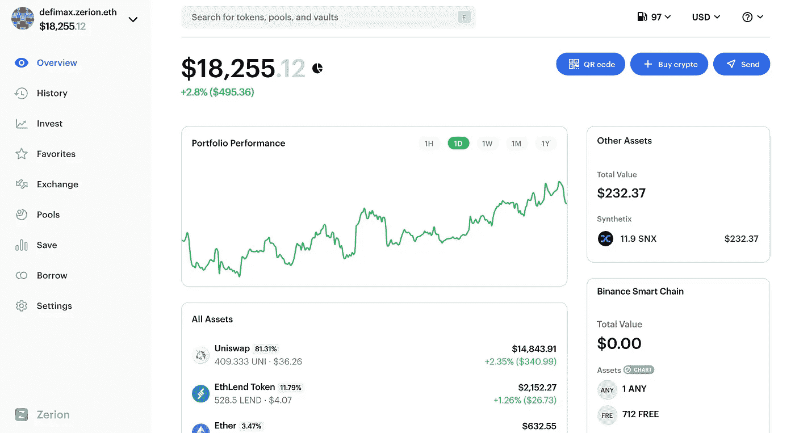
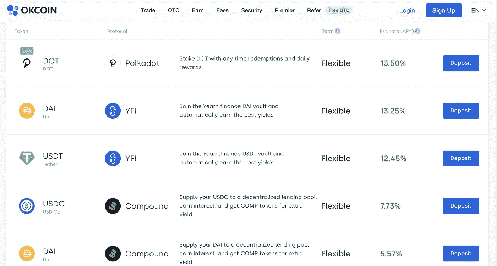

# 三年后的比特币基地会是什么样子

> 原文：<https://medium.com/geekculture/what-coinbase-could-be-in-three-years-8f4a171c00a5?source=collection_archive---------13----------------------->

## 一个有趣的关于自我分裂的比特币基地的思考练习

这是我比特币基地深潜的第三部分——期待它在 4 月 14 日的公开上市。如果你有兴趣，可以看看 [*第一部分*](/geekculture/the-bear-case-for-coinbase-63f5448e4eb1) *和* [*第二部分*](https://jimmy-chang.medium.com/the-bull-case-for-coinbase-3f44ed3313a9) *帖子。*

*一如既往，本文是为教育目的而作。这不构成交易建议。过去的表现并不代表未来的结果。希望人们发现这些更新有助于跟上这些天来 crypto 飞速发展的步伐。*

不要投资超过你能承受的损失。这不是财务建议；你是否一直对美元硬币等金融工具进行尽职调查

比特币基地日快乐！

在撰写本文时，实际上是周二晚上——比特币基地在纳斯达克上市的前一天晚上。

我倾向于在一两天前写帖子，这样我就有足够的时间将它们提交给各种媒体出版物，如 Startup 或 Geek Culture。

关注我的 [Twitter](https://twitter.com/0xJim) 获取$COIN 列表的实时更新——我不知道会发生什么，所以至少可以说这很有趣！

在我们回到比特币基地之前，快速补充一点——加密市场本周一直很热，期待着行业的潜在分水岭时刻:灯塔加密公司的公开上市。

Source: Trading View

自 2017 年以来，BTC 和 ETH 首次同时打破历史新高——分别为 64K 美元和 2350 美元。

也许在这篇文章发表的时候，这些数字已经过时了！

许多人在推特上称这个星期为“比特币基地周”(我知道是原创)，从 BTC 到 XRP 甚至总督的每一枚硬币都在快速跳动。

昨天，我谈到了比特币基地的[牛市案例](https://jimmy-chang.medium.com/the-bull-case-for-coinbase-3f44ed3313a9)——指出它是少数真正的“Web 2.0 到 Web3 桥梁”公司之一，并将从中受益匪浅。

我也很快浏览了其托管和赌注业务，我认为这一业务有更大的增长空间，可以从比特币基地的交易业务中获得收入份额。

最后，我注意到比特币基地似乎敏锐地意识到了 DeFi 日益增长的“威胁”,并一直在采取措施更多地参与这场运动——通过其 wallet+dapp explorer 产品、WalletLink 开源倡议和 Rosetta API。

我表示，如果这意味着继续生存并执行其开放金融使命，那么该公司并没有超越自我分裂。

我想利用今天的帖子更详细地充实牛市案例 3，因为——虽然我不在比特币基地工作，这纯粹是猜测——我相信比特币基地处于一个很好的位置，可以成为一个以 DeFi 为中心的平台。

我称之为“比特币基地三年后会变成什么样”，但实际上这个时间框架非常宽松——可能是 18 个月(几份收入报告)或 5 年(我认为这已经是过去式了)。

# 密码交易所的未来

我非常确信(可能会在随后的帖子中发布我的信心背后的定量推理),密码交易市场将会出现两种结果之一:

1.  德克斯会把 CEX 和特拉菲当午餐吃掉
2.  德克斯将与塞克斯共存于一个世界

参考第一部分关于德克斯、CEX 和特拉菲的定义。

从民族精神的角度来看，结果#1 更有趣、更令人信服——DEX 是交易的民主化，这是以前从贪婪的中间人那里囤积的:罗宾汉、忠诚，以及最近的世界货币基础。

我内心的乐观主义者和反体制的叛逆者愿意相信第一种结果会发生。

毕竟，DEXes 是 Web3 本地的，而 CEXes 不是。DEX 用户基本上[以交易费的形式获得回报](https://uniswap.org/docs/v2/advanced-topics/understanding-returns/)——基于他们对平台的贡献(例如，增加流动性)。

通常由中间商收取的交易费在股指期货用户之间公平分配。

谁不会呢——相比之下，T4 使用像罗宾汉这样的中央经纪人什么都没得到呢？

但我内心的怀疑者尖叫道，总会有 CEX 用户，因为他们要么:

(a)不了解并因此信任 DEXes 技术；

(b)懒得钻牛角尖去搭载 DEX——因为现在这是一个不小的工作量(有望随着时间的推移得到解决)；或者

(c)重视嘉信理财(Schwab)等传统经纪公司中人与人之间的互动(“你说我不能和人谈论我的指数交易是什么意思？”)

不管怎样，没有一个世界只有 CEXes 会成功。这块馅饼最好的情况是被 DeFi 吃掉一部分，最坏的情况是被 DeFi 完全吃掉。

因此，明智的做法是在我们现有的类别消失之前进入一个新的类别——有点像网飞从 DVD 交付转向视频流。

目前约有 50 万 DeFi 用户([180 万个以太网地址](https://duneanalytics.com/rchen8/defi-users-over-time)，平均每个用户约 4 个地址)。相比之下，比特币基地的用户是 T2 的 100 倍，有 5600 万 T3——所以它的规模足以在一个将蚕食 CEXes 的新兴产业中具有竞争力。

# 作为一站式 DeFi 商店的比特币基地

在近 9 年的历史中，比特币基地已经建立了一个以信任和安全为基础的品牌。

即使在一个充斥着安全漏洞和黑客的行业，用户也相信比特币基地的平台上有数十亿美元。

比特币基地表示，截至 Q1 2021 年，它代表其客户持有 11%的加密市场总市值。

因此，如果用户把他们的钱托付给比特币基地，那么可以有把握地假设，他们中的很大一部分人会在如何处理他们的钱的问题上信任比特币基地。

因此，比特币基地非常适合成为去中心化金融的“入口”。

我会这么做:

## 收购 Zapper 作为平台

成为一站式 DeFi 商店的第一件事是建立一个 GUI，让用户可以轻松地与 DeFi 进行交互。

比特币基地有自己的钱包，[比特币基地钱包](https://wallet.coinbase.com/)，这……很好。如果我想做的只是把钱从钱包 A 发到钱包 b，那么它就是功能性的。

然而，在 DeFi，钱包远不止这些。

与简单的支付设备不同，像 [Metamask](https://metamask.io/) 这样的 DeFi 钱包是允许与其他 dApps 进行交互的基本账户原语——使用户能够在资金不离开钱包的情况下进行借贷和交易，这被称为他们的“托管”。

比特币基地钱包可以与 dApp 互动——它有一个内置的 dApp 浏览器和一个查看 NFTs 的标签，但它很笨重。

我基本上要用手机扫描一个二维码才能上传资金。签署事务比使用元掩码要笨拙得多。

不用说，每个人都使用 MetaMask。

Connecting Coinbase Wallet is a pain. Source: Zapper

与其投入资源来增强比特币基地的钱包，不如让比特币基地更快地利用其资产负债表来获得能力。

我会选择看看两个领先的 DeFi 协议聚合器 [Zapper](http://zapper.fi) 或 [Zerion](http://zerion.io) 。

它们不是钱包；相反，它们是钱包之上的聚合和抽象层。

你输入你的 ETH 地址，它会读取你所有的智能合约——显示你的各种资产和代币。

Dummy account from Zerion

它的产品比 MetaMask 这样的钱包更强大，因为它们背后的团队已经完成了集成到比 ConsenSys Metamask 团队多得多的 DeFi 协议的腿部工作。

因此，Zapper 和 Zerion 本质上是 DeFi 的用户界面入口。在 Zerion 仪表板的左侧，您可以看到您可以做的不仅仅是查看您的资产——您可以在 Uniswap 等指数中积极地交易它们，将它们投资于像 earning 这样的自动化基金，将它们投资于 Curve 这样的池中，等等。

这要感谢以太坊上智能合约的可组合性。

## 提供增值服务

比特币基地不仅仅是一个门户，它还可以向客户提供增值服务，这些客户要么(a)对参与 DeFi 不感兴趣，要么(b)乐于让比特币基地管理他们的资金以获得可观的回报。

对于那些对 DeFi 不感兴趣的人来说，他们仍然可以使用比特币基地的传统产品:带有传统订单簿的 CEX。

它工作得很好，所以不需要改变它。

对于那些根本没有兴趣或时间进入 DeFi 的人，他们可以让比特币基地代表他们投资 DeFi。

在这里，比特币基地实质上成为了一种共同基金——使用 DeFi 协议作为即插即用产品向用户提供服务(例如，贷款、赌注、借款、投资)。

这具有巨大的影响。传统上，如果比特币基地提供其他金融产品，他们将不得不从头开始建立能力:建立资产负债表、信用担保模型等。

现在，比特币基地可以通过利用开源 DeFi 协议，以相对较低的集成度和规模提供这些产品。

这种策略的美妙之处在于疯狂的单位经济学；比特币基地必须做一个相对简单的与 DeFi 协议的集成。

之后，它将用户的资金分配到各种协议中，产生回报。比特币基地可以很容易地从这些协议的收益中获取 100-150 个基点，并返回给用户。

用户会很乐意为比特币基地的简单和信任支付差价…

对他们来说很棒。

无论是哪种情况，比特币基地都是在代表其用户托管资金，然后它可以用这些资金产生回报——就像银行的资产负债表一样。

OKCoin has a product right now where it uses custodied funds into DeFi and return yield to users

如果你认为这篇博文值得你花 5 分钟来阅读，请在下面帮我鼓掌(最多 50 次)。我讨厌乞讨，但我失业了，正在努力挣钱吃饭 🥺 *非常感谢！！*