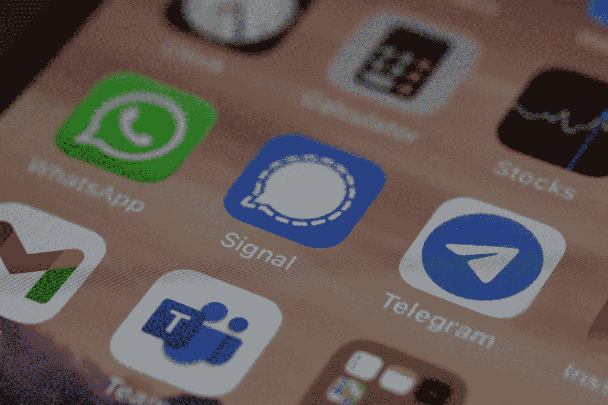

# 关于 WhatsApp，FBI 刚刚透露了什么？

> 原文：<https://medium.com/geekculture/what-did-the-fbi-just-reveal-about-whatsapp-110fb33e4af3?source=collection_archive---------10----------------------->

Wesley Tingey

11 月 29 日,《滚石》杂志披露了一份 FBI 内部文件，披露了信息服务与政府机构合作的频率。这份名单包括了所有通讯领域的顶级公司——WhatsApp、iMessage、Telegram、Viber 和 Signal。对大多数人来说，这份文件似乎相当有利，但 WhatsApp 却吃亏了。当用户意识到这款标榜隐私的应用急切地向 FBI 提供他们的数据时，愤怒随之而来。但是，事情真的像看上去的那样一目了然吗？还是这又是一个因误报而引起的恐慌？让我们找出答案。

# WhatsApp 在文档中的角色

Dmitry Ratushny

那么，这份文件到底透露了什么，声称“[WhatsApp 间谍](https://www.realmicentral.com/2021/12/02/whatsapp-spies-communicates-with-the-fbi-every-15-minutes/)”或联邦调查局可以“[获取你的 WhatsApp 数据](https://www.rollingstone.com/politics/politics-features/whatsapp-imessage-facebook-apple-fbi-privacy-1261816/)”是正确的吗？WhatsApp 的部分声明，该应用程序可以提供“有限”的消息内容，用户的联系人列表，将该用户列入*联系人的列表。不仅如此，它还每 15 分钟发送一次关于每条发送消息的元数据，包括来源和目的地。这听起来很糟糕，确实如此，但这并不意味着 WhatsApp 监视你或向 FBI 提供你的数据。*

实际发生的情况是，联邦调查局可以在 WhatsApp 的帮助下监视你，正如文件中所述。他们可以很容易地找到你和谁通话，多久一次，一天中的什么时间，你发了多少条信息，等等。现在，所有这些都是元数据，而不是数据，这是一个重要的区别，但并没有真正帮助 WhatsApp 挽回面子。该公司向联邦调查局提供数百万用户信息的频率比你喝咖啡的频率还要高。事实上，据《滚石》杂志称，WhatsApp 并不羞于谈论此事，并公开向该出版物谈论此事。也许它想帮助执法的愿望模糊了它对什么是隐私的判断。

现在，如果你阅读 WhatsApp 提供的数据列表，你可能会对“有限的消息内容”感到震惊和困惑。这意味着用户进行的任何 iCloud 备份都将被移交给 FBI。考虑到苹果与联邦调查局的友好关系，这是一个非常令人担忧的迹象。这实质上意味着，如果你在 iOS 上，你的所有信息都可能被暴露，即使你不使用 iOS，只要你的对话伙伴使用 iCloud 备份，你的一些对话也会被暴露。

这份文件有力地证明了 WhatsApp 重视在美国联邦调查局(FBI)的良好声誉，重视用户的真正隐私。尽管我不愿意称这个问题的报道为完美，但这种恐慌程度是相当恰当的，如果不是被低估的话。WhatsApp 的结果让那些相信其诚信的人大失所望。至于其他的…

# 比赛及其结果

Dimitri Karastelev

首先，让我们为 iMessage 唱一首挽歌，如果被请求，它可以提供加密密钥以及数据宝库。当然，他们很有帮助，但是绝对敌视用户。它和 Viber 以及 WhatsApp 都是名单上最糟糕的违规者。

有趣的是，在亚洲与微信一样受欢迎的信使 Line 似乎泄露了几乎所有可能的元数据，但如果消息受到 E2EE 的保护，则不会披露。然而，由于该应用程序上的一些消息不是 E2EE，联邦调查局确实可以访问它们。出于未知的原因，据报道，该应用程序不与局里共享媒体，尊重你假期照片的神圣性胜过尊重你的私人通信。

Threema，WeChat 和 Wickr 做得足够好，这是你可以从这两个注重隐私的信使身上期待的，也是对中国最大的信使的惊喜。在微信的情况下，这并不重要，因为关于该应用加密的后门的传言非常普遍。

也许不出所料，这两个冠军是电报和信号。Signal [喜欢吹嘘](https://signal.org/bigbrother/)收到传票，并通过提供他们能提供的所有信息来遵守它们…这是非常少的。这是一种恶意合规的形式，因为他们只提供用户注册的时间和日期以及他们最后一次上网的时间。Telegram 并不炫耀其结果，但众所周知，它在保护用户数据免受任何查询方面也有类似的声誉。该文件证实，该应用程序只给出注册数据，甚至没有“最后一次看到”被泄露给当局。它还表示，如果他们收到法院命令，确认用户是恐怖嫌疑人，应用程序*可能会*共享一个人的 IP 地址和电话号码，但这不仅是一个非常罕见的情况，文件中包含的*T5 的压力使它看起来更像是“如果他们真的认为有必要”。直觉告诉我，在这种情况下，被政府盯上的举报者没有什么可担心的。*

# 最后

和往常一样，联邦调查局的文件只是证实了大多数人知道或怀疑的事情——WhatsApp 不应该被信任来保护你的数据或确保数据安全；电报和信号是更好的选择。它确实提供了确凿的证据，这总是好的，也表明我个人不喜欢的一些应用程序远没有我想象的那么糟糕。不过，总的来说，所有迹象都表明，通讯应用的新时代已经到来，优秀的软件正在引领这个新时代。不要害怕尝试新事物，要害怕旧的出卖你。