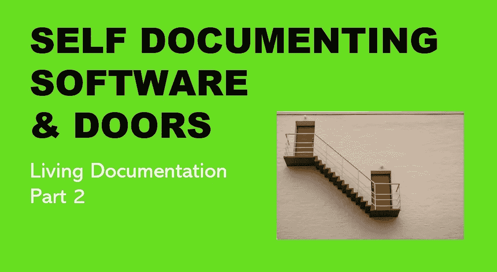

# 自文档软件和门有什么共同点？

> 原文：<https://medium.com/geekculture/what-do-self-documenting-software-and-doors-have-in-common-6ad95063570a?source=collection_archive---------15----------------------->

## 如何为下一个必须使用、修复或出售代码的穷人自我记录代码

## 活文档—第 2 部分

**自我记录** —是以合适的形式记录的文件，通常是标签、标志或嵌入、附加或附近的简单说明…