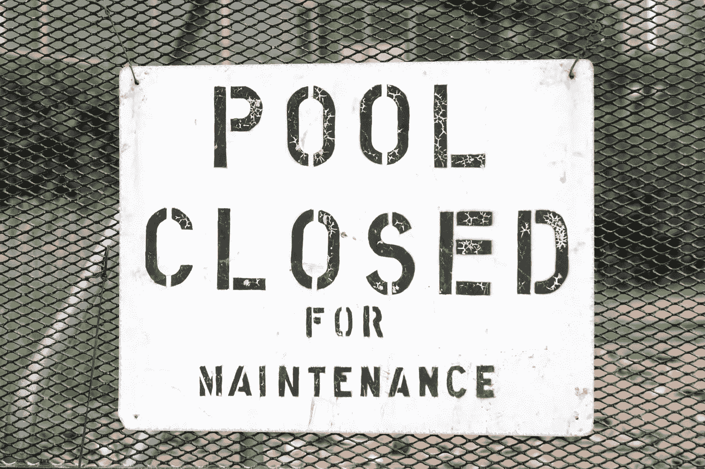
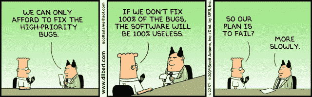

# 作为一名工程师，你需要了解软件维护类型的哪些方面

> 原文：<https://medium.com/geekculture/what-do-you-need-to-know-about-software-maintenance-types-as-an-engineer-e7c17efca41f?source=collection_archive---------17----------------------->

Image credit: [Unsplash](https://unsplash.com/@cobyshimabukuro).

软件开发人员需要不断地培育他们的产品，以增强其功能，减少退化，满足用户的需求，并确保其产品的成功。这是通过软件维护实现的。

软件维护是软件开发生命周期的关键部分。许多公司都采用 DevOps 原则和流程。这包括左移，在开发周期的早期执行测试，以便能够尽快识别和响应问题。但是，即使软件发布了，也不是一发布就忘的问题。

软件开发人员需要不断培育他们的产品，以增强其功能，减少退化，满足用户的需求，并确保其产品的持续成功。这是通过软件维护实现的。

**软件维护任务可以分为四种类型:**

1.  纠正软件维护
2.  适应性软件维护
3.  完美的软件维护
4.  预防性软件维护

本文将详细介绍每一种方法。

# 纠正软件维护

**不出所料，纠正性软件维护就是纠正软件缺陷、错误和故障。**这些错误通常是在软件使用过程中观察到的，可能表明软件设计、逻辑或代码中存在更深层次的缺陷或错误。它们可能会通过来自最终用户反馈的 bug 或错误报告引起您的注意。这种维护是有求必应的。它是关于纠正阻止软件按预期工作的错误。

Image credit: Scott Adams.

纠正性维护*应该是*解决影响软件的潜在问题，但是也有公司选择打补丁的诱惑，这只能解决这种情况下的问题。如果对开发人员来说，纠正性维护是一项持续的、越来越耗时的任务，那么这可能表明开发人员技能、代码质量、测试实践或存在重大技术债务方面存在更广泛的问题。通过自动修复错误，可以自动进行纠正性维护。

# 适应性软件维护

适应性软件维护是关于改变软件以响应其环境的变化。它发生在操作系统(或其软件)、软件依赖、硬件或云存储发生变化的情况下。

适应性软件维护也可能是新公司政策、供应商、应用商店或支付流程变化的结果。这可能是由公司控制范围之外的事情造成的，例如 GDPR 或与支付流程相关的税收等法规的变化。然而，这不是简单地解决一个特定的问题，而是能够预测变化，从而使您的软件足够灵活，以适应过多的变化。

一个常见的例子是 1999 年臭名昭著的 2000 年漏洞，当时公司认为他们的软件将不再运行，因为日期从 1999 年 12 月 31 日变成了 2000 年 1 月 1 日。作为回应，开发人员努力准备他们的软件，以应对 [Y2K](https://www.nationalgeographic.org/encyclopedia/Y2K-bug/) 问题。如果他们做不到这一点，他们将在 1 月 1 日处理维修问题。(现在有关于 2030 年 [Y3K](https://www.tomshardware.com/news/microsoft-has-980-years-address-y3k-bug-windows-10) 的传言，敬请关注……)

# 完美的软件维护

完美的软件维护关注于通过功能增强来改善用户体验的特性。这是关于改善系统性能的方法，不是对故障或问题做出响应，而是对客户反馈做出响应。

例如代码功能增强、可用性变化或速度优化。这些都提高了软件的价值，增强了用户体验。

完美的变更还包括从系统中移除那些对系统的最终目标没有效果和功能的特性。

Image credit: the author is unknown.

# 预防性软件维护

**预防性软件维护是指通过代码优化、重组和文档更新等任务来提高软件的可维护性和稳定性，从而降低软件长期运行时的恶化风险**。

示例包括提高软件可靠性和性能的新功能，以及改进软件以降低软件复杂性，使其更易于维护和理解。

软件系统时代。预防性软件是通过实施良好的实践来实现长期收益，从而保证其寿命和有效性。

# 所有类型的软件维护都至关重要

测量开发人员在维护上花费的时间，作为测量软件开发团队以及产品和代码库的成熟度和技能的一种手段，可能是有益的。

这是不同类型之间的微妙平衡。即使是发布无 bug 代码的最大努力也可能需要纠正性的维护，但是如果这是一个影响发布的软件质量的持续的痛点，这表明需要改进 bug 测试实践。它还可能意味着优先考虑速度而不是效率的过程——好的代码最初可能需要更长的时间来产生，但可以导致更少的错误修复和重构，并消除技术债务的长期痛苦。

高质量的代码使得长期开发和可维护性更容易。全面致力于完善任务，如减少技术债务和[代码重构](https://www.stepsize.com/blog/the-ultimate-engineers-guide-to-refactoring)有助于保持基线，使其更容易扩展现有代码和更快地添加新功能。**一家致力于持续** [**跟踪和优先处理技术债务**](http://stepsize.com/) **的公司，不仅提高了其产品的质量，还在未来几年保持了健康。**

今天的软件公司需要敏捷和有远见。随着公司增加产品功能或响应大规模扩大的客户群，软件维护可能意味着增长。它还应该象征着一家公司对其产品周围的生态系统有很好的了解，包括客户和面临的更广泛的业务挑战以及竞争对手的发展速度。仅仅从第一次发布就创造出一个伟大的产品是不够的，还需要能够在整个生命周期中支持和培育它。

*最初发表于* [*管理科技债务。*](https://www.stepsize.com/blog/software-maintenance-types)