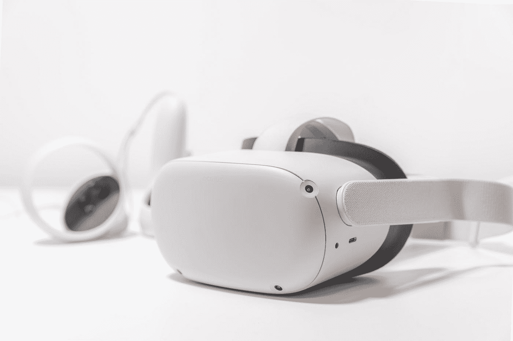

# 使用虚拟现实头戴设备时会戴什么？

> 原文：<https://medium.com/geekculture/what-do-you-wear-when-using-virtual-reality-headsets-6fb4bef90cd?source=collection_archive---------14----------------------->

讨论使用虚拟现实耳机时应该穿什么的博客

Photo by [Vinicius "amnx" Amano](https://unsplash.com/@viniciusamano?utm_source=medium&utm_medium=referral) on [Unsplash](https://unsplash.com?utm_source=medium&utm_medium=referral)

无论你告诉自己多少次虚拟现实头戴设备会一直存在，你仍然需要亲自感受这种体验。你需要看到这种体验有多沉浸，你的生活可以有多不同。这是否意味着当你戴上这些虚拟现实耳机时，你就把你的风格留在了门口？

# 如何使用虚拟现实耳机？

虚拟现实耳机每天被越来越多地使用。随着技术的进步，这一趋势不会很快放缓。市面上有许多虚拟现实耳机，但最受欢迎的是 Oculus Rift 和 HTC Vive。然而，使用虚拟现实头戴设备时，你穿什么？合适的服装可以极大地改变你体验虚拟现实的方式。

我不得不承认，在公共场合看到人们戴着虚拟现实耳机非常有趣。我是说，我已经有几个月没看到有人用它了，但是当我用它的时候，我就忍不住笑了。好像他们的整个世界都变了，他们必须戴上护目镜才能看到。对于之前从未尝试过虚拟现实头戴设备的人来说，这自然是一件大事。如果你是其中之一，我在这里回答这个问题:“当你使用虚拟现实耳机时，你穿什么？”我到过世界各地，我看到到处都有人戴着虚拟现实护目镜——在商场、公园甚至在海滩上！看到人们从正常生活中抽出时间来享受虚拟现实是非常有趣的。但问题仍然是:“当你使用虚拟现实耳机时，你穿什么？”嗯，这是一个非常好的问题。

最近很多人都在问自己:“如何使用虚拟现实耳机？”事实是，使用虚拟现实耳机并没有那么难。你需要做的第一件事就是把虚拟现实耳机戴在头上。然后，你需要调整眼睛和镜片之间的距离。此外，您应该调整耳机中镜头的距离。一旦你做到了这一点，你需要把你的眼睛集中在屏幕上。你应该在戴着耳机的时候做。如果看不清屏幕，需要调整镜头距离。完成所有这些步骤后，您就可以使用耳机了。现在，你需要选择一款 VR 游戏或者 app。你可以通过点击你想使用的游戏或应用的图标来完成。差不多就是这样。只需点击你想用的图标，游戏就开始了。

# 使用虚拟现实耳机时穿什么

虚拟现实正在改变游戏规则。虚拟现实已经改变了我们看电影、玩视频游戏的方式，甚至改变了我们设计复杂空间的方式。下一步是开始看到 VR 将如何改变我们的生活，但我们需要为此做好准备。大多数人在使用虚拟现实耳机时都没有意识到自己应该穿什么。在开始使用这些耳机之前，您应该考虑几件事情。首先，你应该有一条舒适的裤子。我不是在开玩笑。如果你没有穿裤子，你可能会有一个非常糟糕的经历。你不想成为那样的人。

当你第一次戴上虚拟现实耳机时，你会被带到一个新的世界。这是一种全新的体验世界的方式。当你环顾四周，你所能看到的只是虚拟现实。你可以抬头看天，可以看地看草，也可以简单的四处看看，看看一个房子的内部。如果没有合适的虚拟现实服装，这种体验可能会非常怪异，所以这里有一个虚拟现实体验最佳服装的综述。

很难相信今天的技术可以带你去世界上的任何地方，但它确实可以。虚拟现实(VR)耳机可以让你体验一些你无法体验的事情。你有没有想过去非洲平原旅行，和鲨鱼一起游泳，或者一边喝着咖啡一边漫步在巴黎街头？虚拟现实耳机让这成为可能。然而，这项惊人的技术有一个小小的陷阱。要真正通过你的 VR 头戴设备体验这个世界，你需要穿上与环境相匹配的服装。这并不意味着你必须打扮成一个丛林探险者来体验丛林，但你确实需要为这个场合着装。大多数 VR 头戴设备都有几种不同的环境可供您探索，每种环境都需要特定类型的服装。

随着虚拟现实(VR)世界的不断进步和 VR 头戴式耳机用户数量的上升，一些人已经开始关心当使用 VR 头戴式耳机时应该穿什么。对于那些使用谷歌 Daydream 等基于手机的耳机的人来说，尤其如此。随着 Daydream 的出现，越来越多的用户现在购买兼容的手机和耳机来用于他们的 VR 娱乐。也就是说，用户可能会想知道他们应该穿什么，以避免在玩 VR 游戏和使用 VR 应用程序时处于太大的劣势。下面，我们将介绍一些最常见的 VR 头戴设备用户，以及他们在使用 VR 头戴设备时应该如何着装。

当使用虚拟现实耳机时，你应该穿着不限制你运动的舒适服装。还应该是不会因为光线、运动或噪音而破坏虚拟现实体验的服装。穿着平常的衣服没问题，但是你可能会发现它们会妨碍你的体验。例如，如果你试图穿着长裙玩虚拟现实游戏，你会发现你经常被它绊倒。这就是为什么一般建议你穿短的或七分裤或短裤来进行虚拟现实体验。如果你使用虚拟现实耳机看电影或玩游戏，你可能会想穿上保暖的衣服，以防你有点冷。VR 头戴式耳机很轻，在阻挡声音方面非常有效，但在使用它们时，您可能仍然会感到有点冷。

现在，Oculus Rift、HTC Vive 和 PlayStation VR 都在这里，是时候谈谈服装了。是的，服装。我知道，你在想，“为什么我在体验虚拟现实时会在意我穿的是什么？”好吧，你有没有被你的衣服分心过？有没有想过当你穿着滑雪夹克时为什么会这么热？这一切都是为了你的舒适，这意味着当你使用虚拟现实耳机时，要考虑你穿什么。

Photo by [Alexas_Fotos](https://unsplash.com/@alexas_fotos?utm_source=medium&utm_medium=referral) on [Unsplash](https://unsplash.com?utm_source=medium&utm_medium=referral)

> **结论—**

所以，你想使用虚拟现实耳机，但不确定应该戴什么。这个问题问得好！答案实际上取决于你用它做什么。如果你把它当成一个游戏设备来玩，你想穿什么就穿什么。但是，如果你是为了训练之类的目的而使用它，你应该穿你在现实世界中会穿的衣服。如果你在制造业工作，你应该戴上安全眼镜，穿上钢头靴子。如果你想成为一名士兵，士兵。诸如此类。你能做的最重要的事情是确保你在使用它的时候是安全的。

我们很高兴有机会与对虚拟现实感兴趣的人分享我们的经验。我们收到的最常见的问题之一是使用虚拟现实耳机时应该穿什么。我们希望我们的经验和建议已经帮助你弄清楚在使用虚拟现实耳机时应该穿什么。如果你有任何进一步的问题，请让我们知道。

感谢您的阅读，我们希望尽快收到您的回复！