# BTS 唱的是什么？

> 原文：<https://medium.com/geekculture/what-does-bts-sing-about-50a21c4b98e7?source=collection_archive---------25----------------------->

## 运用主题模型理解 BTS 歌词的尝试。

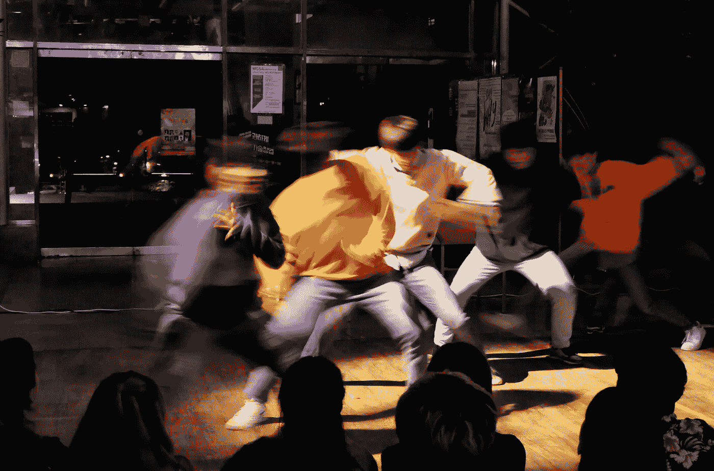

Photo by [Oğuz Şerbetci](https://unsplash.com/@oguzserbetci?utm_source=unsplash&utm_medium=referral&utm_content=creditCopyText) on [Unsplash](https://unsplash.com/?utm_source=unsplash&utm_medium=referral&utm_content=creditCopyText)

# 1.介绍

[BTS (방탄소년단)](https://en.wikipedia.org/wiki/BTS) 是很多东西，包括

*   2010 年在大受欢迎的娱乐节目中首次亮相的七重奏
*   韩国历史上最畅销的艺术家
*   在*福布斯*名人 100 (2019)中排名第 43 位，是世界上收入最高的名人之一

BTS 的成功很大程度上归功于他们所唱的内容，通常是将社会问题嵌入歌词中的，并且经常被称赞为更真实的 k-pop 组合。

# 2.动机

"*第一次用 BTS？”—* [*Dope*](https://www.youtube.com/watch?v=H8lYMWZD5P8)

*   扩展[边项目](https://www.kaggle.com/kailic/bts-lyrics)以收集 BTS 歌曲的数据
*   希望尝试一个文本分析项目，该项目不涉及通常的、更普遍探索的数据集(新闻、社交媒体等)。)
*   为了更好地理解 BTS 作为艺术家的进步，彻底理解他们的歌词

# 3.资料组

*“只管拿走他们拿走他们”——*[*血汗&眼泪*](https://www.youtube.com/watch?v=hmE9f-TEutc)

*   使用抒情网站 Genius 和 BTS 官方网页的数据自行采购和手动清理
*   包括:18 张专辑，225 首歌，从 2013 年到 2021 年，每首歌都有英文歌词翻译
*   有关数据集的更多详细信息，请参见[地图页面](https://www.kaggle.com/kailic/bts-lyrics)

# 4.数据预处理

“雪花落下来，一点一点地飘走”——春日

完整的代码可以在这里找到[，这篇文章试图将代码块嵌入的数量保持在最小，并且大多数代码步骤都没有体现出来，参考链接获得完整的代码。](https://github.com/kaili-chen/bts-lyrics/tree/main/analysis)

## 只保留唯一的轨迹

不包括在探索性分析之外的跟踪包括:

*   重新打包的曲目(以前发行过但在以后的专辑中再次收录的歌曲)—现有曲目的副本
*   混音曲目——被认为是重复的，因为它们的歌词很少不同
*   带有完整版本(`has_full_ver = TRUE`)的曲目—被认为是重复的，因为它的歌词已经在完整版本的曲目中出现
*   “小品”曲目——凭借对 BTS 唱片目录的理解，乐队在曲目列表中加入了对话片段或音乐片段，也称为“小品”
*   “注释”曲目—在某些专辑中，Genius 也有“注释”的翻译，即包含在实体专辑中的印刷文本手册；这些将从分析中删除，因为它们不是歌词

Code Block 1\. Data Pre-processing: only keeping unique tracks in the data frame

## 正常化歌词

*   `pre_normalise`功能—在常规文本规范化方法之前替换文本(例如，替换包含特殊字符的短语)
*   `lyrics`功能——处理各种抒情特征的方法(例如，减少缩写，如将‘dat’改为‘that’；从歌词中删除“啦啦啦”或[非词汇词](https://english.stackexchange.com/questions/211716/non-verbal-lyrics-in-songs-is-there-a-nice-name-for-these)
*   `text`功能——执行常规文本数据清理的方法(删除停用词、词条等)。)
*   `replacements` —除了已经规定的文本数据清理之外，要进行替换的自定义词典(存储在单独的文件中:`replacements.py`)

Code Block 2\. Data Pre-processing: normalize lyrics

# 5.探索性数据分析

你看到我的包了吗— [*话筒掉落*](https://www.youtube.com/watch?v=kTlv5_Bs8aw)

*   在这里找到了代码

## 一般

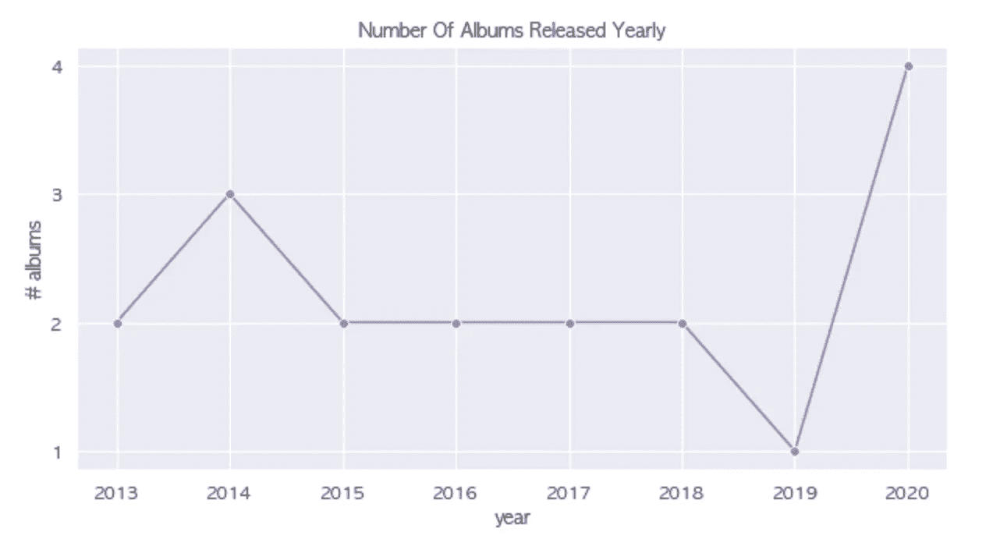

Fig 1\. Number of albums released yearly (Source: author)

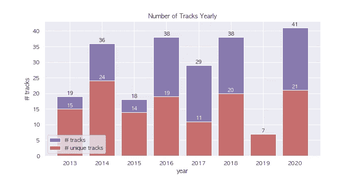

Fig 2\. Number of tracks released yearly (Source: author)

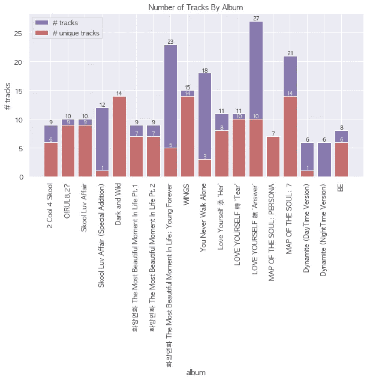

Fig 3\. Number of tracks per album (Source: author)

**观察结果**

*   2020 年可能是专辑发行数量最多的一年，发行的总曲目和独特曲目的数量都没有明显高于 2016 年和 2018 年，其中一半的专辑被发行——可能是因为 2020 年发行的单曲，每个都被认为是不同的专辑(炸药日；炸药之夜)
*   独特曲目的数量在急剧下降之前出现短暂的增长，其中总曲目>独特曲目(下降通常是因为一张专辑是重新打包的)，这表明 BTS 有一个发行模式，在大约 3 张专辑之后可以预期一张重新打包的专辑，其中总< unique tracks
*   Leveraging personal knowledge, to add to the previous point, BTS commonly release a repackaged album as the last album to a series of albums sharing similar prefixes and themes (e.g. Young Forever as the epilogue to the Most Beautiful Moment in Life series; Answer as the epilogue to the Love Yourself series)

## Lyrics

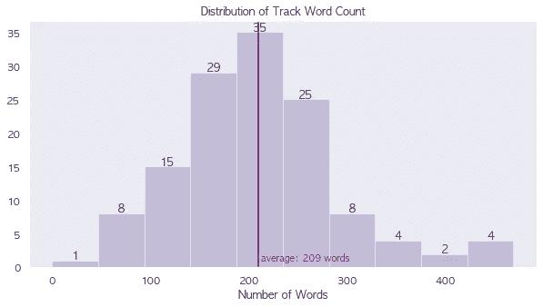

Fig 4\. Distribution of lyric word count in unique tracks (Source: author)

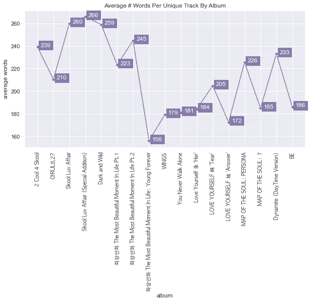

Fig 5\. The average number of words per unique track by album (Source: author)

**观察**

*   BTS 歌词中的单词数遵循典型的正态分布
*   字数的中位数= 207 字，这支持了前面的观点，即数据或多或少具有对称分布
*   整个专辑的平均字数呈下降趋势，这很有趣，因为早期 BTS 发行的歌曲因为缺乏更好的词而更“粗糙”(想想:愤怒，说唱重)，而在最近的过去，他们的歌曲更有声音，这可能是这个观察显示的

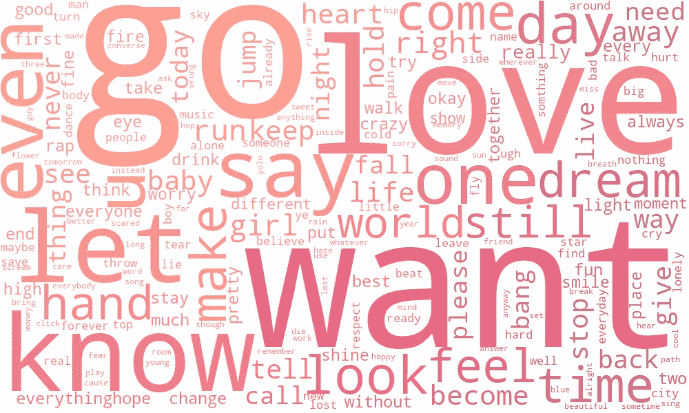

Fig 6\. word cloud of the most common words in BTS lyrics (Source: author)

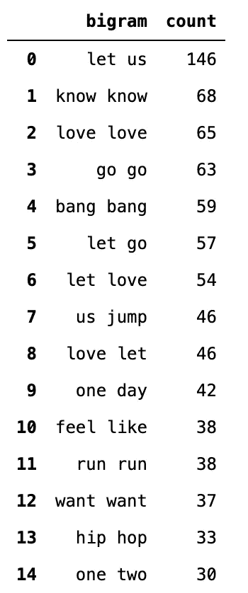

Fig 7\. Top 15 most common bigrams in BTS lyrics (Source: author)

**观察结果**

*   许多二元结构都是重复的同一个词，这并不意外，因为它们是歌词(例如，知道知道，爱爱，走，棒棒，跑跑，旺旺)
*   大多数的二元结构是自然的二元结构，所以这些词经常一起使用也就不足为奇了(例如，让我们，放手，有一天，嘻哈，感觉像，一二)
*   大多数二元模型还包含常用词，如词云所示

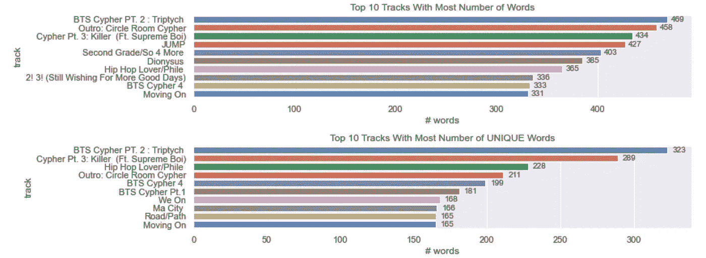

Fig 8\. Top 10 tracks with the most number of words and unique words (Source: author)

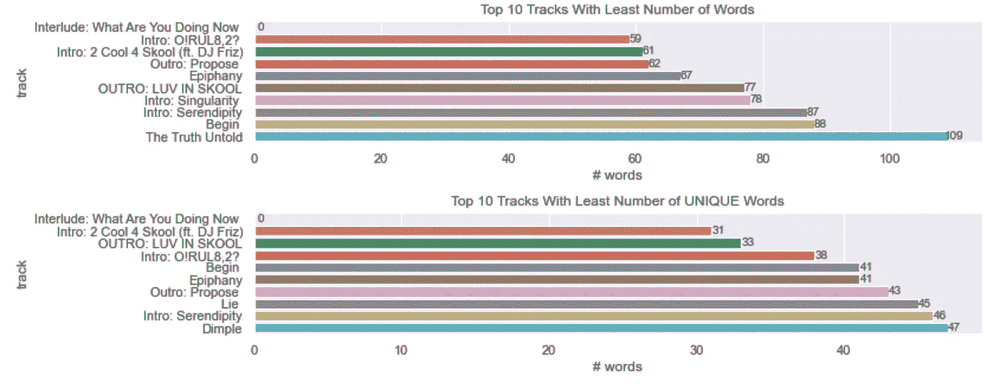

Fig 9\. Top 10 tracks with the least number of words and unique words (Source: author)

**观察结果**

*   标准化后，跟踪“插曲:你现在在做什么”没有词-从用于进一步分析的数据中删除
*   所有的密码音轨(说唱音轨)都在字数最多的音轨中
*   可以预见，开头和结尾轨道用最少的单词组成轨道

## 歌词:单词意义

*   重要性使用 [TF-IDF](https://scikit-learn.org/stable/modules/feature_extraction.html#tfidf-term-weighting) 来衡量，它给不常用的(因此，更有意义和“有趣”)单词更高的权重

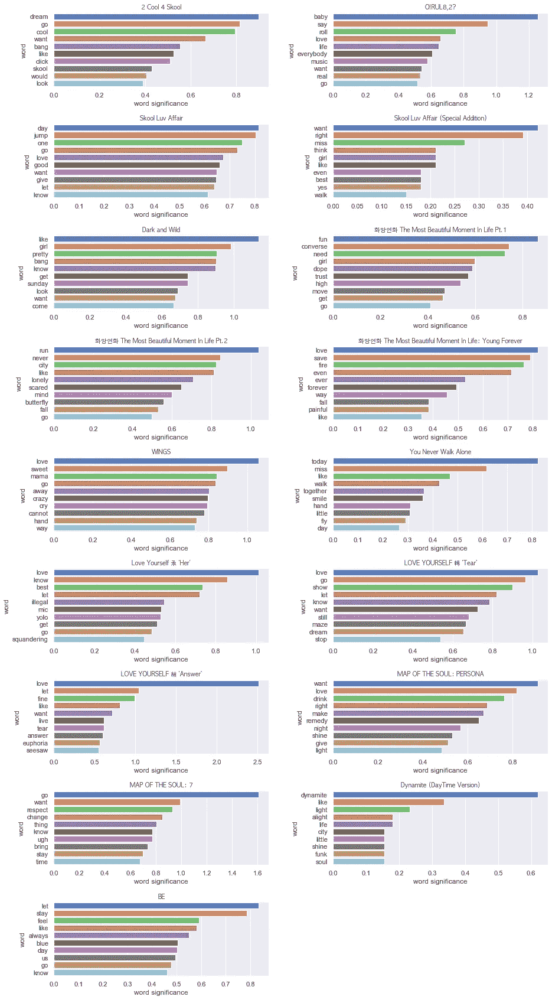

Fig 11\. Most interesting words in each album’s lyrics (Source: author)

**观察结果**

*   《爱你自己》系列名副其实,“爱”这个词是除了一张专辑之外最重要的词
*   作为一个可能的事实，“爱”始终是一个相对重要的词
*   早期的专辑中出现了“女孩”这个词，在明显孤独的专辑“生命中最美的时刻”之后，这个词看起来可能没有那么重要了。2"

# 6.主题建模

*“试着对着镜子咿呀学语，你到底是谁”——*[*假爱*](https://www.youtube.com/watch?v=7C2z4GqqS5E)

*   在这里找到了代码
*   模型:[潜在狄利克雷分配(LDA)](https://www.machinelearningplus.com/nlp/topic-modeling-gensim-python/#4whatdoesldado) ，带有 [genism 库](https://radimrehurek.com/gensim/models/ldamulticore.html)(无监督)
*   模型测量:[连贯性评分](https://radimrehurek.com/gensim/models/coherencemodel.html)
*   方法:用主题数量(`n`)、alpha ( `a`)和 eta ( `b`)的各种值进行实验，以尝试得出最佳 LDA 模型，从而得到可以对 BTS 歌词进行分组的一组主题

## 准备模型输入

Code Block 3\. Prepare LDA model inputs

## 效用函数

*   功能`compute_coherence_value` 将用于减少代码重复

Code Block 4\. Function to initiate and run genism’s LDA model

## 基础模型

Code Block 5\. Base Model

*   输出:`base model c_v: 0.2907`

## 模型 1:改变主题的数量(n)

Code Block 6\. model 1 parameters

*   要测试的主题数量的范围被设置为从 2 到 10，这不仅减少了训练时间，也减少了模型对数据的过度拟合

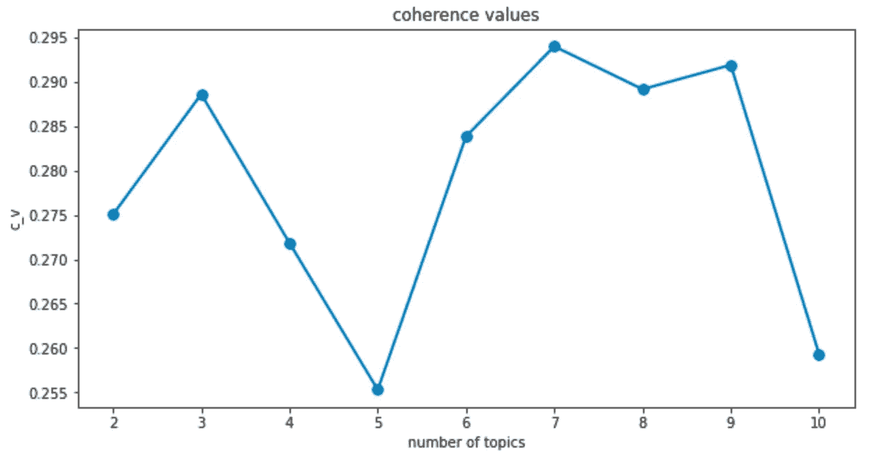

Fig 12\. Plotting model 1’s coherence score

*   为了简单起见，从现在开始将使用获得最高 c_v 的主题数量(`n`)
*   输出:`model 1 c_v: 0.2940` —这是对基本模型的改进

## 模型 2:改变 alpha 值(a)

*   `alpha` : [预期主题的数量，表示我们对每个主题概率的先验信念](https://radimrehurek.com/gensim/models/ldamulticore.html)

Code Block 7\. model 2 parameters

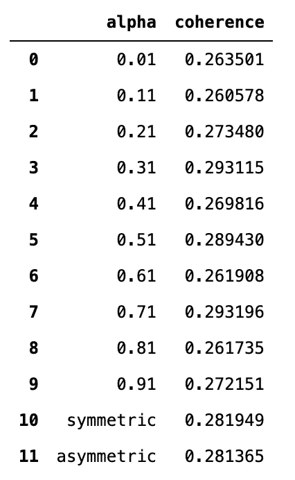

Fig 13\. Table of each alpha value and coherence score

*   当`a=0.71`出现时，连贯性得分最高
*   输出:`model 2 c_v: 0.2932` —这是对基本模型的改进，但略低于模型 1

## 模型 3:改变 eta (b)值

*   `eta` : [对单词概率的先验信念](https://radimrehurek.com/gensim/models/ldamulticore.html)

Code Block 8\. model 3 parameters

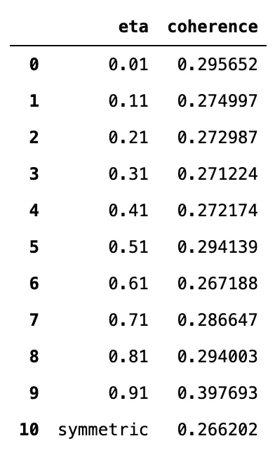

Fig 14\. Table of each eta value and coherence score

*   当`b=0.91`时，连贯性得分最高
*   输出:`model 3 c_v: 0.3977` —这是对基本型号以及型号 1 和 2 的改进

## 最终模型

Code Block 9\. Using model 3 as the final LDA model

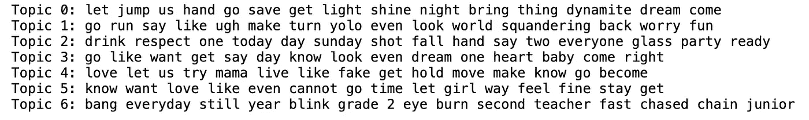

Fig 15\. 15 words associated with each topic extracted by the LDA model

根据个人对 BTS 唱片目录和历史的了解，为数字主题命名:

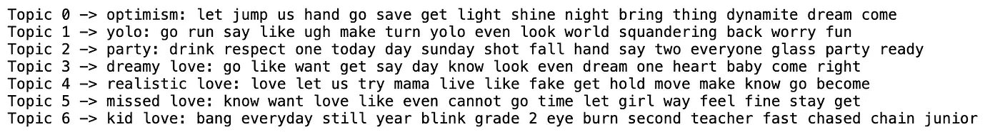

Fig 16\. Putting a name to the topics

# 7.结论

*“喝光它。(受造物)”——*[*狄俄尼索斯*](https://www.youtube.com/watch?v=ZuQCFhGtNY4)

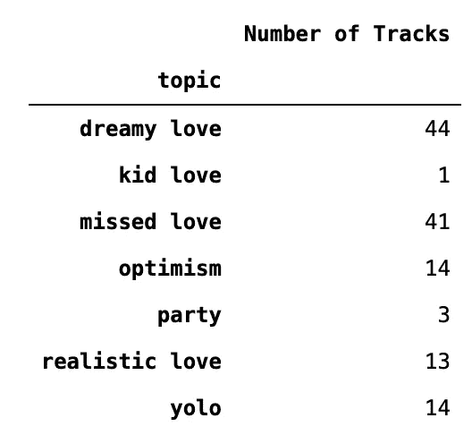

Fig 17\. Table showing topics and the number of tracks classified as each topic

*   话题分布并不均匀，如“孩子的爱”和“聚会”这两个话题的数量很少所示
*   从更具有人类(和粉丝)判断力的角度来看，模型提取的话题彼此相似

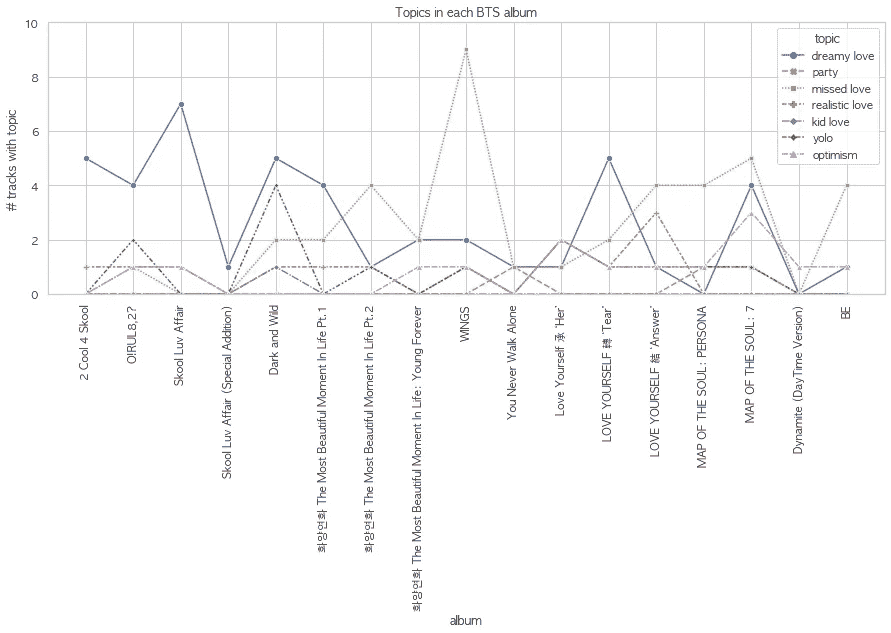

Fig 18\. The trend of each topic by album

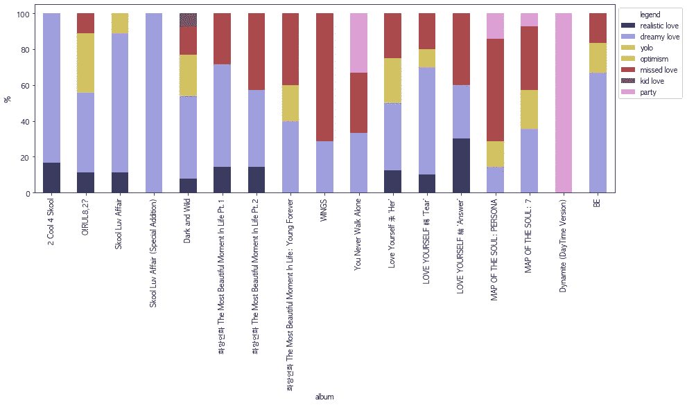

Fig 19\. The composition of each albums’ topics

*   不同专辑中每个主题的数量都是有意义的，在“Skool Luv 事件”中“梦幻爱情”的数量很高，在“WINGS”专辑中“错过的爱情”的数量最高

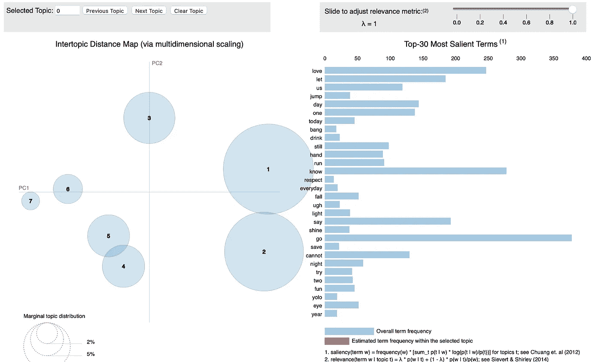

Fig 20\. Visualizing LDA topics with pyLDAvis

*   不同的泡沫之间没有巨大的重叠区域，这是一个很好的迹象，表明主题彼此相当不同
*   与此同时，大多数气泡都不是很大，或者普遍程度不足以使模型成为一个好的分类器(如果人们应该选择以这种方式使用它)，这也反映在模型的低 c_v 分数中

```
Final model c_v : 0.3977
```

*   关于 c_v 分数:这个 LDA 模型在运行这个模型的时间内给出了最好的 c_v 分数，这表明从语义上来说，这个模型产生了最连贯的主题

## 反光

*   BTS 大部分时间，用韩语唱歌。分析中使用的数据集是英语翻译的，这可能会引入一些语言损失
*   该数据集仅包括韩文专辑和最近的英文专辑，不包括日文曲目，并且遗漏了一些特殊专辑(例如，混音带、游戏 ost 专辑)——在主题提取中可以更好地通知模型的附加数据
*   为导出最终 LDA 模型而改变的参数(在特定范围内)限于主题的数量、alpha 和 eta。潜在地，通过改变其他模型参数(例如，通过次数、随机状态)进行试验可能会产生更好的结果模型
*   LDA 可能不是提取主题的最佳模型，其他方法(例如 NMF)可能是更好的方法
*   也许 BTS 只是拒绝在他们的 discography 中有可检测的大量相似主题

## 参考

“*我对一切都很好奇”——*[*男孩与爱人*](https://www.youtube.com/watch?v=XsX3ATc3FbA)

*   [使用机器学习分析泰勒·斯威夫特的歌词](https://news.codecademy.com/taylor-swift-lyrics-machine-learning/) —使用 NMF 了解泰勒·斯威夫特的艺术发展
*   泰勒·斯威夫特唱的到底是什么？使用 LDA 来理解泰勒·斯威夫特唱的是什么
*   [评估主题模型:潜在狄利克雷分配(LDA)](https://towardsdatascience.com/evaluate-topic-model-in-python-latent-dirichlet-allocation-lda-7d57484bb5d0) —探索评估 LDA 模型的不同方法
*   [连贯性评分 0.4 是什么意思？是好是坏？【关闭】](https://stackoverflow.com/questions/54762690/what-is-the-meaning-of-coherence-score-0-4-is-it-good-or-bad)
*   [使用 Gensim (Python)进行主题建模](https://www.machinelearningplus.com/nlp/topic-modeling-gensim-python/#4whatdoesldado) —使用 genism 构建 LDA 模型的指南
*   [BTS 背后的策划者公开了制作 K-Pop 巨头](https://time.com/5681494/bts-bang-si-hyuk-interview/)——了解背景

*编辑日期:2021 年 5 月 16 日，添加了图 19，并更正了一些拼写和语法。*