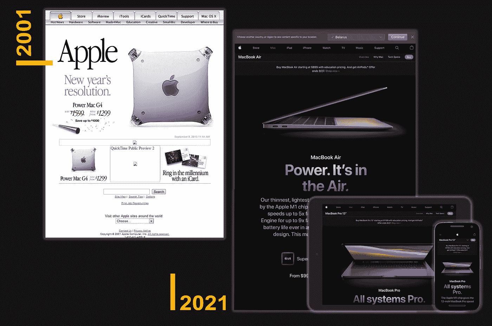
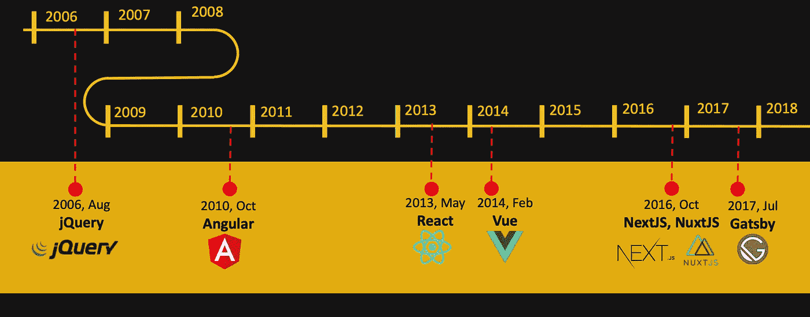
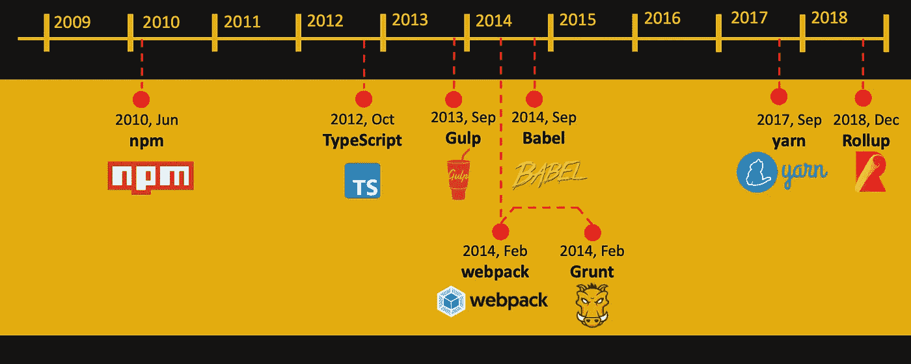
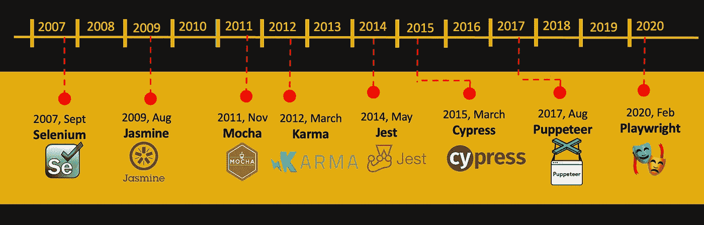

# 如今做一名 JS 前端开发者意味着什么？

> 原文：<https://medium.com/geekculture/what-does-it-mean-to-be-a-js-front-end-developer-nowadays-cb6de806836f?source=collection_archive---------10----------------------->

## 回顾一下 jQuery 还活着的时候 JS 的发展

Photo by [Johannes Plenio](https://unsplash.com/@jplenio?utm_source=medium&utm_medium=referral) on [Unsplash](https://unsplash.com?utm_source=medium&utm_medium=referral)

# 以前是什么

最近，JS 被称为玩具语言，其业务逻辑主要在后端实现。JS 仅用于添加一些简单的与用户的交互，不需要大量的知识库。

以前 FE JS 开发者应该只知道 ***jQuery*** 库和一些对服务器异步请求的基础知识。可能，主要的挑战是在所有浏览器上提供相同的外观和行为，包括旧版本的 Internet Explorer。FE JS 开发人员有时甚至不知道服务器端常用的通用模式。这是一个大多数项目包括单独的 HTML/CSS 开发人员和 JS 开发人员的时代。

所有旧的应用程序都是多页面应用程序。与应用程序交互的主要方式是电脑或笔记本电脑上的浏览器。在这种情况下，服务器负责构建 HTML 布局并将数据放入其中，服务器负责所有的业务逻辑。**模型-视图-控制器(MVC)** 模式闪耀在后端。在前端方面，我们只需要实现一些模态窗口和原始动画，表单，并在`head`部分或在关闭的`body`标签之前上传这些脚本。

# 从多页应用程序到单页应用程序

随着智能手机和物联网的普及，迄今为止一切都被改变了。是时候将开发从**多页面应用**转移到**单页面应用**了。我相信这种转变极大地改变了 JS 开发人员的定义。**单页面应用**将业务逻辑的重要部分从服务器端转移到客户端。

 [## 单页应用程序与多页应用程序

### 网络应用程序正在不知不觉地取代旧的桌面应用程序。它们使用起来更方便，更容易…

medium.com](/@NeotericEU/single-page-application-vs-multiple-page-application-2591588efe58) 

服务器只负责一堆 API，这些 API 应该作为 RESTfull API 从客户端调用。服务器不再构建 HTML 布局。是时候让 JS 开发者知道什么是 **MVC** 模式了。此外，它得到了他们的修改，有时你可能听说在 FE 上它可能被称为**模型-视图-无论什么(MVW)**

 [## 关于 MVC 架构你需要知道的一切

### MVC 架构如何工作的一般解释。

towardsdatascience.com](https://towardsdatascience.com/everything-you-need-to-know-about-mvc-architecture-3c827930b4c1) 

# 三巨头诞生

JQuery 库得到了一个遗留库，新的玩家加入进来: **Angular，ReactJS，VueJS** 。例如，与 Java 开发相比，实际上最流行的框架是 Spring，在我们的情况下，我们应该不断地选择我们需要的框架来绑定我们的职业生涯。我们需要参与某种扶壁，哪个框架更适合即将到来的新项目。我们需要一次又一次地浏览标题为**的文章:Angular vs React vs Vue。**今天是你成为 React 开发者的时候，但明天你必须成为追逐梦想项目的 Angular 开发者。

 [## Vue vs React vs Angular:你会选择什么框架？

### 这个博客对三个最流行的 JavaScript 框架进行了广泛的比较:Vue vs React vs Angular，万一…

medium.com](/swlh/vue-vs-react-vs-angular-what-framework-would-you-choose-5d77a3680b0d) 

# JS 捆扎机和包装经理

FE 代码库在不断增长，分成了成千上万个独立的文件，我们需要一些额外的工具来帮助构建一个应用程序包。它开发了一批捆绑器，如 **gulp** 、 **webpack** 、 **rollup** 等**。**从现在开始，我们不需要只负责 HTML/CSS 部分的开发人员，它将成为任何 JS 开发人员不可或缺的一部分。

我们也不希望找到任何外部库的 cdn，我们应该有自己的包管理器，就像 Java 开发者配备 Maven 一样。没问题，这里是 **npm** 。你可能会说，除了 Maven，Java 开发人员还有像 Grudle 这样的 Maven 替代品。我们已经有了 npm 的替代品— **纱线**。

 [## 2021 年排名前五的 JavaScript 模块捆绑软件

### Webpack、Browserify 等等

enlear .学院](https://enlear.academy/top-5-javascript-module-bundlers-for-2021-e6fe17657fb) 

最近，我们把所有的脚本放在 HTML 布局的`head`部分。但是这是一个相当乏味的任务，因为如果一个脚本依赖于另一个脚本，我们需要跟踪`head`部分中包含的脚本的特定顺序。发明的时候到了，JS 的土地又补充了新的模式: *CommonJS，AMD，RequiredJS* 。最后，来自模块系统的最佳方法在 ***ES6 模块*** 中得到了体现。

 [## --------------------------------------------

### 在我进入模块化部分之前，请查看我独特的比较，垃圾收集与自动…

medium.com](/computed-comparisons/commonjs-vs-amd-vs-requirejs-vs-es6-modules-2e814b114a0b) 

# 设计模式

由于业务的主要部分，逻辑移到了前端部分，我们应该注意应用程序的可伸缩性，这迫使我们学习以前只在后端使用的所有模式。我们现在已经知道了**四人组**的含义，在 FE 开发期间，我们开始遵循**坚实的**原则，并为应用程序配备了**设计模式**，如*观察器、构建器、工厂、策略、适配器、facade*等等。

 [## 设计模式

### 设计模式是软件设计中常见问题的典型解决方案。每个图案就像一个蓝图，你…

重构大师](https://refactoring.guru/design-patterns)  [## 照片中的神盾局原则

### 如果你熟悉面向对象编程，那么你可能听说过坚实的原则。

medium.com](/backticks-tildes/the-s-o-l-i-d-principles-in-pictures-b34ce2f1e898) 

# 新的 JS 挑战

开发**单页面应用**增加了新的挑战。内存泄漏是我们词汇中的一个新词。尽管 JS 是一种高级语言，并且它有一个负责自动释放内存的 Gabarge Collector，但是在没有基本知识的情况下，很容易意外地引入内存泄漏。你可能会问*多页面应用*是否存在内存泄漏，答案是肯定的。但是这里的不同之处在于，只要我们请求一个*多页面应用程序*的新页面，JS 就会释放堆中已经为前一个页面分配的所有内存。在这种情况下，即使内存泄漏存在，我们也不太可能遇到它。

在一个*单页面应用*中，我们使用浏览器历史 API 在页面之间路由，这意味着如果我们在一个页面上引入内存泄漏，它会在页面导航期间更快地在 JS 堆中累积，我们可能会耗尽内存，应用崩溃。

 [## JavaScript 中的内存泄漏以及如何避免它们。

### 概观

medium.com](/preezma/memory-leaks-in-javascript-and-how-to-avoid-them-63916a02f68) 

我们需要解决的另一个问题是 SEO 优化。传统 spa 的内容在客户端呈现(在浏览器中)。当您的应用程序加载时，您的服务器会向浏览器发送一个空的 HTML 外壳和一些要执行的 JavaScript 代码。这是一个问题，因为到目前为止，搜索引擎还不能考虑到这一点。这让我们引入了新的方法— **服务端渲染(SSR)和静态站点生成(SSG)** 。是时候在现有框架的基础上发明新的框架了。我来介绍一下**盖茨比**， **NextJS** ， **NuxtJS。**

 [## 2021 年服务器端渲染的前三名 JavaScript 框架

### 盖茨比 vs Next vs. Nuxt

enlear .学院](https://enlear.academy/top-3-javascript-framework-for-server-side-rendering-276c4848fbbe) 

如果我们正在实现 SSR，我们不能再将所有的 JS 和 CSS 文件作为静态内容交付，我们应该有一个单独的 NodeJS 服务器，它将在服务器端呈现所有的页面。这可能意味着我们需要深入一些 DevOps 的东西，比如我们应该如何在服务器上部署它。或许我们还需要将我们的申请归档？

 [## 记录下你的下一个。JS 应用程序

### 学习使用 Docker 来包装你的下一个。用于测试或部署试运行或生产的 JS 应用程序

medium.com](/swlh/dockerize-your-next-js-application-91ade32baa6) 

# 测试

哦，我又忘了，可能是因为我在 JQuery 还活着的时候就开始工作了😎，但是我们应该已经知道如何测试我们的应用程序。它不再是一个小剧本了。它发现了测试技术的整个领域，我们在书架上放了一本新书，书名是:“**测试 JavaScript 应用**”。它给我们的武器库中带来了新的框架: **Jest** 、 **Jasmine** 、 **Cypress** 等等。当我们提供实现特定特性的粗略估计时，我们也知道我们需要考虑用测试覆盖它的额外时间。最近只有后端开发者知道什么是**测试驱动开发(TDD)或者行为驱动开发(BDD)** ，但是这个时代已经过去了。

 [## 我们应该使用 TDD 还是 BDD…还是两者都用？

### 测试驱动开发和行为驱动开发的比较

medium.com](/walmartglobaltech/should-we-use-tdd-or-bdd-or-both-801b6a2c6f31) 

# 打字出生

JS 带着动态类型来找我们。一方面，它提供了很大的灵活性，另一方面，它也是很多 bug 的来源。我们不能忍受它，我们不比 Java 开发人员差，他们比我们有更少的运行时错误，因为 Java 是一种严格类型化的语言，他们可能会在编译器阶段发现很多问题。在微软推出 TypeScript 之前，我们还没有这样的奢侈。它帮助我们写出更有表现力、更不容易出错的代码，当然我们还没有编译器阶段，但是我们配备了 transpiler 阶段，在它变成运行时错误之前，可能会暴露很多 bug。

 [## 打字稿初学者指南(附历史)

### 在这一课中，我们将学习 TypeScript 是如何出现的，它解决了什么问题。我们也要去…

medium.com](/jspoint/typescript-a-beginners-guide-6956fe8bcf9e) 

# 微服务架构

随着时间的推移，出现了新的趋势——从*单片应用向微服务应用*过渡。起初，它只影响服务器端，但现在我们配备了工具，允许前端也这样做。Webpack 5 引入了一个[**模块联合插件**](https://webpack.js.org/concepts/module-federation/) ，支持多个独立构建和部署的代码束，形成一个应用。这是微前端架构的基础，模块联合插件使得实现这样的架构更加简单。

 [## Webpack 5 联盟:JavaScript 架构的游戏改变者

### 多个 Webpack 构建一起工作，就像一个整体。运行时轻松、可扩展的编排，在两个客户端上…

medium.com](/swlh/webpack-5-module-federation-a-game-changer-to-javascript-architecture-bcdd30e02669) 

# 结论

前端开发在过去的十年里已经发展了很多，今天任何一个开发人员不仅应该知道一些普通 JS 的具体细节，我们还需要知道大量的额外工具。这是一个获取新知识的无限过程，在 JS 进化中没有什么是不发生的。一方面，它使我们的生活变得不容易，另一方面，每一天都是发现我们以前不知道的新事物的机会。