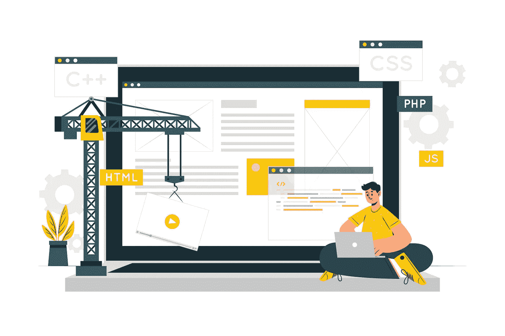

# 如何才能在前端开发中脱颖而出？这里有 8 个要求

> 原文：<https://medium.com/geekculture/what-does-it-take-to-excel-at-front-end-development-here-are-8-requirements-28eeff0f30e8?source=collection_archive---------8----------------------->

## 对于所有有志的刚起步的开发人员——我会帮助你们。

[@storyset](https://www.freepik.com/author/stories) / Freepik

在今天这个时代，每个人都在网上——我们购物、交流、工作，我们在屏幕前度过了生命中相当长的一段时间。当你仔细想想，科技发展的如此之快令人着迷——我仍然记得我们都必须去最近的报摊才能了解世界上发生在我们周围的一切的时代。

但是今天不同了——从我们醒来的那一刻到入睡前的那一刻，我们都被科技包围着。我们几乎无法想象没有手机或笔记本电脑的日子。当我们深深珍惜技术给我们带来的一切(并且仍然设法进一步发展)时，我们很少关注和赞扬我们取得这些进步的人。

你有没有想过谁应该对我们使用的网站和应用程序的外观负责？也许你有时想知道我们是如何设法与我们最喜欢的平台互动的。我敢打赌，你一定惊讶于购买、注册、浏览无止境的产品列表，以及基本上与你在屏幕上看到的东西积极互动是多么容易。嗯，有一些超级英雄成功地完成了所有这些工作——我指的是前端开发人员。

在今天的文章中，我将解释前端和后端开发人员之间的主要区别，以及作为前端开发人员要做到无懈可击需要满足的一些要求。敬请关注。

## 什么是前端开发，为什么它如此重要？

[@storyset](https://www.freepik.com/author/stories) / Freepik

也许你已经听过几百次了，用户交互和用户体验对于任何网站都是多么重要。

前端开发人员负责设计一个壮观的、稳定的、结构良好的、有品牌意识的网站外观，包括功能、结构和交互。当涉及到网站或应用程序设计时，他们是关键角色——毕竟，网站访问者每次登陆平台都会看到他们的工作。

实际上，用户可以与之交互的任何东西都是前端开发。想想浏览、登录、布局设计、图像、菜单、类别和博客部分——这都要归功于前端开发人员的工作。

考虑到现在几乎每个人都在网上，当涉及到搜索和需求时，假设前端开发处于历史最高水平是合乎逻辑的。这篇文章的重点是阐明这个问题——有太多有才华的人对细节有独到的见解。他们需要的只是信息和有用的指导方针。

**让我们快速回顾一下前端和后端开发的主要区别**

如果你对选择哪种网站开发方式感到困惑，那么我会帮你解决。

正如我们解释的，前端开发处理用户界面的开发。前端开发人员的工作是为网站提供最合适的布局、设计、结构和优化功能。基本上，前端开发人员的工作显示在你设备的屏幕上——你在浏览时看到和交互的任何东西都是他们才华的产物。

另一方面，后端开发人员处理编程和脚本。本质上，他们的工作是维护服务器架构、网站安全、数据转换、数据库结构和众多可伸缩性选项。

正如你所看到的，前端和后端开发人员的共同努力对于创建一个好的网站或应用程序来说才是真正重要的。

除了需要许多软技能，如想象力、敏捷性、与客户的良好沟通，以及对网站如何工作和用户意图的全面理解，成为一名成功的前端开发人员还需要实现各种技术技能。让我们来看看下面的一些基础知识——这里有 10 项必备的硬技能，对你未来的前端开发职业生涯至关重要。

## 查看这 10 项必备的前端开发技能

**从绝对必要的 HTML 开始**

 [## 主页

### 披露:您的支持有助于保持网站运行！我们为我们在…上推荐的一些服务赚取介绍费

html.com](https://html.com) 

如果你想从事前端开发，熟悉 HTML 是绝对必要的。它代表超文本标记语言，它的作用是展示网站页面在导航、位置和设计特征方面的整体结构。HTML 可以帮助你决定众多的页面特性——从标题的大小、主菜单和文本段落的位置到图像和其他类型的视觉元素。简而言之，HTML 是前端开发人员的主要路线图，所以你绝对应该把它包括在你的下一个学习任务列表中。

**别忘了 CSS**

 [## CSS 是用来做什么的？

### 如果你对网页设计或开发感兴趣，你可能会问自己，“CSS 有什么用…

www.codecademy.com](https://www.codecademy.com/resources/blog/what-is-css-used-for/) 

每当前端开发人员不得不处理网站的整体风格时，他们最终会转向 CSS。它代表级联样式表，并规定样式特性，如文本字体和大小、内容间距和列分布、背景颜色、添加动画，以及几乎所有与页面表示有关的特性。

一个熟练的前端开发人员同时处理 HTML 和 CSS，所以这不是选择哪一个的问题；相反，这是一个掌握两种语言的问题。总的来说，CSS 用于设计已经使用 HTML 创建的内容。

**添加前端开发三位一体的最后一块——JavaScript**

 [## JavaScript 是用来做什么的？灯塔实验室

### 全世界的程序员都使用 Javascript 来创建动态和交互式的 web 内容，如应用程序和…

www.lighthouselabs.ca](https://www.lighthouselabs.ca/en/blog/what-is-javascript-used-for#:~:text=Javascript%20is%20used%20by%20programmers,by%2097.0%25%20of%20all%20websites) 

到目前为止，我们已经介绍了使用 HTML 来设计某个页面，然后使用 CSS 来帮助我们修改已经创建的内容。但是，如果我们想最终得到一个真正令人眼花缭乱的功能网站，我们需要增加一个功能(至少可以这么说)——我们需要使它尽可能具有交互性。

这就是 JavaScript 发挥作用的地方。如果一个网站不仅仅是为了显示内容，那么它需要 JavaScript，这样用户就可以以各种方式与平台进行交互。它的主要目的是允许开发人员创建动态和交互式的 web 内容。构建响应性用户界面、自动补全、动态页面、构建应用程序和开发游戏都是 JavaScript 的亮点。

**不要错过 JavaScript 库和框架**

 [## 2022 年 Web 开发中最受欢迎的 10 个 JavaScript 框架和库

### 毫无疑问，JavaScript 现在是世界上排名第一的编程语言，也是 web 开发之王…

medium.com](/javarevisited/10-of-the-most-popular-javascript-frameworks-libraries-for-web-development-in-2019-a2c8cea68094) 

一旦您熟悉了 JavaScript，接下来您可以做的最好的事情就是自学 JavaScript 库和框架。

库是非常有用的数据库，其中包含您可以使用的已经开发的代码。从本质上讲，这节省了时间，使编程更加高效。

框架类似于库，因为它们也包括现成的代码。主要的区别是你选择一个特定的库组件，并在你的代码中指定它，使用框架，你把你的代码插入到框架中。库和框架都承诺更快和更智能的开发过程。

**自举框架**

 [## 引导程序

### 阅读安装文档通过 npm、RubyGems、Composer 或 Meteor 安装 Bootstrap 的源 Sass 和 JavaScript 文件…

getbootstrap.com](https://getbootstrap.com) 

一个简短的声明——在上面的链接中，你可以读到 JavaScript 最著名和最广泛使用的库和框架，现在我们把注意力集中在一个 CSS 框架上——见见 Bootstrap！

就像 JS 的库和框架一样，Bootstrap 也为您提供了大量(主要)用 HTML 和 CSS 编写的代码和组件。它非常方便，因为它还节省时间，并且对前端和后端开发人员都非常有效。

**一路 APIs】**

 [## WordPress 开发中的微服务与| Vipe Studio

### 在这个时代，就好像我们一直被网络术语包围着——无论是网络开发、编程…

vipestudio.com](https://vipestudio.com/en/microservices-vs-apis-in-wordpress-development/) 

API(应用程序编程接口)是支持两个应用程序或服务之间通信的软件。简而言之，它们是软件用来交流的通道。

如今，越来越多的开发者关注微服务软件架构(相对于整体模型)，API 已经迅速成为 web 开发的重要前景。它们允许开发人员快速有效地部署或调试软件的单个单元，而不会干扰整个构造。在前端开发中，当涉及到网站集成时，API 是有用的——例如，您可能希望将日历集成到您的网站或跟踪订单片段中。

**熟悉 CMSs**

 [## 什么是内容管理系统(CMS)？

### 内容管理系统，通常缩写为 CMS，是帮助用户创建、管理和修改内容的软件…

kinsta.com](https://kinsta.com/knowledgebase/content-management-system/) 

内容管理系统如今非常庞大——据估计，WordPress(世界上最大和最受欢迎的内容管理系统)驱动着[超过 40%的全球网站！](https://w3techs.com/technologies/details/cm-wordpress#:~:text=Our%20reports%20are%20updated%20daily,is%2042.9%25%20of%20all%20websites.)

作为一名前端开发人员，你应该熟悉 CMSs，因为你很有可能要在一个已经使用 CMS 建立的网站上工作。它们很受欢迎，因为普通用户无需任何技术技能就可以更新、添加内容和管理平台——一旦用户实现了任何更改，CMS 就会以 HTML 和 CSS 等形式覆盖它们。

**不要错过响应式设计原则**

 [## 响应式网页设计:它是什么以及如何使用它

### 开始响应式网页设计！在这篇文章中，你会发现如何回应用户的行为和…

www.smashingmagazine.com](https://www.smashingmagazine.com/2011/01/guidelines-for-responsive-web-design/) 

如今，人们主要通过智能设备访问网站和应用程序。

对于前端开发人员来说，熟悉响应性和移动设计原则非常重要。毕竟，大多数用户将通过智能手机访问该平台。所有的功能和设计都必须能够正常工作，并且可以随时随地在任何设备上进行调整。

## 把东西包起来

成为一名前端开发人员就像掌握一门手艺——所有的 web 开发都非常接近表演艺术！

我希望这篇文章能对所有选择前端开发作为职业道路的有志开发人员有所帮助。当然，我已经列出了所需的基本技术技能，但是一旦你掌握了它们，你将能够不断升级，每天都有越来越多的成就。恭喜你，祝你好运！

大家好，我是 Ivan，我在这里与大家分享我对文字、优秀内容、企业家精神、个人发展、管理、爱好以及所有这些方面的热情。

我在我的 WordPress 开发机构@ [Vipe Studio](https://vipestudio.com/en/) 担任首席执行官，在那里我很高兴领导一个多样化的、出色的和充满活力的专家团队。请随时联系我——我很乐意交流新的想法并相互启发！