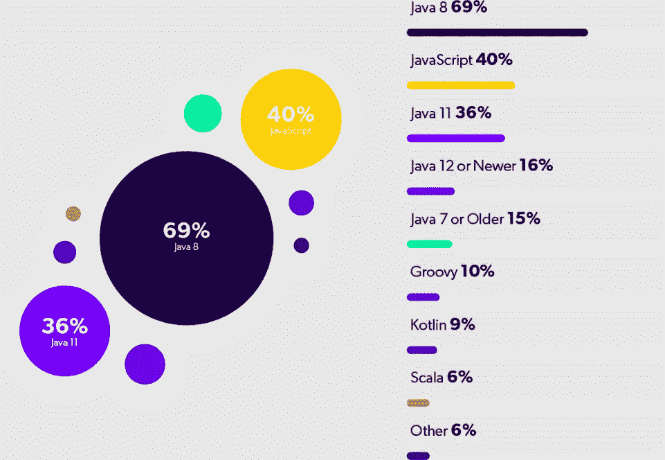

# 2022 年 Java Web 开发的未来是什么样子的？

> 原文：<https://medium.com/geekculture/what-does-the-future-of-java-web-development-look-like-in-2022-d103b0b065a?source=collection_archive---------17----------------------->

[截至 2021 年，Java 是全球开发者使用第五多的编程语言](https://www.statista.com/statistics/793628/worldwide-developer-survey-most-used-languages/)。即使有了 Python 和 Node.js 这样的技术，Java 开发服务仍在继续增长。

Java 是一种简单的面向对象的编程语言，用于构建数字解决方案。它是一种跨平台的编程语言。Java 工程师也钦佩该技术扩展应用程序的能力。

谷歌、Spotify、Pinterest、亚马逊、优步、Airbnb 是几个广泛利用 [Java 应用开发](https://www.botreetechnologies.com/blog/why-is-java-application-development-popular/)的公司。持续的更新使编程语言保持完整，并与当今的企业和初创公司相关。

Source: JRebel

多年来，Java 一直是编程语言的选择。在 TIOBE 的索引中，Java 是最受欢迎的编程语言。

然而，关于 [Java web 开发服务](https://www.botreetechnologies.com/java-development-company)对当今商业的功效，问题出现了。它能够处理机器学习、人工智能、数据分析、元宇宙等等吗？

在我们理解 Java 的[前景之前，让我们来看看为什么公司会利用 Java web 开发并将继续这样做。](https://www.botreetechnologies.com/blog/what-does-the-future-of-java-web-development-look-like/)

# **为什么 2022 年公司更青睐 Java Web 开发？**

公司更喜欢使用 Java 有几个原因。随着 Java 8 的引入，每个 Java web 开发公司现在都在探索如何以更好的方式从该技术中获益。

**以下是 2022 年公司仍然更喜欢 Java 开发的原因:**

*   **平台无关** [Java 应用开发流程](https://www.botreetechnologies.com/blog/why-is-java-application-development-popular/)最大的优势就是编程语言是平台无关的。开发人员可以在多种平台上轻松编译 Java 字节码，比如 Windows、Linux 和 macOS。
*   **易学** Java 是最容易学的编程语言之一。大学和学院将 Java 作为主要的编程语言教授给学生。它有一个简单的语法，开发人员可以在几周内开始编码。
*   多线程
    多线程是 Java 最强大的特性之一，它使开发者能够创建两个或更多可以并发工作的程序。它提高了应用程序的响应能力，并最大限度地减少了系统的资源使用。

# Java Web 开发:未来的用例

[Java 是开发运维、人工智能、虚拟现实](https://www.oracle.com/se/a/ocom/docs/java-strength-in-numbers.pdf)、大数据、持续集成、分析、移动、聊天机器人和社交的头号语言。随着机器学习和数据分析占据中心位置，Java 也在不断发展以满足这些需求。

**以下是 Java web 编程** **语言**的顶级真实用例

*   ****企业应用** 如今，大多数公司都需要企业应用来简化运营。Java 是构建 SaaS 产品、企业 CRM、CMS、ERP 和其他系统的最佳编程语言之一。它支持开发可扩展的应用程序，提供完整的操作效率。几乎每个企业软件开发公司都在其技术栈中使用 Java。**
*   ****科学解决方案** Java 拥有强大的特性和库，使其适合科学应用和解决方案。Java 对数学计算很有用，MatLab 是最流行的工具之一。Java 也适用于数值计算和其他科学发展( [NASA 将 Java](https://newrelic.com/blog/nerd-life/what-you-can-do-with-java) 用于有趣的应用)。**
*   ****金融科技应用** 随着金融科技的发展，企业寻找 Java web 应用开发公司来满足他们的需求。Java 提供了在 FinTech 中构建服务器端应用程序的惊人能力，以确保服务器之间正确的数据交换。从零开始创建金融科技解决方案也是一项非常有用的技术。**
*   ****大数据解决方案** 没有一个开发者能否认 Java 在大数据中的用处。大数据框架 Apache Hadoop 是用 Java 写的。Apache Kafka 对处理实时数据很有用，也是用 Java 和 Scala 编写的。ElasticSearch 是一个用于集成和分析数据的强大工具，它也利用了 Java 编程语言。**
*   ****机器学习** Java 拥有大量的[机器学习库](https://www.botreetechnologies.com/machine-learning-solutions)，使开发者能够构建基于人工智能的高级应用。Java 深度学习(DLJ4)和 Apache Spark 的 MLib 是两个最受欢迎的机器学习库。Java 对于 AI 解决方案来说是高度稳定的，甚至比 Python 还要稳定。**

# **Java Web App 的未来:积极的一面**

**正如我们在上面看到的，在现代技术世界中有几个 Java 的用例。从人工智能到企业应用，Java 在技术进步方面提供了惊人的能力。**

**专家和开发人员对 Java 有不同的看法。对 Java 虚拟机的普遍看法是积极的。这是一个很好的开发环境，有很多工具来构建高质量的解决方案。**

*   **Java 也为云做好了准备，提供了新的垃圾收集器和线程实现。今天，大多数公司可以轻松地在云上使用每一个 Java web 应用程序开发框架。**
*   **Java 的另一个好处是它对于微服务来说非常优秀。它将保持长期的领先地位，因为它有能力为云开发微服务。从这个意义上说，Java 的未来看起来非常明显——成长和成熟的未来。**
*   **与此同时，面向企业的快速 web 应用程序开发仍然是一个流行的选择。企业严重依赖 Java 来满足其应用需求。因此，编程语言的未来看起来是光明的。**

# **Java Web App 的未来:挑战**

**开发人员和 Java 专家也看到了未来几年的挑战。虽然 Java 是一门伟大的编程语言，但它可能会败在 Python、Node.js 和其他几种高级语言的手下。**

**Java 应用程序确实有比其他语言更复杂的代码库。该语法在理解和健壮性方面存在限制。因此，即使是最好的定制软件开发公司也可能不愿意在现代应用程序中使用 Java。**

*   **随着技术的进步，工程师们认为 Java 可能无法跟上创新的步伐。这是一项庞大的技术，无法修改以适应现代需求。**
*   **用 Java 进行实验比其他编程语言风险更大。当公司扩展解决方案时，他们必须考虑数据库和应用程序的变化。Java 可能无法达到这样的实验规模。**
*   **即使在 Java 对最新进展有用之前，现有应用程序的维护仍将是重点。因此，Java 应用程序开发过程将需要几十年的时间来加速，以适应这种颠覆性的步伐。**

****阅读更多:**[**2022 年招聘 Java 开发者指南**](https://www.botreetechnologies.com/blog/guide-to-hiring-java-developers/)**

# **包扎**

**对于所有类型的应用程序来说，Java 是一种完全可行的编程语言。近年来，Java 与其他编程语言之间的争斗愈演愈烈。Java 有可能再次成为领头羊，但还需要一段时间。公司需要关注如何最大限度地利用这种语言。**

**[**联系我们**](https://www.botreetechnologies.com/contact) **今天免费咨询。****

**BoTree Technologies 是一家领先的 Java web 开发公司，可以帮助企业满足他们的应用程序开发需求。**

***原载于 2022 年 3 月 9 日 https://www.botreetechnologies.com***。****