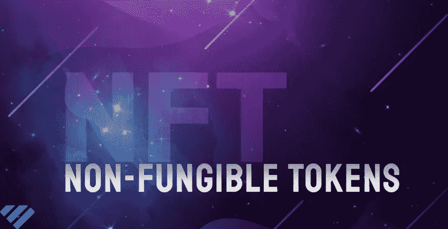

# NFT 的炒作意味着什么？

> 原文：<https://medium.com/geekculture/what-does-this-nft-hype-mean-fbb0843e0e97?source=collection_archive---------10----------------------->

Non-Fungible Tokens

数字资产和区块链技术的日益普及和需求正在改变贸易的未来。因此，NFT 也是这种积极增长的受益者。NFT 为艺术、时尚、游戏和时尚领域的大型行业参与者打开了大门。随着将数字资产应用于多个行业的快速发展，区块链上的智能合约功能已经获得了对许多资产未来估值的巨大把握。

# 什么是不可替换令牌(NFT)？

NFTs 代表不可替换的令牌。NFT 代表一个数字文件，这是唯一的加密生成和验证使用区块链技术。因此，它们不能互换。它们是可数字化收集的独特资产，以加密货币的形式保持其价值。拥有一幅 NFT 就像拥有一件独一无二的艺术品或一件值得收藏的古董。NFT 是独特的令牌或数字资产，由于其独特性而产生价值。一旦您创建或购买了此令牌，它会为您分配一个唯一的号码。因此，只有你可以购买或出售代币，因为由于其不一致的特征，它们是不可复制的。

NFT 的所有权被限制在一个数字账本上，任何人都可以访问，因为它是公开存储的。该分类帐持续监控谁拥有 NFT，并确保 NFT 不会被复制。不可替代的代币代表有形和无形的物品，如艺术品、运动卡，甚至虚拟房地产。没有哪两个非功能性测试是完全相同的，很容易验证。每个 NFT 都包含具体信息，如买家姓名、活动日期和地点。

# 非功能性测试的显著特征是什么？

NFTs 的重要性在于提供了使用数字账本安全估价、购买和交换数字艺术品的能力。以下是非功能性测试的一些重要特征。

*   不可分割性:由于非功能性甲状腺肿是以完整的形式存在的，因此不可能将其分成小的种类。
*   **可验证性:**可以在区块链上存储历史所有权数据。像数字艺术品这样的项目可以很容易地从原始创作者处追溯到完整的身份验证，而无需任何第三方验证。
*   **非破坏性:**由于整个 NFT 数据通过智能合同存储在区块链网络上，因此不可能破坏、移除或复制非功能性传输系统。不可替换令牌的所有权是不可变的。这意味着收藏家或游戏玩家拥有他们的代币，而不是产生这些代币的公司。

你可以[通过上传数字艺术作品等文件来创建 NFTs](https://www.leewayhertz.com/create-non-fungible-tokens/) 。像任何其他艺术形式一样，NFT 是不可互换的，这使得它们更像是“收藏品”。以太坊等一些区块链平台允许数字艺术被“令牌化”，并通过智能合约功能使用去中心化的开源区块链安全地存储所有权。然而，它完全消除了对中介的需求。

# 为什么应该创建 NFT？

事实证明，非技术森林是一种很好的投资形式。因此，有必要了解为什么要创建不可替换的令牌，原因如下:

*   **提供流动性** 令牌化资产在向投资者传递其资产的更多流动性方面发挥着至关重要的作用，尤其是在需要时。例如，虚拟土地所有者可以向广告商有偿出租他们的虚拟空间。同时，他保留了对土地的所有权。这意味着虚拟土地属于所有者，但它的一部分在租金方面是液化的。在房地产领域，拥有和管理虚拟土地让你有权决定出租或建立一个安全的广告或在线销售业务。
*   **持有标记化资产的估价** NFTs 的广泛使用为艺术品等实物创造了动力和媒介。将这些物品符号化可以带来巨大的好处，比如消除艺术品的重复，限制艺术家的所有权。这将提高需求，增加更多艺术品的价值。艺术家可以直接向全球买家出售数字形式的艺术品，无需任何拍卖行或画廊。这使得他们可以保留很大一部分销售利润。当版税被编入数字艺术作品时，创作者也能获得销售利润的一部分。
*   **不可改变的所有权** 由于区块链技术的出现，游戏玩家有机会成为游戏物品和其他资产的不可改变的所有者来赚钱。甚至玩家也有机会创造和赚钱虚拟结构，如主题公园、赌场等。他们也有可能在玩游戏时出售他们拥有的数字物品，如服装和其他物品。

随着各行各业对非功能性桌面的需求不断增长，从数字资产到日常必需品，非功能性桌面已经触手可及。现实世界中资产跟踪和数据经济的用例越来越多，已经在高速发展。不可替代的令牌是令人难以置信的新东西，它们背后的技术仍在通过不知疲倦的创新经历着重大的变化和改进。随着分散金融行业超过 40 亿美元，NFTs 的未来看起来很有希望，并且在未来的日子里将会大幅增长。