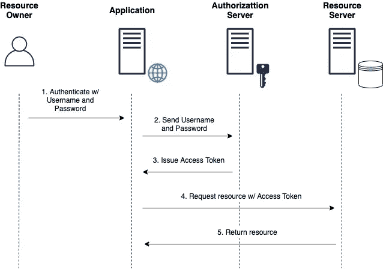
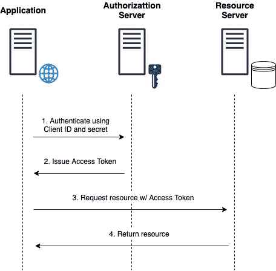
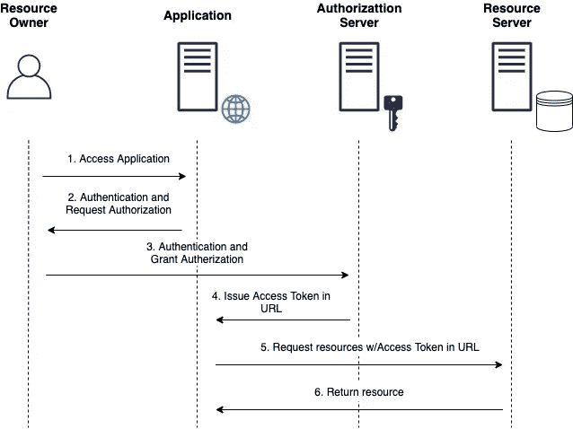
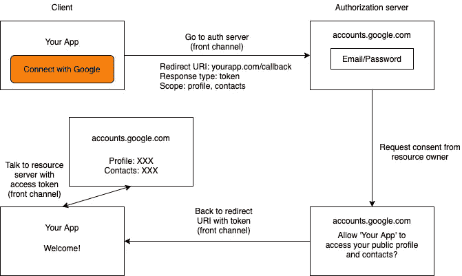
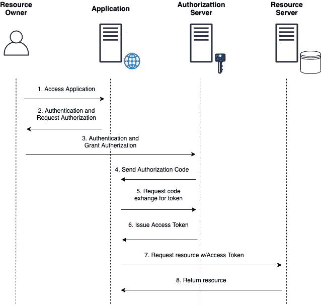
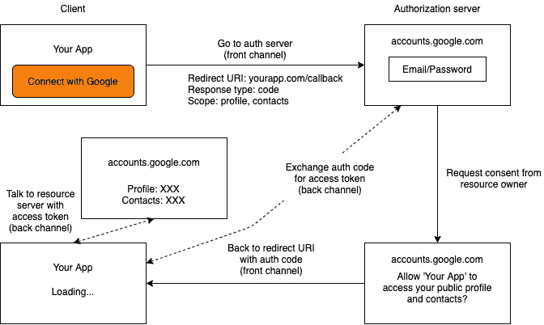

# 选择什么授权类型及其原因:揭开 OAuth 2.0 授权类型的神秘面纱

> 原文：<https://medium.com/geekculture/what-grant-type-to-chooses-and-why-demystifying-oauth-2-0-grant-types-321bc2d46ad?source=collection_archive---------24----------------------->

当用户登录 web 应用程序时，该应用程序会获得一个“访问令牌”来从服务器获取数据。浏览器(客户机)将代表用户使用这个令牌来导航到 web 应用程序的不同页面，发出请求等等。因此，这个令牌充当用户的标识符。

但是令牌究竟是如何收集的呢？这篇文章将谈论一些在工业中遵循的工作流程。注意，这篇文章将**而不是**谈论 OAuth 2.0 的起源以及它是如何产生的。它面向已经熟悉 REST APIs 基础的读者，为他们提供了请求中使用的授权类型的典型工作流的概述。

当我们想到用户在 web 应用程序中获得身份验证(并获得访问令牌)时，我们首先想到的可能是使用“用户名/密码”登录。

让我们讨论一下这个工作流程是如何工作的。

> 在这种方法中，资源所有者只是将其凭证直接传递给应用程序。也就是说，高度信任该应用程序来处理此类敏感数据。

**上图中—**

*   资源所有者:用户，试图登录的人。
*   应用:网络应用
*   授权服务器:web 应用程序用来验证用户的专用服务器
*   资源服务器:为用户存储用户数据的地方

资源所有者将其凭证提供给应用程序，然后应用程序将凭证发送给授权服务器进行验证。在验证用户的凭证之后，auth server 发布一个访问令牌，并将其发送回客户端。客户机将使用这个令牌在任何需要的时候从资源服务器访问资源(当然是根据用户的请求)。

## 此获取访问令牌的流程使用“资源所有者密码”授权类型。

相当简单，但是有一个警告，信任应用程序忠实地处理敏感数据。通常，出于安全原因，这种授权类型是通过后台通道(服务器-服务器通信)使用的，而不是前台通道(浏览器-服务器通信)。也就是说，流中的请求使用后端服务而不是浏览器发生。

如果您没有任何用户，并且希望对传入的请求进行某种身份验证，该怎么办呢？

> **在这种方法中，应用程序经常在没有用户的情况下使用调用 API 的服务。**

这里，auth server 为来自应用程序的请求颁发访问令牌，而不验证任何“用户/密码”。那么，如果没有用户，认证服务器如何知道传入请求的有效性呢？我们在哪里使用这种奖助金类型，为什么？

让我们来看看第一步。应用程序使用**客户端 ID** 和**客户端秘密**向认证服务器发出请求。

客户端 ID 是应用程序的公共标识符。作为一名开发人员，当您希望访问第三方应用程序以使用他们的资源(访问 API)来开发应用程序时，您需要向第三方应用程序注册您的应用程序。例如，如果您想将 Google Maps APIs 用于您正在设计的 web 应用程序，您的应用程序需要使用客户端 ID 向 Google 注册。

客户端密码是应用程序的私有标识符。它安全地存储在服务器端，不向公众开放。这可选地用于向第三方应用注册以增强安全性。稍后将详细介绍。

这个想法是，auth server 将验证“客户机证书”——客户机 ID/客户机秘密，与传入的请求一起附加，并相应地发出一个访问令牌。

这是给谁的，什么时候安全？一般来说，这个流的目标是需要访问不属于用户(个人)的受保护资源的客户机。为了确保安全，它通常用于反向信道。例如，在基于微服务的应用程序中，一个服务与后端的另一个服务(机器对机器通信)进行对话，其中没有用户参与，环境是安全的。

## 此获取访问令牌的流程使用“客户端凭据”授权类型。

到目前为止讨论的两种授权类型都非常适合于反向通道用例，在这种情况下，您不希望将请求直接从浏览器发送到 auth 服务器，而是希望您的后端来做脏活。但是如果没有暗道呢？如果是基于 React 或者 Angular 的纯 javascript app，没有任何后端(静态页面)怎么办？也许它调用了一些后端 API，但它没有任何后端来呈现页面或运行一些代码。

在这些情况下，唯一的选择是使用前通道。

> 在这种方法中，交易通过前端渠道进行。

第一步是在浏览器上访问应用程序。该应用程序将提示用户输入用户名和密码。用户还会看到应用程序的权限列表。根据用户授予的权限，应用程序可以代表他们访问资源。

你可能想知道，这是新的！在“资源所有者密码”授权类型中(我们同样提供了用户名/密码)，我们没有看到任何这样的提示。这是因为对于该授权类型，我们通过直接向应用程序提供用户凭据并默认授予所有访问权限来信任应用程序。

然而，这里要注意的是，资源所有者直接向 auth 服务器提供其凭证，而不是向应用程序提供凭证(步骤# 3)。那是什么意思？

我们希望我们的应用程序用户直接与认证服务器*对话*，我们**不想处理敏感信息。一个真实的例子(步骤 3)是使用像谷歌或脸书这样的服务登录各种网络应用。**

假设您希望您的 web 应用程序用户使用他们的 gmail 帐户登录。第一步是去谷歌的认证服务器，为应用程序创建客户端 ID 和客户端密码。一旦应用程序注册到谷歌的认证服务器，它会将你的应用程序识别为“可信应用程序”。然而，对于这个流，不使用客户端秘密，因为该流仅*用于前端通道使用。*

一旦用户授予适当的权限(步骤# 3)，认证服务器将生成一个令牌并将其返回给应用程序(步骤# 4)。

那么令牌是怎么归还的呢？既然一切都在前面的频道上，这真的安全吗？Google 怎么知道认证后重定向到哪里？

为了更好地理解，让我们看一下下图。

当客户端向谷歌发送“登录”页面的请求时(步骤 3)，它还发送“重定向 URI”、“响应类型”、“范围”，并将请求作为查询参数。

*   “重定向 URI”告诉认证服务器在验证用户后去哪里
*   “范围”定义用户授予的权限。
*   “响应类型”告诉认证服务器返回访问令牌

一旦 auth server 验证了凭据，它就会生成访问令牌(因为响应类型设置为“令牌”)，并将其返回给提供的回调 URI。请注意，令牌交换是使用前端通道进行的，并且是公开的。

这很容易危及访问令牌(访问令牌应被视为敏感数据，因为它可用于访问敏感资源)。但是，对于单页面应用程序，只要我们意识到安全风险，就可以实现这个流程。

## 获取访问令牌的流程使用“隐式”授权类型。

现在，让我们来谈谈当今许多 web 应用程序中最常用的一种。

隐式授权类型向我们介绍了如何使用外部(第三方)认证服务器登录的想法。但是我们发现，它并不完全安全，令牌可以很容易地从浏览器中提取出来。

隐式授权类型的大问题是仅使用前通道来交换令牌。这个流程将充分利用前通道和后通道。

> 在这种方法中，前通道和后通道都被用来提供增强的安全性。

该流程的前 3 个步骤类似于隐式授权类型，只有一个关键区别。在步骤# 3 中，“响应类型”被设置为“代码”而不是“令牌”，以返回名为“授权代码”的内容。那是什么？嗯，这是客户通过反向通道获取访问令牌的代码。

在第 5 步和第 6 步中，当客户端获取代码并从后端服务器向 auth 服务器发出请求时，就会发生令牌交换。一旦认证服务器验证了在步骤# 4 中生成的认证代码，以及一些其他信息，比如客户机机密，它就将访问令牌返回给客户机。请注意，交换不能使用前端通道进行，因为“秘密”密钥是秘密存储在服务器上，而不是浏览器上。通过反向信道交换还可以防止拦截请求和提取授权码以生成访问令牌的恶意尝试，因为“秘密”在服务器上仍然是安全的。

客户端继续使用反向通道从资源服务器访问资源(步骤# 7 和 8)。

## **获取访问令牌的流程使用“授权码”授权类型。**

目前就这些。我希望它是有用的。:)

*作者:*[Atif Shafi](https://www.linkedin.com/in/iatif/)

# 参考

*   [OAuth 2.0 和 OpenID 连接(视频)](https://www.youtube.com/watch?v=996OiexHze0&ab_channel=OktaDev)
*   [OAuth 2.0 授权类型](https://docs.pivotal.io/p-identity/1-11/grant-types.html)
*   [客户端 ID 和密码](https://www.oauth.com/oauth2-servers/client-registration/client-id-secret/)