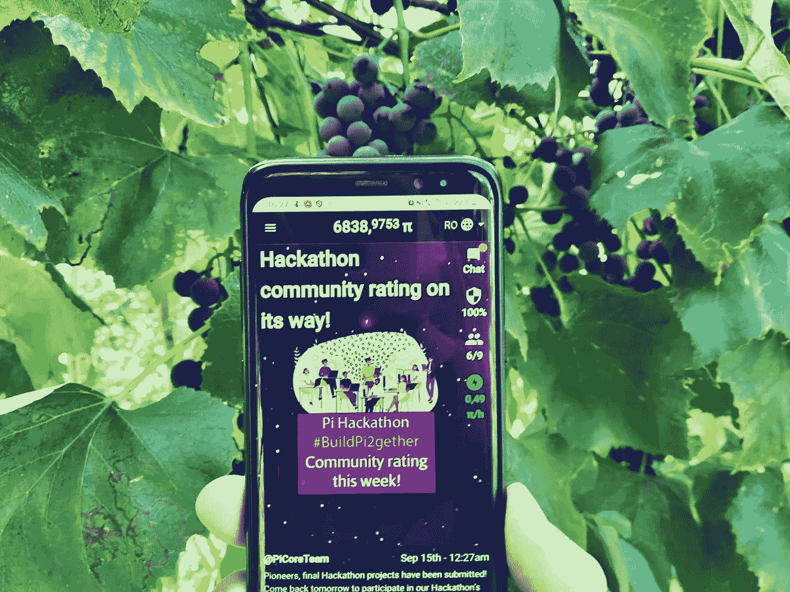

# Pi 网络上最近发生了什么

> 原文：<https://medium.com/geekculture/what-happened-lately-on-pi-network-9b79f8728760?source=collection_archive---------3----------------------->

## 为 12 月的 Mainnet 发布做准备

Photo made by the author

T[Pi 网络](https://minepi.com/)的目的，正如团队在这个项目开始时所说的，是成为人们的加密货币。虽然这可能是一个很好的信息，但首先，在项目开始后，许多其他类似的努力接踵而至，这也是事实的结果:让我们诚实地说…项目进展缓慢。

从 2019 年开始，我们现在到了 2021 年，该项目仍处于测试模式。我仍然会相信这个项目，因为我从一开始就知道它背后的团队想要实现什么。

很多人可能没有理解的是，加密货币 Pi 是一般个人的加密货币，字面意思。这意味着它将在与人民，即所谓的开拓者的合作中成长。他们可以参与其中，对于那些拥有合适技能的人来说，已经有了一系列参与的机会。如果人们不做出贡献，它就不会起作用。

要了解关于这个项目的更多信息，你可以在这里阅读我以前关于这个主题的文章:

 [## 一年前我加入了 Pi 网络

### 值得投入时间吗？

medium.com](/geekculture/i-joined-pi-network-a-year-ago-457795d7b27b) 

# 有什么新鲜事？

2021 年夏天，Pi Network 背后的团队很高兴地宣布了两个新东西:Pi 应用实用程序平台，Pi 开发者门户，以及一个名为 Pi Hackathon 的竞赛，价格基金为 10 万美元和 10 万 Pi，提供给可以创建正确应用的开发者。

让我们看看他们每个人都在努力实现什么！

# Pi 应用工具平台

该平台是一个基础设施，允许 Pi 用户使用 Pi 区块链支持与商品和服务相关的交易。它通过 Pi 浏览器将用户连接到区块链，现在它是一个测试网，但最终将在 12 月成为一个 Mainenet(正如所承诺的，我们希望没有延迟)。

Pi 实用程序平台由基于 web 的应用程序组成，这些应用程序在 Pi 浏览器中运行。核心团队已经发布了一个 [SDK 套件](https://github.com/pi-apps/pi-platform-docs)，供想要构建应用的 web 开发者使用，Pi 网络的用户可以从他们的钱包里发送测试 Pi 给第三方应用，用于测试目的。

开发人员可以将他们的应用程序直接上传到 Kubernetes 标准化集群，据技术负责人 Nicolas Kokkalis 博士称，这将有助于避免未来的可扩展性问题。开发者可以在 Discord 上互相交流，在他们通过测验并在 Discord 服务器上被接受后。

# Pi 开发人员门户

Pi 开发者门户是一个工具，它允许全球的网络和应用开发者创建和展示他们的作品。他们将为他们的应用程序选择一个名称，一个描述，他们将指出它托管在哪里，Pi 也允许他们在 Pi 网络上托管他们的应用程序。

在 Pi 开发者门户中，开发者可以创建和测试他们的应用。他们可以使用 SDK 及其文档。他们还可以为 Pi 用户设置不同的访问级别。

# Pi 黑客马拉松

Pi Hackathon 是一个将 Pi 用户和开发者聚集在一起的事件，可以说是为了创造平台的未来。该活动已经举行，旨在允许应用类别的开发:商业、消费者相关和生态系统应用。从 2021 年 6 月 28 日持续到 8 月 10 日。

## 陈列

Pi 黑客马拉松上展示了一些应用提案。其中一个叫做 [Pi 劳动力池](https://piyet.com/)，一个连接自由职业者和雇主的平台。当然，付款将以 Pi 进行。竞赛的另一个想法是 [WePi](https://wepi.vn/) ，一个专为先锋们打造的分散式社交媒体平台。另一个项目是 Diners，这是美食爱好者的文化中心，也可能是他们未来的市场。

我们还有一个名为 [Pi 易货商城](https://lgkm.net/)的大型市场，供 Pi 用户使用 Pi 作为加密货币购买商品。还有一个 NFT 市场，让创作者为圆周率出售他们的创作，称为 Uneat。另一个项目是 My Pi Break，这是一个面向作家的开源应用程序，他们可以分享自己的故事或书籍，并以 Pi 支付报酬。YouPi 是先锋们用加密货币交换商品和服务的市场。另一个有趣的想法是体育挑战，用户可以接受体育挑战，并以 Pi 支付。

这些只是竞争赢得 10 万美元和 10 万 Pi 奖金的项目的一些例子。获奖者将从这些和其他项目中选出，这里没有举例说明。

我看到 YouTube 上一些不断制作关于 Pi 的视频的内容创作者，因为长时间没有核心团队的消息，变得厌倦等待，决定不再制作视频，甚至离开 Pi。然后，接下来的几个月就有消息了。新闻是关于 Pi Hackathon 的，所以我们在等待更多来自团队的消息，直到 12 月 Mainnet 发布。

现在离开根本不是一个好的决定。让我们期待更好的结果吧！